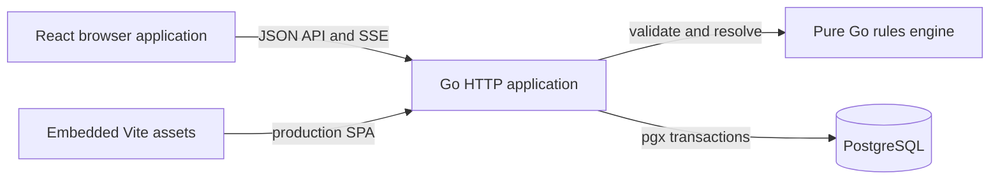

# System documentation

This directory is the canonical guide to Worldwright. It describes the system
implemented in this repository: separate membership-scoped Play and Build
entry points, a typed input/derived mechanic graph, problem-authored persistent
status layers, generated entity sheets, player-controlled characters with
world-authored onboarding fields, and a multiplayer table where facilitators
create every problem ad hoc.

The application intentionally has no built-in entity classes, privileged
configured keys, seed vocabulary, or canonical JSON document model. World
authors supply mechanic vocabulary through world configuration, while
facilitators name problem-specific statuses in live Consequences. The server
stores both in relational, world-scoped structures and enforces their declared
constraints.

## Documentation map

| Document                        | Use it to understand                                                                                  |
| ------------------------------- | ----------------------------------------------------------------------------------------------------- |
| [Architecture](architecture.md) | System boundaries, runtime topology, layers, data flow, and repository layout.                        |
| [Domain model](domain-model.md) | Worlds, mechanics, typed state, memberships, invitations, and interactions.                           |
| [Workflows](workflows.md)       | World creation, configuration, invitations, sheets, and the ad-hoc Play lifecycle.                    |
| [API reference](api.md)         | HTTP conventions, authentication adapter, payloads, errors, concurrency guards, SSE, and every route. |
| [Backend](backend.md)           | Go server construction, application packages, rules engine, persistence adapters, and transactions.   |
| [Frontend](frontend.md)         | React application structure, screens, state management, API integration, and styling.                 |
| [Database](database.md)         | PostgreSQL schema, migration model, table groups, constraints, receipts, and immutability.            |
| [Development](development.md)   | Prerequisites, local setup, managed services, change workflows, and troubleshooting.                  |
| [Testing](testing.md)           | Validation targets, unit/integration coverage, disposable database tests, and browser tests.          |
| [Operations](operations.md)     | Production build, configuration, deployment, health, logging, backups, and recovery.                  |
| [Security](security.md)         | Current trust boundary, authorization rules, visibility filtering, known gaps, and hardening path.    |

## System at a glance

The production artifact is one Go binary. It runs migrations, connects to
PostgreSQL, serves `/api/*`, and serves the embedded frontend for every other
route. During development, Vite serves the frontend on port `5173` and proxies
`/api` to the Go process on port `8080`.

## Product path

A world author defines input and derived capacities/capabilities, generates
sheets for stateful subjects, admits participants by invite link, and runs
improvised interactions at the table. For each resolved problem, the
facilitator authors one prose Consequence summary plus ordered targeted effects;
an apply-status effect defines its status inline, while a later Consequence may
remove an exact active instance. Base-state changes, status lifecycle changes,
effective-value receipts, and the world event commit in one transaction.

## Core invariants

- Configuration is user-authored and scoped to exactly one world.
- Durable identities are UUIDs at the HTTP and database boundaries.
- A character is an ordinary world entity with one or more active player-control
  relationships, never an engine class or privileged configured key.
- Every active character field is authored by the world owner/editor and is
  required for every controlled character; there is no built-in field list.
- Character-field values are relational presentation data and are never loaded
  by the rules engine or exposed as mechanical state.
- Player admission to live play is derived from control and character-field
  completion rather than persisted as a second membership lifecycle.
- Typed state is stored relationally; the database does not use a canonical
  JSON document as its source of truth.
- Numbers use exact PostgreSQL `numeric` and exact Go decimal arithmetic.
- Missing stored input state materializes from the mechanic's authored default.
- Derived expressions are type-checked as a complete world graph; unknown,
  cross-world, archived, mismatched, or cyclic dependencies reject publication.
- Effective values evaluate each mechanic's intrinsic value and then its
  deterministic active-status modifiers; derived references consume dependency
  effective values.
- Scalar effects execute in authored order over logical base inputs and observe
  earlier scalar mutations. Status effects create inline-authored instances or
  remove exact active instances. Active modifiers are never baked into scalar
  storage.
- Failed transitions do not partially mutate state.
- State, status sets, the world mechanic graph, memberships, the world table,
  interactions, and action submissions use revision guards or transaction
  locks where concurrent commands could overwrite one another.
- A committed live resolution, its applied-effect receipt, and its world event
  are immutable audit history.

## Terminology

| Term               | Meaning                                                                                                |
| ------------------ | ------------------------------------------------------------------------------------------------------ |
| World              | Membership, configuration, entity, live-play, receipt, and event boundary.                             |
| Capacity           | User-authored numeric score or pool that appears on generated sheets.                                  |
| Capability         | User-authored Boolean skill or numeric rating that appears on generated sheets.                        |
| World membership   | Link between a real user and a world with owner, editor, player, or spectator role.                    |
| Invite             | Revocable, expiring bearer link that grants a configured non-owner world role.                         |
| Entity             | Durable state owner represented to authors as a person or other world subject.                         |
| Character          | Product view of a world entity controlled by one or more active player memberships.                    |
| Character field    | Ordered, world-authored required text prompt shared by every controlled character.                     |
| Entity profile     | One entity's values for the world's active character fields, separate from typed mechanical state.     |
| State definition   | World-scoped numeric or Boolean input/derived mechanic underlying a capacity or capability.           |
| Logical state      | Stored input overrides combined with input defaults; derived mechanics do not own logical storage.    |
| Intrinsic value    | An input's logical value or a derived expression's result before modifiers on that mechanic.           |
| Effective value    | A mechanic's intrinsic value after active status modifiers, and the value consumed by dependents.      |
| Status instance    | Durable condition created by one problem effect, with source provenance and immutable modifier snapshots. |
| Interaction        | An ad-hoc facilitator-authored problem with its audience, responders, actions, and Consequence.          |
| Consequence        | One prose summary plus ordered targeted effects authored while the facilitator adjudicates a problem.   |
| Resolution receipt | Immutable record of a committed Consequence, requested effects, applications, and effective changes.     |

## Sources of truth

The documentation explains behavior; these implementation areas are the final
authority when behavior and prose diverge:

- `internal/rules/` for domain validation and transition semantics.
- `internal/app/api.go`, `routes.go`, and the resource files for HTTP contracts,
  including character-field configuration, readiness, control, and profile
  authorization.
- `internal/migrations/*.sql` for persisted shape and database constraints.
- `web/frontend/src/api/types.ts` for the frontend's view of API payloads.
- `web/frontend/src/features/` for screen behavior.
- `ci.sh`, `run.sh`, `railway.toml`, and `railpack.json` for tooling and runtime
  operations.

When changing one of those areas, update the corresponding document in the
same change.
