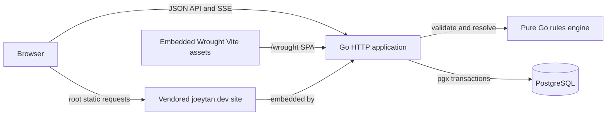

# System documentation

This directory is the canonical guide to Wrought. It describes the system
implemented in this repository: separate membership-scoped Play and Build
entry points, a typed input/derived mechanic graph, problem-authored persistent
Status-instance layers, generated Entity sheets, membership-controlled Characters with
world-authored onboarding fields, and Play with exactly one
designated Facilitator: a human facilitator, Terra, or an agent such as
ChatGPT.

The application intentionally has no built-in entity classes, privileged
configured keys, global vocabulary, or canonical JSON document model. Optional
Markdown-template terms become ordinary world-scoped relational data when
copied. World authors supply Mechanic vocabulary through World configuration, while
facilitators name Inline statuses in live Consequences. The server
stores both in relational, world-scoped structures and enforces their declared
constraints.

The registered Semantics repository identified by the root participation
marker is authoritative for maintained project and architecture terminology.
Discover and read it through `semantics.repository.explore`. The documents
below, code, and tests remain authoritative for actual behavior.

## Documentation map

| Document                        | Use it to understand                                                                                  |
| ------------------------------- | ----------------------------------------------------------------------------------------------------- |
| [Architecture](architecture.md) | System boundaries, runtime topology, layers, data flow, and repository layout.                        |
| [Domain model](domain-model.md) | Worlds, mechanics, typed state, memberships, invitations, and interactions.                           |
| [Workflows](workflows.md)       | World creation, configuration, invitations, sheets, and the ad-hoc Play lifecycle.                    |
| [API reference](api.md)         | HTTP conventions, sessions/CSRF, payloads, errors, concurrency guards, SSE, and every route.           |
| [Backend](backend.md)           | Go server construction, application packages, rules engine, persistence adapters, and transactions.   |
| [Frontend](frontend.md)         | React application structure, screens, state management, API integration, and styling.                 |
| [World templates](../internal/app/world_templates/) | The three complete Markdown starter Worlds and their reproducible manifests.                         |
| [Database](database.md)         | PostgreSQL schema, migration model, table groups, constraints, Resolution receipts, and immutability. |
| [Development](development.md)   | Prerequisites, local setup, managed services, change workflows, and troubleshooting.                  |
| [Testing](testing.md)           | Validation targets, test-layer vocabulary, ChatGPT acceptance, disposable database tests, browser tests, and deployed smoke checks. |
| [Operations](operations.md)     | Production build, configuration, scripted Railway deployment and verification, health, backups, and recovery. |
| [Security](security.md)         | Current trust boundary, authorization rules, visibility filtering, known gaps, and hardening path.    |
| [ChatGPT/WebMCP](webmcp.md)     | Delegated start, Start and Play site-tool surfaces, attached browser tab trust boundary, commands, and acceptance. |
| [Deployment readiness](deployment-readiness/README.md) | Audits, blockers, decisions, and exit criteria for trusted staging and public release. |

## System at a glance



The production artifact is one Go binary. It runs migrations, connects to
PostgreSQL, serves the Wrought API and SPA only under the exact `/wrought`
mount, and serves a tracked personal-site snapshot at the remaining root paths.
The canonical application URL is <https://joeytan.dev/wrought>; its security
origin is `https://joeytan.dev`, without a path. During development, Vite serves
Wrought on port `5173` and proxies `/wrought/api` to the Go process on port
`8080`.

## Product path

A world author defines input and derived capacities/capabilities, generates
sheets for stateful subjects, admits user accounts by invite link, and runs
improvised Problems during Play. The membership role stays separate from
the current play role, so an authorized membership can reassign the Facilitator responsibility to
another non-spectator, Terra, or an agent, normally between
Problems. A human Facilitator authors one prose Consequence and may preview Luna's
compiled Effects. Terra instead creates and resolves its own Interactions
autonomously. When ChatGPT is Facilitator, it authors the
Problem and Consequence through the signed-in Play page while the person's current
play role remains `player`. Logical-state changes, Status-instance lifecycle changes,
effective changes, and the World event commit in the Resolution transaction.

## Core invariants

- Configuration is user-authored and scoped to exactly one World.
- Durable identities are UUIDs at the HTTP and database boundaries.
- A Character is an ordinary Entity with one or more active non-spectator Controller
  relationships, never an engine class or privileged configured key.
- Every active Character field is authored by the World owner/editor and is
  required for every controlled Character; there is no built-in field list.
- Character-field values are relational presentation data and are never loaded
  by the rules engine or exposed as mechanical state.
- Player admission to live play is derived from control and character-field
  completion rather than persisted as a second membership lifecycle.
- Exactly one facilitator assignment exists per world: either one active human
  membership, Terra, or an agent. It determines the current play role
  without rewriting the durable membership role.
- Typed state is stored relationally; the database does not use a canonical
  JSON document as its source of truth.
- Numbers use exact PostgreSQL `numeric` and exact Go decimal arithmetic.
- A missing stored override materializes from the Mechanic's authored default.
- Derived expressions are type-checked as a complete world graph; unknown,
  cross-world, archived, mismatched, or cyclic dependencies reject publication.
- Effective values evaluate each Mechanic's intrinsic value and then its
  deterministic Status modifiers from active instances; derived references consume dependency
  effective values.
- Scalar Effects execute in authored order over logical input values and observe
  earlier scalar mutations. Apply-status Effects create instances from Inline statuses;
  remove-status Effects remove exact active instances. Status modifiers are never baked into scalar
  storage.
- Failed transitions do not partially mutate state.
- Logical state, status sets, the world mechanic graph, memberships, the World
  roster, Interactions, and Actions use revision guards or transaction
  locks where concurrent commands could overwrite one another.
- A committed live Resolution, its resolution receipt, and its World event
  are immutable audit history.

## Vocabulary

The registered Semantics repository identified by the root participation
marker is the single authority for maintained project and architecture terms.
Read it through the installed discovery route:

```sh
/Users/joey/.local/bin/chancery show semantics.repository.explore
```

In brief: a **World** is the sole scope; its **world mechanic graph** is
versioned by a **rules revision**; a user-facing **Problem** is carried by the
technical **Interaction** aggregate; and a **Consequence** is committed as a
**Resolution** with an immutable **resolution receipt**.

## Sources of truth

The documentation explains behavior; these implementation areas are the final
authority when behavior and prose diverge:

- `internal/rules/` for domain validation and transition semantics.
- `internal/app/api.go`, `routes.go`, and the resource files for HTTP contracts,
  including character-field configuration, readiness, control, and profile
  authorization.
- `internal/migrations/*.sql` for persisted shape and database constraints.
- `web/frontend/src/api/types.ts` for the frontend's view of API payloads.
- `web/site/` for the pinned `joeytan.dev` root-site snapshot.
- `web/frontend/src/features/` for screen behavior.
- `ci.sh`, `run.sh`, `deploy.sh`, `test/src/deployment/`, `railway.toml`, and
  `railpack.json` for tooling and runtime operations.

When changing one of those areas, update the corresponding document in the
same change.
