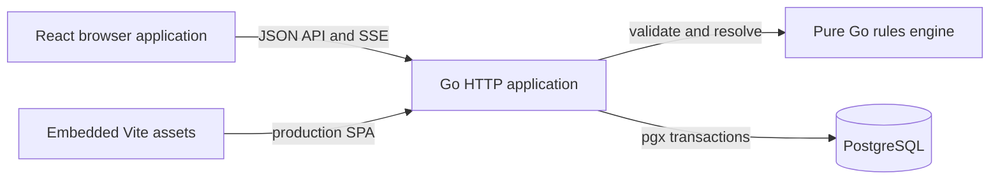

# System documentation

This directory is the canonical guide to the Stateful Rule Composer and Game
Player. It describes the system that is implemented in this repository: a
configuration-first rules engine, a ruleset-scoped authoring and simulation
surface, and a game-scoped multiplayer Play surface.

The application intentionally has no built-in entity classes, privileged
configured keys, seed vocabulary, or canonical JSON document model. Ruleset
authors supply the mechanical vocabulary. The server stores that vocabulary in
relational, ruleset-scoped structures and enforces its declared constraints.

## Documentation map

| Document                        | Use it to understand                                                                                  |
| ------------------------------- | ----------------------------------------------------------------------------------------------------- |
| [Architecture](architecture.md) | System boundaries, runtime topology, layers, data flow, and repository layout.                        |
| [Domain model](domain-model.md) | Rulesets, schemas, typed state, conditions, problems, effects, games, and interactions.               |
| [Workflows](workflows.md)       | The authoring sequence, configured runtime resolution, and multiplayer Play lifecycle.                |
| [API reference](api.md)         | HTTP conventions, authentication adapter, payloads, errors, concurrency guards, SSE, and every route. |
| [Backend](backend.md)           | Go server construction, application packages, rules engine, persistence adapters, and transactions.   |
| [Frontend](frontend.md)         | React application structure, screens, state management, API integration, and styling.                 |
| [Database](database.md)         | PostgreSQL schema, migration model, table groups, constraints, receipts, and immutability.            |
| [Development](development.md)   | Prerequisites, local setup, managed services, change workflows, and troubleshooting.                  |
| [Testing](testing.md)           | Validation targets, unit/integration coverage, disposable database tests, and browser tests.          |
| [Operations](operations.md)     | Production build, configuration, deployment, health, logging, backups, and recovery.                  |
| [Security](security.md)         | Current trust boundary, authorization rules, visibility filtering, known gaps, and hardening path.    |

## System at a glance

The production artifact is one Go binary. It runs migrations, connects to
PostgreSQL, serves `/api/*`, and serves the embedded frontend for every other
route. During development, Vite serves the frontend on port `5173` and proxies
`/api` to the Go process on port `8080`.

## The two runtime paths

The shared state-transition engine is exposed in two ways:

1. **Configured runtime** is ruleset-scoped. Authors define reusable problem
   definitions, create problem instances, bind targets, preview a choice, and
   resolve it. Conditions select an authored outcome and authored effects
   mutate state.
2. **Live Play** is game-scoped. A facilitator maps an exclusive subset of a
   ruleset's entities into a game, presents an improvised interaction, accepts
   player action text, and commits a narrative plus optional concrete effects.
   The state change and immutable resolution receipt are one transaction.

Both paths eventually create an ordered concrete transition plan and pass it
to the same pure Go transition engine. This keeps type checking, ownership,
effect ordering, default handling, and atomic failure semantics aligned.

## Core invariants

- Configuration is user-authored and scoped to exactly one ruleset.
- Durable identities are UUIDs at the HTTP and database boundaries.
- Owner schemas are capabilities/tags, not built-in classes. An entity may
  implement zero or more of them.
- A state variable can be owned by an entity when their schema sets intersect.
- Typed state is stored relationally; the database does not use a canonical
  JSON document as its source of truth.
- Numbers use exact PostgreSQL `numeric` and exact Go decimal arithmetic.
- Many-valued state has set semantics and rejects duplicates.
- Missing state is either logically `unknown` or materialized from an authored
  default.
- Conditions use three-valued logic: `met`, `unmet`, and `unknown`.
- Effects execute in authored order and observe earlier effects in the same
  transition.
- Failed transitions do not partially mutate state.
- State, bindings, memberships, games, interactions, and action submissions
  use revision guards where concurrent commands could overwrite one another.
- One ruleset entity can be assigned to at most one game at a time.
- A committed live resolution, its applied-effect receipt, and its game event
  are immutable audit history.

## Terminology

| Term                      | Meaning                                                                                                     |
| ------------------------- | ----------------------------------------------------------------------------------------------------------- |
| Ruleset                   | Isolation boundary and container for an authored mechanical vocabulary.                                     |
| Owner schema              | User-authored capability/tag used to declare which entities can own state or fill a target.                 |
| Entity                    | Generic durable state owner. It has no built-in fictional type.                                             |
| State-variable definition | Typed schema for a piece of entity state, including ownership, defaults, presentation, and allowed effects. |
| Logical state             | Stored overrides combined with authored missing/default semantics.                                          |
| Condition set             | Reusable parameterized three-valued expression tree.                                                        |
| Problem definition        | Reusable configured interaction with targets, availability rules, choices, outcomes, and effects.           |
| Problem instance          | An entity plus target bindings for one problem definition.                                                  |
| Game                      | Live-play boundary that maps an exclusive subset of one ruleset's entities.                                 |
| Membership                | Link between a real user and a game with facilitator, player, or spectator role.                            |
| Interaction               | A facilitator-authored live prompt and its audience, responders, actions, and ruling.                       |
| Resolution receipt        | Immutable record of a committed ruling, requested effects, applied before/after values, and narrative.      |

## Sources of truth

The documentation explains behavior; these implementation areas are the final
authority when behavior and prose diverge:

- `internal/rules/` for domain validation and transition semantics.
- `internal/app/api_*.go` and `internal/app/handlers_*.go` for HTTP contracts.
- `internal/migrations/*.sql` for persisted shape and database constraints.
- `web/frontend/src/api/types.ts` for the frontend's view of API payloads.
- `web/frontend/src/features/` for screen behavior.
- `ci.sh`, `run.sh`, `railway.toml`, and `railpack.json` for tooling and runtime
  operations.

When changing one of those areas, update the corresponding document in the
same change.
