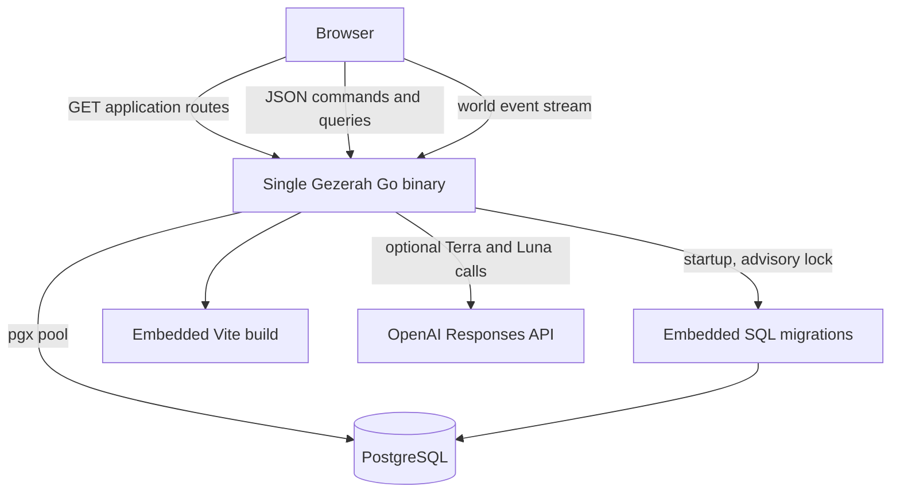
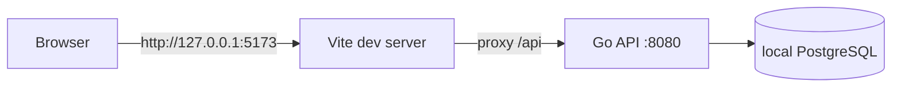
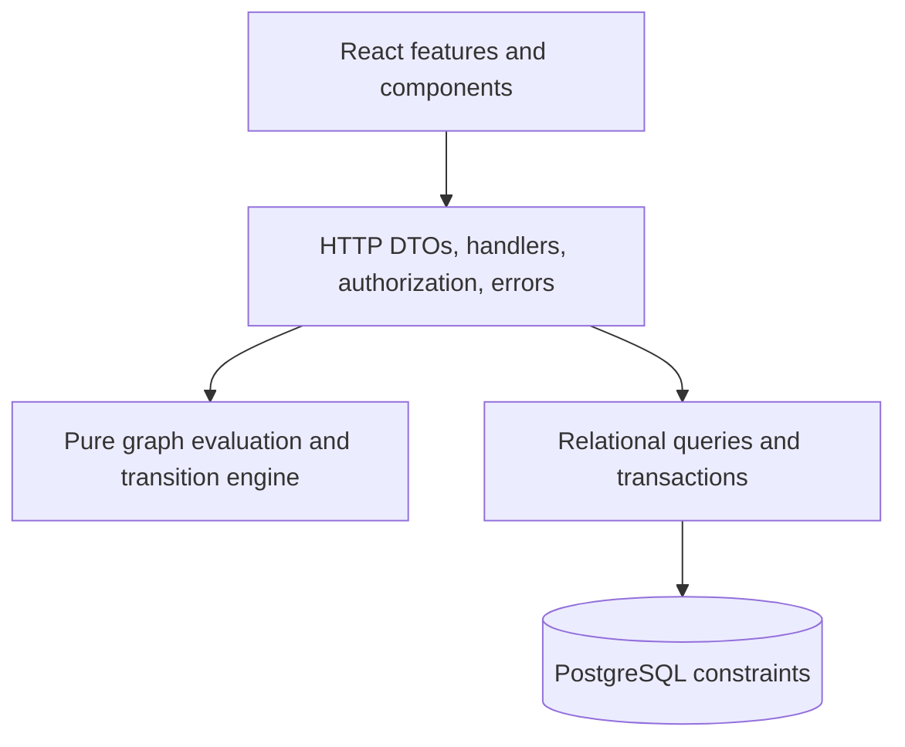
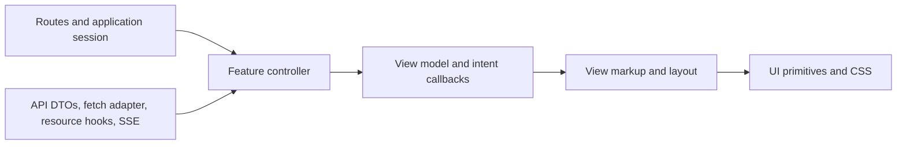
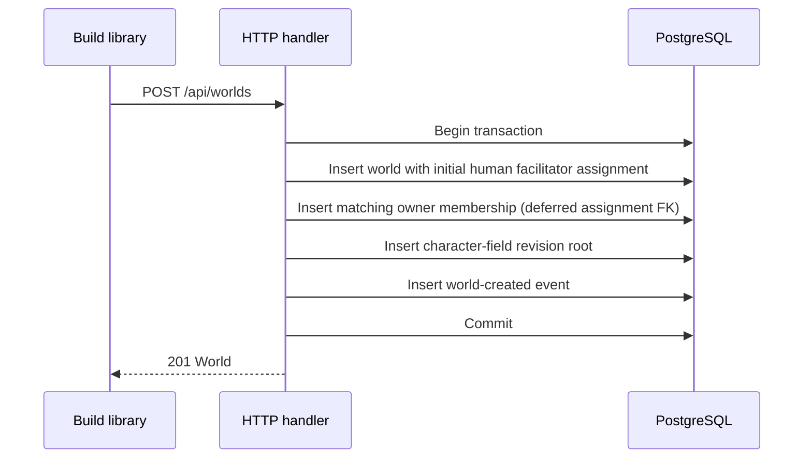
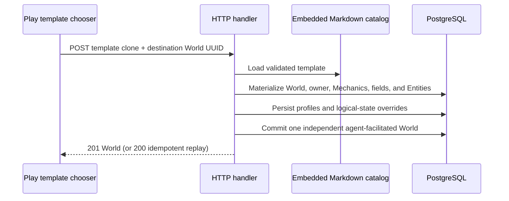
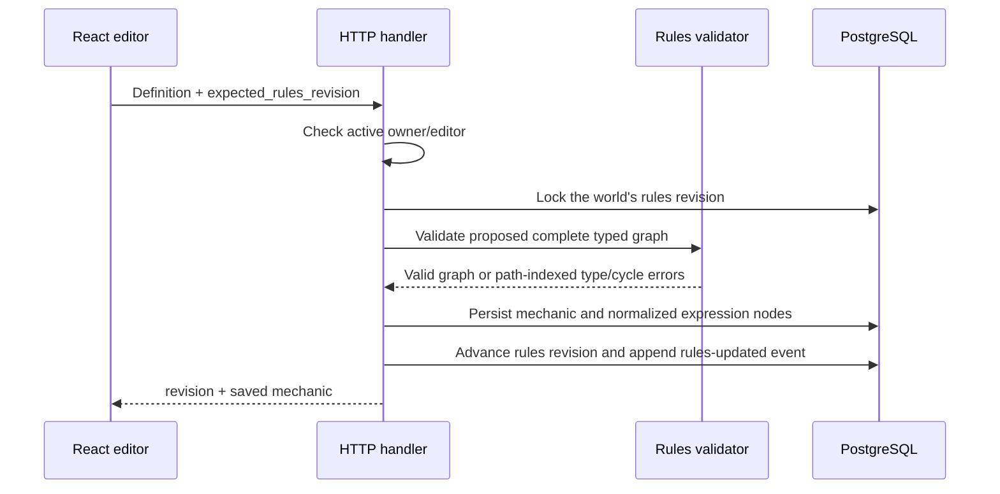

# Architecture

## Purpose and boundaries

Gezerah is a world-centered typed state-transition system. Authors define
only the capacities, capabilities, character fields, and entities that matter
to their world. Problems are improvised in the multiplayer loop rather than
authored as reusable configuration.

The world is the sole product and data boundary. It owns:

- owner/editor/player/spectator memberships and expiring bearer invitations;
- one human-membership, Terra, or agent facilitator assignment, from which current
  facilitator/player/spectator current play roles are derived;
- numeric/Boolean input and derived capacity/capability definitions plus their
  typed dependency graph;
- problem-authored persistent status instances with immutable modifier
  snapshots and source-resolution provenance;
- entities, logical state, intrinsic/effective values, character fields, profiles, and control;
- improvised Interactions, Actions, Consequences, and immutable Resolution receipts;
- one append-only event cursor for live invalidation;
- separate Play and Build browser surfaces over the same resources.

The system does not currently own:

- email addresses, password recovery, MFA, or a federated identity provider;
- built-in entity classes, privileged mechanic names, or global vocabulary;
- cross-world inheritance or resource sharing;
- matchmaking, chat, files, maps, dice, or turn scheduling;
- background jobs or an external event broker;
- a separately versioned public HTTP API.

## Runtime topology

### Production



The binary loads configuration, installs structured logging, connects to
PostgreSQL, applies unapplied embedded migrations, constructs the HTTP server,
and listens. `SIGINT` and `SIGTERM` start a bounded shutdown attempt with a
ten-second deadline.

The HTTP server sends `/api` and `/api/*` to a method-aware API mux. Other GET
paths use static-file serving with SPA fallback to `index.html`. Missing assets
under `/assets/` do not receive that fallback.

### Local development



`./run.sh` builds and manages the Go process and starts Vite. PID files and
logs live below ignored `.gezerah/`. The frontend uses the same relative `/api`
paths in both topologies.

## Architectural layers



### Browser layer

The browser starts with a data-free choice between `/build` and `/play`.
Build owns the owner/editor world library and configuration. Play owns
the admitted-World picker, player onboarding, and Play surface. Both areas
share the authenticated account boundary, API types, fetch helpers, route
helpers, and UI primitives.

Within the browser, operational dependencies point inward through feature
controllers and stop at a semantic presentation contract:



Files matching `*View.tsx` or `*ViewModel.{ts,tsx}`, together with shared
components, form the presentation boundary. They may express product semantics
and local interaction but cannot import transport DTOs, API functions,
API-backed resource hooks, event streams, or route construction. Controllers map
authoritative resources into display state and translate user intent back into
revision- and idempotency-bearing commands. The boundary is enforced by
frontend linting and exercised with server-rendered fixture tests, so layout
can be developed without a running API.

This is intentionally a feature-level separation rather than an
interchangeable-backend architecture. The same-origin API and browser client
remain one coordinated product artifact; there is no generic repository,
dependency-injection container, or duplicated canonical frontend model.

World configuration is a master-detail editor for capacities/capabilities,
their derived expressions, character fields, roster setup, memberships and invitations, and
settings. Build never mounts the event stream; Play does not render
configuration or direct logical-state inputs. Inline statuses are authored only in a
Problem's Consequence during Play.
A current player who is not ready sees only controlled-character onboarding and does
not request live interactions or events.

Routing uses the History API. Only the current `/build/**`, `/play/**`, and
area-scoped invite URLs are recognized. Unknown paths render not found.

Ordinary JSON calls pass through one credentialed fetch adapter that sets JSON
headers, maps the error envelope, and attaches the in-memory session CSRF token
to unsafe methods. The world-event hook uses streaming `fetch`, remembers its
cursor, and reconnects after a stream ends unless the session has ended.

### HTTP/application layer

`internal/app` owns transport and persistence orchestration:

- username/password signup and signin, Argon2id verification, opaque session
  issuance/revocation, same-origin enforcement, and CSRF validation;
- strict request/response DTOs preserve exact numeric input;
- handlers validate path, query, body, authenticated actor, World membership, and membership role;
- world response mapping keeps membership role separate from the designated
  human/Terra/agent facilitator and current play role;
- world-scoped queries load relational aggregates;
- command transactions lock mutable roots and recheck revisions;
- mechanic publication validates the proposed complete dependency graph and
  advances its rules revision;
- Entity-sheet reads call the pure evaluator to separate intrinsic and
  effective values with modifier explanations;
- model-generation and Terra handlers assemble revision-consistent world snapshots,
  compile human prose for review, or autonomously create and decide Terra
  Interactions through the ordinary preview/resolve paths;
- agent handlers accept page-agent prose from a ready current player, derive
  audience and context server-side, and use the same deterministic
  preview/resolve paths without a server-side model call;
- live Consequences call the pure runtime transition/evaluation engine and
  persist logical state, Status-instance lifecycle, and history atomically;
- visibility filtering removes restricted Character fields before serialization.

The application layer does not put SQL, HTTP, authentication, clocks, or UUID
generation into the rules engine.

### Rules engine

`internal/rules` is pure Go and storage-neutral. Stable IDs are strings. It
type-checks the World mechanic graph, reports concrete cycle paths,
compiles a dependency order, evaluates intrinsic/effective values, validates
Inline statuses and active Status instances, and applies ordered set,
adjust-number, apply-status, and remove-status Effects to cloned runtime snapshots. Results include
Applications, changed Entity IDs, and evaluation
explanations.

The engine does not increment revisions, acquire locks, write Resolution receipts, or
commit transactions. Those remain adapter responsibilities.

### Persistence layer

PostgreSQL is authoritative. The clean baseline is normalized around
`world_id`; there are no secondary configuration or live-play containers.
Composite foreign keys make cross-world relationships structurally invalid.
Checks enforce scalar tagged shapes, expression-node shapes, numeric bounds
metadata, membership roles, Play statuses, and lifecycle shapes. Triggers protect Status-instance
modifier snapshots, final Resolution receipts, and World-event rows.

JSON is a transport format, not canonical storage.

Three repository-owned Markdown World templates provide optional starting
content for Play. The server embeds and validates those release artifacts, then
materializes a selected template into the same normalized relational tables as
an authored World. Every copied resource receives a fresh UUID. No template ID
or file-local reference survives as a privileged database key, and there is no
runtime inheritance back to the template file.

## Major data flows

### Creating a world



The revision roots contain no vocabulary and do not create another product
scope; the World remains the sole configuration boundary.

### Copying a World template



The destination UUID makes an uncertain client retry idempotent. A replay is
accepted only for the same account and template copy; unrelated existing
Worlds remain conflicts.

### Authoring a mechanic



Archiving is explicit and retains stored overrides and Resolution-receipt references. An
active derived dependency or active Status-instance modifier reference blocks Mechanic
archive. Once archived, a mechanic remains readable but has no product restore
transition.

### Live interaction resolution

```mermaid
sequenceDiagram
    participant F as Human facilitator or Terra
    participant H as World interaction handler
    participant DB as PostgreSQL
    participant R as Transition engine
    participant E as SSE clients

    F->>H: Resolve Consequence narrative + ordered Effects + revisions + idempotency key
    H->>DB: Authorize active assignment/source and check idempotent replay
    H->>DB: Lock mechanic graph and Interaction roots
    H->>DB: Check lifecycle, revisions, and selected-Action metadata
    H->>DB: Lock sorted target Entity logical-state/status-set roots
    H->>R: Evaluate before; validate/apply inline statuses and exact removals; evaluate after
    R-->>H: Applications and effective changes or atomic failure
    H->>DB: Persist stored overrides, Status instances/modifier snapshots, and status-set revisions
    H->>DB: Insert attributed immutable Resolution receipt
    H->>DB: Finalize interaction/actions and append world event
    H->>DB: Commit
    H-->>F: Resolution result
    DB-->>E: Cursor becomes visible to event polling
```

Logical state, Status instances and modifier snapshots, source Interaction/Resolution/Effect
provenance, the Resolution receipt, selected/declined Action statuses, Interaction
lifecycle, and World event either all commit or all roll back. Equivalent idempotent
replay returns the immutable Resolution receipt with
`replayed: true`; different content conflicts.

### Human compilation and Terra orchestration

```mermaid
sequenceDiagram
    participant U as Play-ready current players
    participant H as Application handlers
    participant T as GPT-5.6 Terra
    participant L as GPT-5.6 Luna
    participant DB as PostgreSQL
    participant V as Existing preview path
    participant R as Existing resolve path

    U->>H: Continue while Terra is Facilitator and Play is idle
    H->>T: Revision-consistent world snapshot
    T-->>H: Problem prose
    H->>DB: Lock/recheck; create and present Terra interaction
    U->>H: Actions or pass from every ready responder
    U->>H: Decide + revisions + idempotency key
    H->>DB: Lock/recheck; enter adjudicating
    H->>T: Problem, Actions, and World snapshot
    T-->>H: Immutable Consequence prose
    H->>L: Prose + same snapshot
    L-->>H: Selected-Action metadata + Effects
    H->>V: Existing Consequence DTO + current revisions
    V-->>H: Validated Consequence preview
    H->>R: Resolve immediately as Terra
    R->>DB: Commit attributed Resolution receipt and World event
    H-->>U: Committed Resolution result
```

Terra uses `gpt-5.6-terra` for plain text. Luna uses `gpt-5.6-luna` with a
strict JSON Schema for the mechanical interpretation. Both one-shot Responses
API calls set `reasoning.effort` to `none` and `store` to `false`.

Each call receives a read-only `REPEATABLE READ` snapshot containing the world
description as world brief, all active Mechanics with their exact authored
constraints and expressions, every non-archived Entity with its
facilitator-visible profile values and generated sheet data (logical input,
intrinsic/effective values, and active Status instances), and the three most recent resolved
Problem/Consequence pairs. Consequence generation and compilation also
include the current Problem and all submitted Actions. Short per-request
references stand in for UUIDs, then the server maps Luna's references back to
world-owned resources before preview.

For a human facilitator, Luna compilation is advisory and persists nothing;
the human sees the original prose, effects, and preview and separately chooses
whether to resolve. For Terra, only the provider calls and preview are
non-persistent: Continue writes the presented interaction, and Decide enters
adjudication then invokes resolve without returning model output for human
editing or approval. On the ordinary autonomous path, Terra interactions,
resolutions, and events record Terra as source and leave their human actor
columns null even though an authenticated current player paced the request.

If a Terra decision fails after adjudication starts, a current player can reload and
retry with the same idempotency key. There is also one narrow owner recovery
path: when exactly one unfinished interaction exists and it is Terra-authored
and open or adjudicating, the owner may assign the facilitator to themself. The
transaction withdraws the owner's submitted action if present, changes the
world assignment, and retains the interaction's original Terra source. The
owner closes/adjudicates an open Problem as needed and then uses the human
Consequence UI; the resulting Resolution is attributed to the human owner. All
other handoffs remain between interactions.

## Consistency and concurrency

The system combines:

1. **Optimistic revisions.** Settings/facilitator assignment, the World roster,
   the world mechanic graph, character fields, profiles, Entity logical state,
   Interactions, and Actions reject stale expected revisions. Membership rows
   carry recorded revisions but no membership mutation currently accepts an
   expected membership revision.
   Entity status-set roots version actual Status-instance lifecycle changes.
2. **Row locks and stable ordering.** Mutation transactions lock aggregate roots
   first and sort mechanic/entity IDs where lock order matters.
3. **Database constraints.** Uniqueness, world-scoped foreign keys, tagged
   shapes, lifecycle checks, and immutability triggers remain the final guard.

`worlds.revision` protects settings, lifecycle, and facilitator assignment.
`worlds.roster_revision` protects complete controller-set replacements and
other roster composition changes.
`world_mechanic_graphs.revision` protects the mechanic graph independently of both.
Its value is embedded in Entity sheets and committed Resolution receipts.

Read paths that assemble several tables may use read-only `REPEATABLE READ` so
a response cannot combine different revisions.

## Events and freshness

Live and rules-configuration mutations append `world_events`. The browser opens
`GET /api/worlds/{world_id}/events` with an `after` cursor or `Last-Event-ID`.
The server emits monotonic IDs and compact resource references, plus keep-alive
comments. Events are invalidation hints; clients reload authoritative world
resources instead of reconstructing state from event payloads. A
`rules-updated` event causes Play to reload the world mechanic graph and evaluated
Entity sheets before enabling a Consequence based on them.

Ordinary human adjudication and cancellation may remove an interaction from
audience visibility. A marked lifecycle event remains visible to its audience
and is projected for non-facilitators as
`interaction-feed-invalidated`, retaining cursor/time metadata and clearing
resource and human actor IDs. Autonomous Terra adjudication instead emits a
full, unmarked Terra event and remains visible for progress, retry, or owner
takeover. This preserves cursor progress without leaking restricted identifiers.

Events distinguish `actor_source` from nullable human actor membership. Terra
events never attribute the ready current player who pressed Continue or Decide as the
author. Human handoff and emergency-takeover events carry the authenticated
membership that performed them.

There is no broker. A successful mutation broadcasts an in-process wakeup so
streams on the same server query PostgreSQL immediately after commit. Each open
handler also polls PostgreSQL every 1.5 seconds, preserving correctness after a
lost wakeup and across replicas. Capacity planning must therefore account for
one request and recurring fallback queries per connected Play client. A full
100-event query repeats immediately, with authorization checked again, until
the backlog is below the batch limit.

The SSE handshake uses ordinary authentication, including a coarse activity
touch when due; subsequent stream session checks are read-only. Each stream
write/flush has a five-second deadline that is cleared while waiting, so the
ordinary 130-second response deadline does not routinely close healthy streams.
Process cancellation propagates through request contexts. On any disconnect,
clients reconnect with their last cursor.

## Repository layout

| Path                            | Responsibility                                                                   |
| ------------------------------- | -------------------------------------------------------------------------------- |
| `cmd/gezerah/`                      | Executable entrypoint and process lifecycle.                                     |
| `internal/rules/`               | Pure graph/type validation, effective evaluation, and runtime transitions.       |
| `internal/app/`                 | HTTP DTOs, handlers, authorization, SQL, and transactions.                       |
| `internal/migrations/`          | Embedded PostgreSQL baseline and future migrations.                              |
| `web/frontend/`                 | React/Vite Build and Play SPA.                                                   |
| `web/static/`                   | Ignored Vite output embedded by Go; only a placeholder is tracked.               |
| `test/`                         | Playwright harness, clean-database scenarios, and deployed-system smoke tooling. |
| `ci.sh`, `run.sh`, `deploy.sh`  | Validation, managed local development, and Railway release orchestration.        |
| `railpack.json`, `railway.toml` | Railway build and deployment configuration.                                      |

## Design constraints for future changes

- Keep mechanic vocabulary in user-authored world configuration and status
  vocabulary in user-authored Consequences, not Go constants, migrations, or
  seed data.
- Do not make a configured key, entity name, or mechanic name privileged.
- Keep `world_id` as the single configuration, authorization, and live scope.
- Preserve normalized relational storage; JSON may be transport, never the
  canonical aggregate.
- Keep rules functions deterministic and independent of HTTP, SQL, clocks, or
  authentication.
- Reject graph type errors and cycles before advancing the rules
  revision; retain runtime cycle detection as a defensive invariant.
- Keep problem-authored status modifiers literal and persist their source IDs
  and instance snapshots so later changes cannot rewrite active or historical
  meaning.
- Validate at both application and database boundaries.
- Route every live mechanical mutation through one concrete transition path.
- Treat Resolution receipts and World events as history; add new facts instead of rewriting
  committed history.
- Keep player reads world-scoped and visibility-filtered.
- Keep browser presentation modules independent of transport DTOs, API-backed
  hooks, route construction, and event streams. Cross into views only through
  semantic models and user-intent callbacks; keep authorization authoritative
  on the server.
