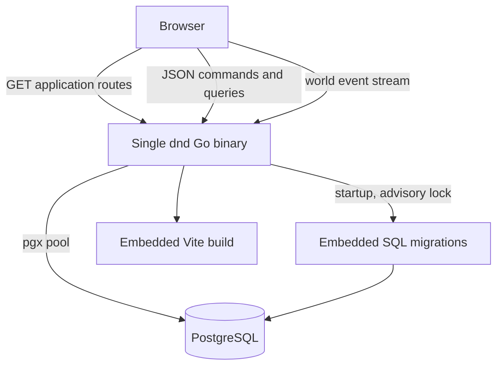
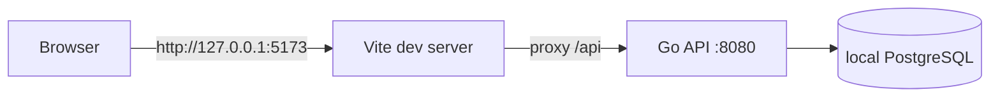
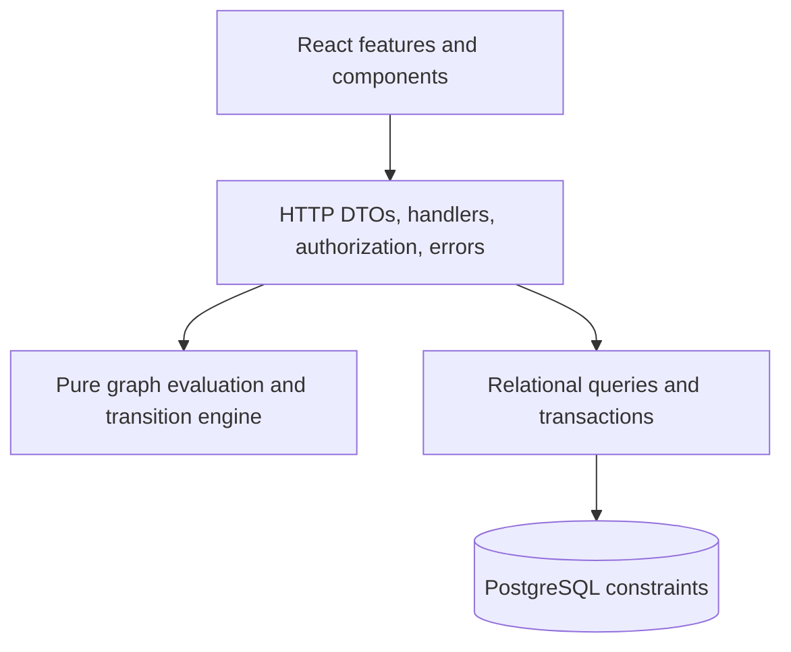
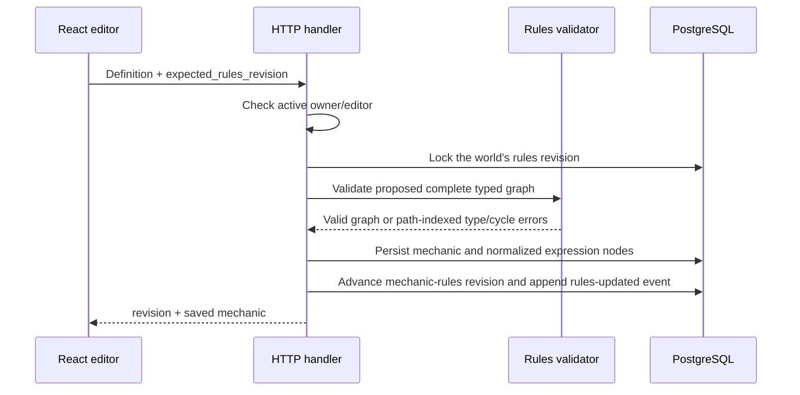

# Architecture

## Purpose and boundaries

Worldwright is a world-centered typed state-transition system. Authors define
only the capacities, capabilities, character fields, and entities that matter
to their world. Problems are improvised in the multiplayer loop rather than
authored as reusable configuration.

The world is the sole product and data boundary. It owns:

- owner/editor/player/spectator memberships and expiring bearer invitations;
- numeric/Boolean input and derived capacity/capability definitions plus their
  typed dependency graph;
- problem-authored persistent status instances with immutable modifier
  snapshots and source-resolution provenance;
- entities, base/effective state, character fields, profiles, and player control;
- improvised interactions, actions, Consequences, and immutable receipts;
- one append-only event cursor for live invalidation;
- separate Play and Build browser surfaces over the same resources.

The system does not currently own:

- email addresses, password recovery, MFA, or a federated identity provider;
- built-in entity classes, mechanic names, or seeded vocabulary;
- cross-world inheritance or resource sharing;
- matchmaking, chat, files, maps, dice, or turn scheduling;
- background jobs or an external event broker;
- a separately versioned public HTTP API.

## Runtime topology

### Production



The binary loads configuration, installs structured logging, connects to
PostgreSQL, applies unapplied embedded migrations, constructs the HTTP server,
and listens. `SIGINT` and `SIGTERM` start a bounded shutdown attempt with a
ten-second deadline.

The HTTP server sends `/api` and `/api/*` to a method-aware API mux. Other GET
paths use static-file serving with SPA fallback to `index.html`. Missing assets
under `/assets/` do not receive that fallback.

### Local development



`./run.sh` builds and manages the Go process and starts Vite. PID files and
logs live below ignored `.dnd/`. The frontend uses the same relative `/api`
paths in both topologies.

## Architectural layers



### Browser layer

The browser starts with a data-free choice between `/build` and `/play`.
Build owns the owner/editor world library and configuration studio. Play owns
the admitted-world table picker, player onboarding, and live table. Both areas
share the authenticated account boundary, API types, fetch helpers, route
helpers, and UI primitives.

World configuration is a master-detail editor for capacities/capabilities,
their derived expressions, character fields, roster setup, people, and
settings. Build never mounts the event stream; Play does not render
configuration or direct setup-state inputs. Statuses are authored only in a
problem's Consequence during Play.
A player who is not ready sees only controlled-character onboarding and does
not request live interactions or events.

Routing uses the History API. Only the current `/build/**`, `/play/**`, and
area-scoped invite URLs are recognized. Unknown paths render not found.

Ordinary JSON calls pass through one credentialed fetch adapter that sets JSON
headers, maps the error envelope, and attaches the in-memory session CSRF token
to unsafe methods. The world-event hook uses streaming `fetch`, remembers its
cursor, and reconnects after a stream ends unless the session has ended.

### HTTP/application layer

`internal/app` owns transport and persistence orchestration:

- username/password signup and signin, Argon2id verification, opaque session
  issuance/revocation, same-origin enforcement, and CSRF validation;
- strict request/response DTOs preserve exact numeric input;
- handlers validate path, query, body, authenticated actor, membership, and role;
- world-scoped queries load relational aggregates;
- command transactions lock mutable roots and recheck revisions;
- mechanic publication validates the proposed complete dependency graph and
  advances its world-rules revision;
- state reads call the pure evaluator to separate intrinsic and effective
  values with modifier explanations;
- live Consequences call the pure runtime transition/evaluation engine and
  persist base state, status lifecycle, and history atomically;
- visibility filtering removes private fields before serialization.

The application layer does not put SQL, HTTP, authentication, clocks, or UUID
generation into the rules engine.

### Rules engine

`internal/rules` is pure Go and storage-neutral. Stable IDs are strings. It
type-checks the world mechanic dependency graph, reports concrete cycle paths,
compiles a dependency order, evaluates intrinsic/effective values, validates
inline status specifications and active snapshots, and applies ordered
scalar/status effects to cloned runtime snapshots. Results include
scalar/status applications, changed state-record IDs, and evaluation
explanations.

The engine does not increment revisions, acquire locks, write receipts, or
commit transactions. Those remain adapter responsibilities.

### Persistence layer

PostgreSQL is authoritative. The clean baseline is normalized around
`world_id`; there are no secondary configuration or live-play containers.
Composite foreign keys make cross-world relationships structurally invalid.
Checks enforce scalar tagged shapes, expression-node shapes, numeric bounds
metadata, roles, statuses, and lifecycle shapes. Triggers protect status
modifier snapshots, final receipts, and event rows.

JSON is a transport format, not canonical storage.

## Major data flows

### Creating a world

```mermaid
sequenceDiagram
    participant UI as Build library
    participant H as HTTP handler
    participant DB as PostgreSQL

    UI->>H: POST /api/worlds
    H->>DB: Begin transaction
    H->>DB: Insert world; trigger creates rules revision root
    H->>DB: Insert owner membership
    H->>DB: Insert character-field revision root
    H->>DB: Insert world-created event
    H->>DB: Commit
    H-->>UI: 201 World
```

The revision roots contain no vocabulary and do not create a second ruleset
scope; the world remains the sole configuration boundary.

### Authoring a mechanic



Archiving is explicit and retains stored values and receipt references.

### Live interaction resolution

```mermaid
sequenceDiagram
    participant F as Facilitator client
    participant H as World interaction handler
    participant DB as PostgreSQL
    participant R as Transition engine
    participant E as SSE clients

    F->>H: Resolve Consequence summary + ordered effects + revisions + idempotency key
    H->>DB: Lock mechanic rules, interaction, entities, state/status roots
    H->>DB: Recheck facilitator, lifecycle, revisions, selected action
    H->>R: Evaluate before; validate/apply inline statuses and exact removals; evaluate after
    R-->>H: Applications and effective changes or atomic failure
    H->>DB: Persist changed state, status snapshots/provenance, and status revisions
    H->>DB: Insert immutable Consequence, applications, and effective changes
    H->>DB: Finalize interaction/actions and append world event
    H->>DB: Commit
    H-->>F: Resolution result
    DB-->>E: Cursor becomes visible to event polling
```

Base state, status instances and snapshots, source problem/resolution/effect
provenance, the receipt, selected/declined action statuses, interaction
lifecycle, and event either all commit or all roll back. Equivalent idempotent
replay returns the immutable Consequence with
`replayed: true`; different content conflicts.

## Consistency and concurrency

The system combines:

1. **Optimistic revisions.** Settings, the world table, the world mechanic graph,
   character fields, profiles, entity state, memberships, interactions, and
   actions reject stale expected revisions. Entity status-set roots version
   actual status lifecycle changes.
2. **Row locks and stable ordering.** Mutation transactions lock aggregate roots
   first and sort mechanic/entity IDs where lock order matters.
3. **Database constraints.** Uniqueness, world-scoped foreign keys, tagged
   shapes, lifecycle checks, and immutability triggers remain the final guard.

`worlds.revision` protects settings and lifecycle. `worlds.table_revision`
protects complete controller-set replacements and other table-scoped authority.
`world_rule_sets.revision` protects the mechanic graph independently of both.
Its value is embedded in evaluated state and applied resolution receipts.

Read paths that assemble several tables may use read-only `REPEATABLE READ` so
a response cannot combine different revisions.

## Events and freshness

Live and rules-configuration mutations append `world_events`. The browser opens
`GET /api/worlds/{world_id}/events` with an `after` cursor or `Last-Event-ID`.
The server emits monotonic IDs and compact resource references, plus keep-alive
comments. Events are invalidation hints; clients reload authoritative world
resources instead of reconstructing state from event payloads. A
`rules-updated` event causes Play to reload the mechanic catalog and evaluated
entity state before enabling a Consequence based on them.

There is no broker. A successful mutation broadcasts an in-process wakeup so
streams on the same server query PostgreSQL immediately after commit. Each open
handler also polls PostgreSQL every 1.5 seconds, preserving correctness after a
lost wakeup and across replicas. Capacity planning must therefore account for
one request and recurring fallback queries per connected table client. The HTTP
server's write deadline can close a stream; clients reconnect with their last
cursor.

## Repository layout

| Path                            | Responsibility                                                             |
| ------------------------------- | -------------------------------------------------------------------------- |
| `cmd/dnd/`                      | Executable entrypoint and process lifecycle.                               |
| `internal/rules/`               | Pure graph/type validation, effective evaluation, and runtime transitions. |
| `internal/app/`                 | HTTP DTOs, handlers, authorization, SQL, and transactions.                 |
| `internal/migrations/`          | Embedded PostgreSQL baseline and future migrations.                        |
| `web/frontend/`                 | React/Vite Build and Play SPA.                                             |
| `web/static/`                   | Ignored Vite output embedded by Go; only a placeholder is tracked.         |
| `test/`                         | Playwright harness and clean-database acceptance scenarios.                |
| `ci.sh`, `run.sh`               | Validation and managed local development.                                  |
| `railpack.json`, `railway.toml` | Railway build and deployment configuration.                                |

## Design constraints for future changes

- Keep mechanic vocabulary in user-authored world configuration and status
  vocabulary in user-authored Consequences, not Go constants, migrations, or
  seed data.
- Do not make a configured key, entity name, or mechanic name privileged.
- Keep `world_id` as the single configuration, authorization, and live scope.
- Preserve normalized relational storage; JSON may be transport, never the
  canonical aggregate.
- Keep rules functions deterministic and independent of HTTP, SQL, clocks, or
  authentication.
- Reject graph type errors and cycles before advancing the mechanic rules
  revision; retain runtime cycle detection as a defensive invariant.
- Keep problem-authored status modifiers literal and persist their source IDs
  and instance snapshots so later changes cannot rewrite active or historical
  meaning.
- Validate at both application and database boundaries.
- Route every live mechanical mutation through one concrete transition path.
- Treat receipts and events as history; add new facts instead of rewriting
  applied history.
- Keep player reads world-scoped and visibility-filtered.
