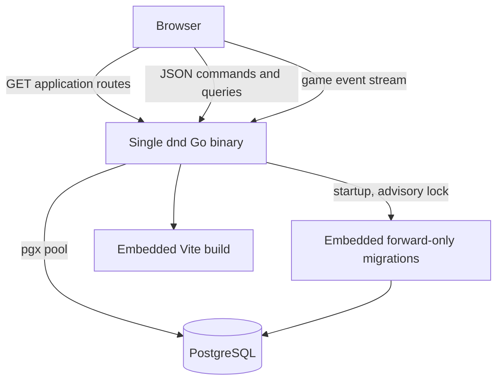
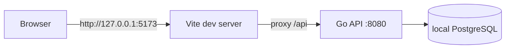
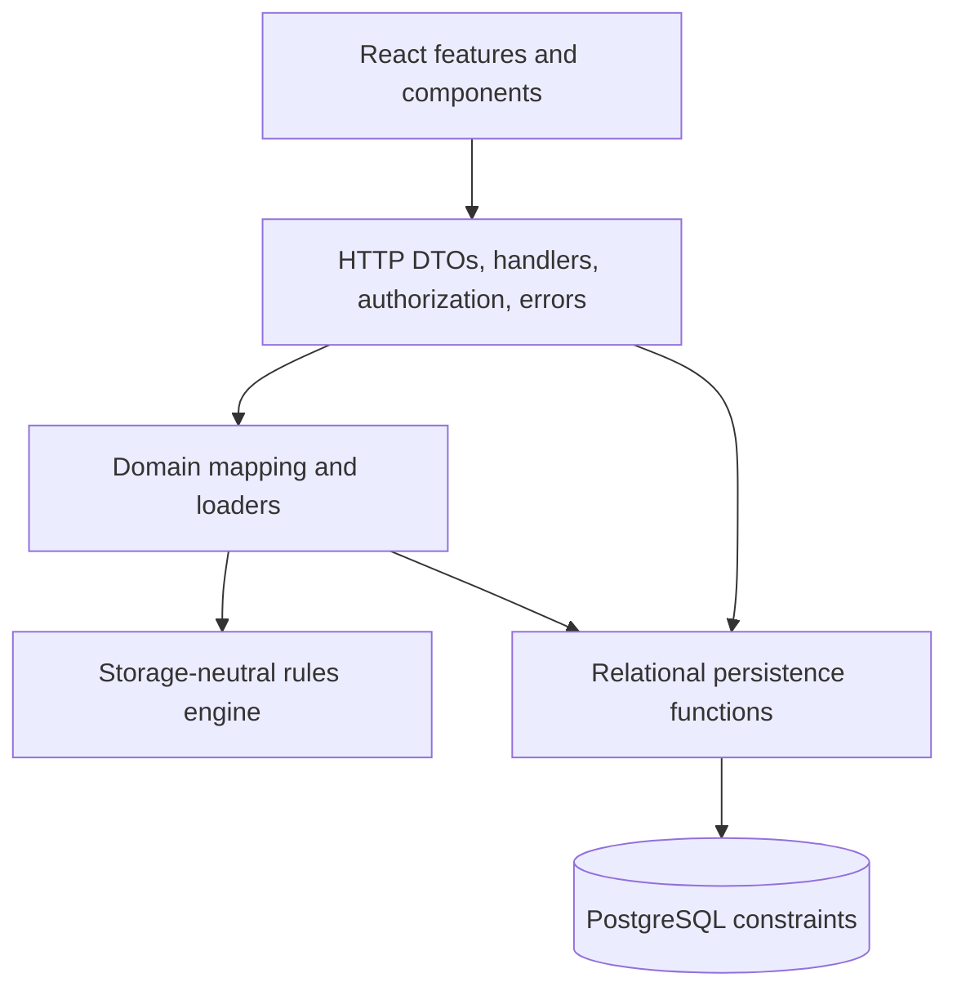
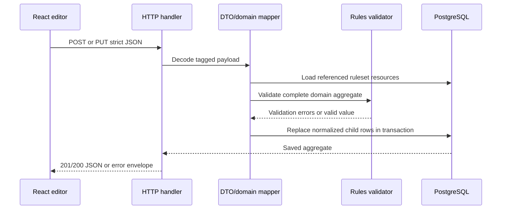
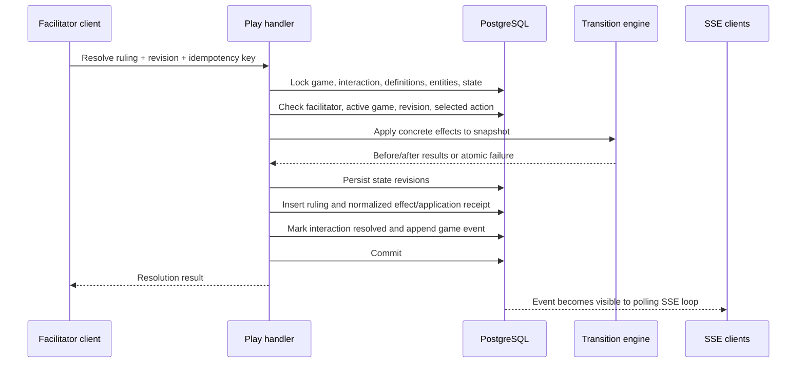

# Architecture

## Purpose and boundaries

The application is a configurable typed state-transition system. It lets users
author a mechanical vocabulary without baking a particular game world's
ontology into the codebase. That vocabulary can then be exercised by either a
configured problem simulator or an improvised multiplayer game loop.

The system owns:

- ruleset-scoped configuration and generic entities;
- typed entity state and optimistic revisions;
- reusable conditions and configured problem definitions;
- configured problem instances and choice resolution;
- development users, games, memberships, entity assignment, and live
  interactions;
- atomic application and immutable receipts for live rulings;
- the authoring and Play browser interface.

The system does not currently own:

- production authentication, sessions, passwords, or an identity provider;
- a built-in game ontology, entity taxonomy, or seed ruleset;
- cross-ruleset inheritance or sharing;
- matchmaking, chat, files, maps, dice, or turn scheduling;
- background job processing or an external event broker;
- a public compatibility/versioning promise for the HTTP API.

## Runtime topology

### Production



The binary starts by loading environment configuration, configuring structured
JSON logging, opening a `pgxpool`, pinging PostgreSQL, applying every unapplied
embedded migration, constructing the HTTP server, and listening. `SIGINT` and
`SIGTERM` trigger a bounded HTTP shutdown attempt with a ten-second deadline.
Active request contexts are not derived from the process root context, so an
open SSE handler can consume that deadline before it disconnects or a write
fails.

The HTTP server sends `/api` and `/api/*` to a method-aware API mux. All other
GET paths use static-file serving with SPA fallback to `index.html`. Missing
asset paths under `/assets/` do not receive the SPA fallback.

### Local development



`./run.sh` builds and manages the Go process and starts Vite. PID files and
logs are stored below ignored `.dnd/`. The frontend preserves normal relative
`/api` calls in both topologies.

## Architectural layers



### Browser layer

The React application is a client-rendered SPA with a small history-based route
helper rather than an external router. Feature screens own server collections
and edit drafts. Shared components provide workspaces, typed value editors, and
effect editors. Ordinary JSON calls pass through one fetch adapter, which adds
JSON headers, maps the error envelope, and attaches the selected development
user when present. The game-event hook uses a separate streaming `fetch`, adds
the identity header itself, reconnects with its cursor, and keeps a three-second
query-polling fallback active.

### HTTP/application layer

`internal/app` owns the transport and database orchestration:

- API DTOs model tagged JSON unions and protect numeric parsing.
- Handlers perform path/body validation and translate errors to HTTP.
- Mapping files convert DTOs and rows to storage-neutral domain types.
- Store files save and load normalized relational aggregates.
- Domain loaders assemble ruleset snapshots needed by the engine.
- Live Play handlers apply identity, membership, role, visibility, and
  game-entity boundaries.
- Transaction orchestration supplies consistent snapshots, locks mutable roots,
  checks revisions, calls the rules engine, and persists atomically.

The application layer deliberately does not place SQL or HTTP concerns in the
rules engine.

### Rules engine

`internal/rules` is pure Go and storage-neutral. IDs are non-empty stable
strings, so the engine does not depend on PostgreSQL UUIDs. It validates
definitions, state, condition bindings, problem bindings, effect plans, and
snapshots. It evaluates three-valued conditions and applies ordered transition
plans to cloned in-memory snapshots.

The engine does not increment revisions, write receipts, acquire locks, or
commit transactions. Those are adapter responsibilities.

### Persistence layer

PostgreSQL is the authoritative store. Configuration aggregates are normalized
across typed relational tables. Foreign keys carry ruleset IDs where needed to
make cross-ruleset references structurally impossible. Check constraints mirror
important tagged-union shapes, bounds, statuses, and lifecycle invariants.

Application validation provides useful field messages; database constraints
remain the final integrity boundary.

## Major data flows

### Authoring a configuration aggregate



PUTs for owner schemas, entities, state variables, conditions, and problems are
aggregate replacements. Nested child IDs preserve durable identity when they
are supplied. New nested resources receive generated UUIDs in the mapping
layer. Archive commands are explicit POSTs and keep historical references
intact.

### Configured choice resolution

```mermaid
sequenceDiagram
    participant UI as Runtime screen
    participant H as Resolution handler
    participant DB as PostgreSQL
    participant R as Rules engine

    UI->>H: Preview/resolve choice + expected revisions
    H->>DB: Load definition, bindings, entities, conditions, state
    H->>R: ResolveChoice(snapshot)
    R->>R: Validate availability and resolution conditions
    R->>R: Select outcome and apply ordered effects
    R-->>H: unavailable, incomplete, or applied result
    alt preview
        H-->>UI: Advisory result; transaction remains read-only
    else resolve
        H->>DB: Verify guards and persist changed records atomically
        H-->>UI: Authoritative result
    end
```

Availability is a conjunction of the problem guard and the selected choice
guard. An unmet guard makes the choice unavailable even if another guard is
unknown. If no guard is unmet but one is unknown, resolution is incomplete.

### Live interaction resolution



The transaction is the consistency boundary: state, interaction lifecycle,
receipt, selected/declined action statuses, and game event either all commit or
all roll back. Reusing the same idempotency key with an equivalent request
returns the immutable ruling and applied effects with `replayed: true`; using it
for different content is a conflict. Replay state records are loaded at replay
time, so they may be newer than the state returned by the original request.
Replay also passes through the current identity, facilitator, and active-game
checks.

## Consistency and concurrency

The system uses three complementary mechanisms:

1. **Optimistic revisions.** Clients send expected state, binding, membership,
   game, interaction, or action revisions for overwrite-sensitive commands.
   Stale requests receive `409 revision_conflict`.
2. **Row locks and ordered locking.** Mutation transactions lock aggregate
   roots and state rows before rechecking guards. Entity and definition IDs are
   sorted where a stable lock order matters.
3. **Database constraints.** Uniqueness, foreign keys, typed shapes, lifecycle
   checks, and immutability triggers protect against invalid writes from any
   application path.

Read paths that assemble multi-table aggregates commonly use read-only
`REPEATABLE READ` transactions so a response cannot mix revisions.

## Events and freshness

Game-scoped Play mutations append rows to `game_events`. Trusted ruleset
authoring endpoints can also change entities, state, or configuration visible
to a game, but they neither consult game status nor append game events. The
browser opens an SSE request to `GET /api/games/{game_id}/events`, providing an
`after` cursor or `Last-Event-ID`. The server emits event IDs and JSON event
payloads and sends periodic keep-alive comments. Events are hints that cause the
client to reload authoritative resources; they are not a full state-replication
protocol.

There is no external broker. Each stream handler polls PostgreSQL, so capacity
planning must include one open request and recurring event queries per connected
game client. The current Go server's 30-second write deadline bounds each
HTTP/1 stream; the browser hook reconnects with its last cursor when a stream
ends.

## Repository layout

| Path                            | Responsibility                                                                          |
| ------------------------------- | --------------------------------------------------------------------------------------- |
| `cmd/dnd/`                      | Executable entrypoint, process lifecycle, and HTTP server startup.                      |
| `internal/rules/`               | Pure domain types, validation, condition evaluation, and state transitions.             |
| `internal/app/`                 | HTTP DTOs/handlers, persistence, authorization, mapping, and transaction orchestration. |
| `internal/migrations/`          | Embedded forward-only PostgreSQL schema migrations.                                     |
| `web/frontend/`                 | React/Vite authoring and Play SPA.                                                      |
| `web/static/`                   | Ignored frontend build output embedded by Go; only a placeholder is tracked.            |
| `web/static.go`                 | `embed.FS` declaration for production frontend files.                                   |
| `test/`                         | Playwright harness, disposable database management, and end-to-end scenarios.           |
| `ci.sh`                         | Isolated validation orchestrator.                                                       |
| `run.sh`                        | Managed local backend/frontend processes.                                               |
| `railpack.json`, `railway.toml` | Railway build and deployment configuration.                                             |

## Design constraints for future changes

- Keep fictional vocabulary in ruleset configuration, not Go constants,
  migrations, or seed data.
- Do not make a configured key privileged. Reference durable IDs and declared
  relationships.
- Preserve normalized relational storage as the authoritative model. JSON may
  be a transport representation, but not the canonical persisted aggregate.
- Keep rules engine functions deterministic and independent of HTTP, SQL,
  clocks, or authentication.
- Validate at both the domain and database boundaries.
- Route both configured and improvised mutations through `TransitionPlan` so
  their mechanics cannot drift.
- Treat receipts and events as history. Add new facts instead of rewriting
  applied history.
- Keep player-facing reads game-scoped and filtered; do not expose generic
  builder endpoints as a substitute for a player API.
