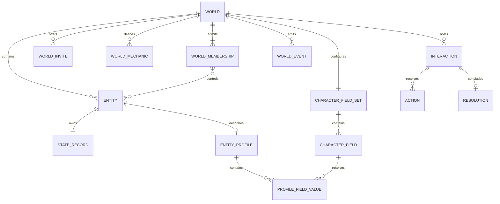

# Domain model

## Model overview

Worldwright separates world membership, user-authored mechanics, fictional
entities, and improvised live play. Nothing in the mechanical vocabulary is
globally special: every mechanic name and entity is created by a user inside a
world. Problems exist only as live interactions created at the table.



## World product model

A world is the single authorization, configuration, entity, live-play, and
event boundary. It owns lifecycle and table revisions. A world membership has
an `owner`, `editor`, `player`, or `spectator` role; owners and editors have
facilitator authority during play.

A world mechanic is a scalar state definition with an author-facing
classification:

- a capacity is a numeric `score` or `pool`;
- a capability is a Boolean `binary` value or numeric `rating`;
- `mutable_during_play` determines whether a live ruling may target it.

The classification adds no canonical name, entity class, or special key.

World problems are interactions: prompt-first, free-form moments created by a
facilitator during play. Their audience, responders, context entities, player
actions, ruling, requested effects, and before/after receipt are captured
relationally.

A character is a product projection over an ordinary world entity. It becomes
a character when at least one active player-control relationship points to it.
Control is many-to-many, permitting troupe play and shared characters without
introducing an engine class.

## Authored identity and scope

The world is the isolation boundary for mechanics, entities, memberships,
interactions, receipts, and events. Durable resources use UUIDs. Human-readable
names are authored presentation and have no privileged meaning in application
code. Composite foreign keys carry `world_id` so relationships cannot cross
worlds when application code is bypassed.

## Entities, character fields, and profiles

An entity is a durable fictional state owner with a display name, archive
state, and one optimistic state revision. Creating an entity also creates its
empty state-record root.

Each world owns one independently revisioned, ordered set of active character
fields. A field has a durable UUID, user-authored label, optional guidance,
position, and visibility:

- `table` is readable by every active world member;
- `controllers-and-facilitators` is readable only by the entity's active player
  controllers and world owners/editors.

Every active field is required for every controlled entity. Requiredness is a
property of membership in the active field set, not a separate flag. Labels
such as “Backstory,” “Appearance,” or “Goals” are entirely user-authored. The
database seeds no field vocabulary and stores no canonical JSON profile.
Replacing the field set is atomic; omitted fields are archived, while their
definitions and existing values remain relationally retained.

Any entity may have one profile root with its own optimistic revision. Its
value rows connect that entity to configured fields and contain non-empty plain
text. A complete replacement may omit fields, allowing an incomplete draft to
be saved. It must match both the profile revision and field-set revision so a
draft cannot silently ignore a concurrent schema change.

Owners/editors may edit any active entity profile. An active player may edit a
profile only while their world membership controls that entity. Control
removal, leaving, or a role change revokes edit authority without deleting the
profile. Ordinary admitted members receive only completed table-visible values.

Completion and live-play admission are derived, never stored. An uncontrolled
entity is `not-controlled`. A controlled entity is `setup-required` while any
active field lacks a non-empty value and `ready` otherwise; with zero fields it
is immediately ready. An active world player is `waiting-for-character` with no
control, `setup-required` when every controlled entity is incomplete, and
`ready` once at least one controlled entity is ready.

Profile prose is not mechanical state. It cannot change mechanic applicability,
be targeted by effects, or advance the entity-state revision.

## Capacities and capabilities

World mechanics are scalar numeric or Boolean definitions:

| Product kind | Mode     | Scalar  | Authorable metadata                           |
| ------------ | -------- | ------- | --------------------------------------------- |
| Capacity     | `score`  | Number  | Default, optional bounds/step/unit            |
| Capacity     | `pool`   | Number  | Default, optional bounds/step/unit            |
| Capability   | `binary` | Boolean | Boolean default                               |
| Capability   | `rating` | Number  | Default, optional bounds/step/unit            |

Numbers use exact PostgreSQL `numeric` and exact Go decimal arithmetic. HTTP
numbers are decoded with `json.Number`; the backend does not intentionally
round-trip them through `float64`. The TypeScript client uses JavaScript
numbers, so extremely large or precise values still require care in a browser.

Every mechanic applies to every entity in the world. There is no applicability
taxonomy, built-in class, or manufactured catch-all resource.

Archiving a mechanic removes it from current sheet presentation and new live
effects while retaining stored values and receipts so history remains
interpretable.

## Logical state

`state_records` provides one revision root per entity. Relational scalar rows
store overrides by mechanic ID. Missing storage materializes the mechanic's
authored default, so a new entity immediately has a complete generated sheet
without redundant value rows.

State responses contain:

- `values`: materialized logical number/Boolean values;
- `defaulted_mechanic_ids`: mechanics whose value came from the default;
- `revision`: the optimistic state revision.

A full state replacement supplies the desired logical values, not a patch.
Values equal to their authored defaults normalize back to absence. A semantic
no-op keeps the current revision; a real change advances it.

## Participants, memberships, and invitations

A `user` represents a real participant. A `world_membership` grants an owner,
editor, player, or spectator role and lifecycle status. Owners and editors have
facilitator authority; players may respond when admitted and ready.

An invite is an expiring and revocable bearer grant for a non-owner role. The
raw URL-safe token is returned only when the invite is created. PostgreSQL
stores its SHA-256 digest, and a redemption row makes use counting idempotent
per invite/user pair. Redeeming a valid link creates or reactivates one world
membership without escalating an already-active member.

The current identity boundary is only `X-DND-User-ID`. The server derives the
actor from that header and then enforces membership and roles, but the header is
forgeable and is not production authentication.

## World table scope and control

`world_membership_entity_controls` is the only character-authority edge. An
active player may control multiple entities, and an entity may have multiple
active player controllers. An optional acting entity on an action must be both
controlled by the submitting player and complete at submission time. The
accepted action snapshots its display name for stable history.

The world's `table_revision` guards complete controller-set replacements. It
advances when table-scoped membership/control state changes independently of
the world settings revision.

Readiness gates the live table for players. Onboarding players remain active
world members so they can read and edit authorized character profiles, but
interactions/events return `character_setup_required` until at least one
controlled character is ready. Incomplete entities cannot be new interaction
context, acting-entity attribution, or live-effect targets.

## Interactions and actions

An interaction is an improvised live problem with this lifecycle:

```text
draft ──present──> open ──adjudicate──> adjudicating ──resolve──> resolved
  └────────────────────── cancel ──────────────────────────────> cancelled
```

- `draft`: facilitator-editable prompt and audience setup;
- `open`: visible to its audience and accepting eligible player actions;
- `adjudicating`: submissions are closed and the interaction is hidden from
  non-facilitators;
- `resolved`: immutable ruling and applied receipt exist;
- `cancelled`: final without a ruling.

An interaction stores an optional title, required prompt, facilitator-private
notes, audience memberships, eligible responders, and ordered context entities.
Presentation requires at least one audience member. Eligible responders are an
active, ready player subset of the audience.

Each eligible player may have at most one submitted action. The player may
withdraw it while the interaction is open. During adjudication the facilitator
may select one submitted action or explicitly select none.

Non-facilitators may read only open/resolved interactions in whose audience they
participate. Responses omit private notes and facilitator-only receipt fields.

## Effects and transition semantics

A live ruling may be narrative-only or include ordered effects against
mechanics marked `mutable_during_play`:

| Operation       | Mechanic | Behavior                                      |
| --------------- | -------- | --------------------------------------------- |
| `set`           | Any      | Replaces a numeric or Boolean logical value.  |
| `adjust-number` | Numeric  | Adds an exact amount, then validates the result. |

Every target entity must belong to the world, be active and eligible, and own a
state root. An effect value must match the mechanic kind; numeric results must
satisfy configured bounds and step.

Effects execute in author order and observe earlier effects in the same plan.
The pure engine clones its input snapshot before applying anything. If any
effect fails, it returns no partially usable result. The application adds
database transaction atomicity.

Preview runs the same validation and application logic without persisting.
Resolve locks the relevant lifecycle/configuration/state roots, rechecks
revisions, applies the plan, and commits state plus history together.

## Resolution receipts and events

A resolved interaction owns one immutable resolution containing:

- public narrative and optional facilitator-private notes;
- selected action, if any;
- resolving facilitator and idempotency key;
- ordered requested effects and concrete targets;
- ordered applications with `changed`, `before`, and `after` values;
- affected state records after commit.

Resolution is unique per interaction. A world-scoped idempotency key makes retry
safe: equivalent reuse returns the existing receipt with `replayed: true`,
while different content conflicts. Replay rebuilds current state records rather
than pretending the original response snapshot is still current.

The receipt tree and final interaction root are protected from mutation by
database triggers. A committed ruling, its state changes, receipt, action
statuses, interaction lifecycle, and world event share one transaction.

`world_events` is an append-only monotonic cursor used for SSE invalidation. Its
payload carries event and related resource IDs rather than state snapshots.
Clients reconnect with their last cursor and reload authoritative resources.

## Revisions and lifecycle rules

Optimistic revisions protect world details, the world table, character-field
sets, profiles, entity state, memberships, interactions, and action
submissions. A stale command returns `409 revision_conflict`. Preview does not
reserve a revision; resolve must use fresh authoritative values.

Archive and final-state rules include:

- archived mechanics cannot be used by new effects;
- archived entities reject setup/profile mutation and new live references;
- a world cannot archive while an interaction is unfinished;
- resolved/cancelled interactions and applied receipts remain readable history.

Configuration and state are normalized relational data. JSON is a transport
shape, never the canonical persisted aggregate, and no migration seeds a world
vocabulary.
