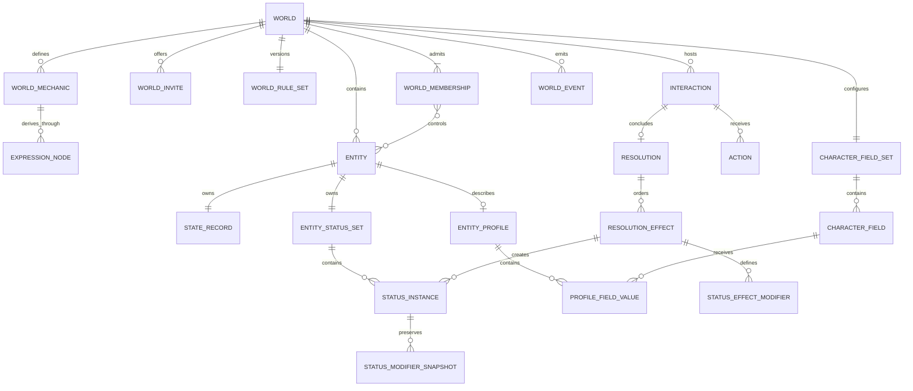

# Domain model

## Model overview

dnd separates world membership, user-authored mechanics, fictional
entities, and improvised live play. Nothing in the mechanical vocabulary is
globally special: every mechanic name and entity is created by a user inside a
world. Problems exist only as live interactions created at the table.



## World product model

A world is the single authorization, configuration, entity, live-play, and
event boundary. It owns lifecycle and table revisions. A world membership has
an `owner`, `editor`, `player`, or `spectator` role; owners and editors have
facilitator authority during play.

The world setting `dm_source` is either `human` or `terra` and defaults to
`human`. It decides whether a facilitator writes consequence prose or asks the
Auto DM to write it. In Terra mode the world description also serves as the
campaign brief supplied to generation; it remains ordinary user-authored world
prose rather than a privileged rules field.

A world mechanic is a typed scalar state definition with an author-facing
classification and a source:

- a capacity is a numeric `score` or `pool`;
- a capability is a Boolean `binary` value or numeric `rating`;
- an `input` owns a default and optional stored override;
- a `derived` owns a typed expression over other mechanics;
- `mutable_during_play` determines whether a live Consequence may directly
  target an input with a scalar `set` or `adjust-number` effect; it does not
  restrict status modifiers.

The classification adds no canonical name, entity class, or special key.

World problems are interactions: prompt-first, free-form moments created during
play by a facilitator or, in Terra mode, proposed by the Auto DM. Their
audience, responders, context entities, player actions, Consequence, requested
effects, and before/after receipt are captured relationally. A Consequence is
one prose account of what transpires plus ordered targeted effects compiled
from that prose. An apply-status effect defines its name, optional description,
and modifiers in that problem; it is not selected from world configuration.

A character is a product projection over an ordinary world entity. It becomes
a character when at least one active player-control relationship points to it.
Control is many-to-many, permitting troupe play and shared characters without
introducing an engine class.

## Authored identity and scope

The world is the isolation boundary for mechanics, entities, memberships,
interactions, receipts, and events. Durable resources use UUIDs. Human-readable
names are authored presentation and have no privileged meaning in application
code. Composite foreign keys carry `world_id` so relationships cannot cross
worlds when application code is bypassed.

## Entities, character fields, and profiles

An entity is a durable fictional state owner with a display name, archive
state, one optimistic base-state revision, and one independent runtime-status
revision. Creating an entity also creates its empty state-record and status-set
roots.

Each world owns one independently revisioned, ordered set of active character
fields. A field has a durable UUID, user-authored label, optional guidance,
position, and visibility:

- `table` is readable by every active world member;
- `controllers-and-facilitators` is readable only by the entity's active player
  controllers and world owners/editors.

Every active field is required for every controlled entity. Requiredness is a
property of membership in the active field set, not a separate flag. Labels
such as “Backstory,” “Appearance,” or “Goals” are entirely user-authored. The
database seeds no field vocabulary and stores no canonical JSON profile.
Replacing the field set is atomic; omitted fields are archived, while their
definitions and existing values remain relationally retained.

Any entity may have one profile root with its own optimistic revision. Its
value rows connect that entity to configured fields and contain non-empty plain
text. A complete replacement may omit fields, allowing an incomplete draft to
be saved. It must match both the profile revision and field-set revision so a
draft cannot silently ignore a concurrent schema change.

Owners/editors may edit any active entity profile. An active player may edit a
profile only while their world membership controls that entity. Control
removal, leaving, or a role change revokes edit authority without deleting the
profile. Ordinary admitted members receive only completed table-visible values.

Completion and live-play admission are derived, never stored. An uncontrolled
entity is `not-controlled`. A controlled entity is `setup-required` while any
active field lacks a non-empty value and `ready` otherwise; with zero fields it
is immediately ready. An active world player is `waiting-for-character` with no
control, `setup-required` when every controlled entity is incomplete, and
`ready` once at least one controlled entity is ready.

Profile prose is not mechanical state. It cannot change mechanic applicability,
be targeted by effects, or advance the entity-state revision.

## Capacities, capabilities, and the mechanic graph

World mechanics are scalar numeric or Boolean definitions. Product kind and
mode determine the scalar kind; `source_kind` determines where its value comes
from:

| Product kind | Mode     | Scalar  | Input metadata                     | Derived metadata          |
| ------------ | -------- | ------- | ---------------------------------- | ------------------------- |
| Capacity     | `score`  | Number  | Default, optional bounds/step/unit | Expression, optional unit |
| Capacity     | `pool`   | Number  | Default, optional bounds/step/unit | Expression, optional unit |
| Capability   | `binary` | Boolean | Boolean default                    | Boolean expression        |
| Capability   | `rating` | Number  | Default, optional bounds/step/unit | Expression, optional unit |

Numbers use exact PostgreSQL `numeric` and immutable exact Go decimal
arithmetic. Exact decimal values cross HTTP as strings, responses are
canonicalized, and the values remain strings in the TypeScript client, so
ordinary JSON parsing cannot round large or highly precise values. JSON number
tokens are reserved for inherently integral transport values such as revisions,
counts, positions, and priorities.
The Go `Decimal` zero value is numeric zero; optionality is represented only by
`*Decimal` fields, and external text enters the domain through `ParseDecimal`.

Every mechanic applies to every entity in the world. There is no applicability
taxonomy, built-in class, or manufactured catch-all resource. Derived
mechanics have no default, bounds, step, stored row, or direct-play mutability.

A derived expression is a recursive typed tree whose leaves are typed literals
or stable mechanic-ID references. Supported internal operations are numeric
addition, subtraction, multiplication, minimum, maximum, and negation; Boolean
`and`, `or`, and `not`; equality; numeric comparisons; and a typed `if`.
References consume the dependency's effective value, not merely its stored
input. The collection of references across a world is therefore a directed
dependency graph even though each expression is represented as a tree.

Every mechanic save validates the proposed complete world graph. Type
inference verifies every node's arity and scalar kind, references must remain
inside the world and cannot point at an archived dependency from an active
mechanic, and cycle detection reports a concrete dependency path. Any error
rejects the whole save before the rules revision advances. Evaluation uses a
compiled dependency order and also detects a cycle defensively at runtime.
Literal status modifiers authored in a Consequence introduce no dependency
edges, so they cannot create a second kind of graph cycle.

Archiving a mechanic removes it from current sheet presentation and new live
effects while retaining stored values and receipts so history remains
interpretable. An active mechanic cannot be archived while an active derived
mechanic depends on it or an active status modifier targets it. Archive the
derived dependents and remove the active statuses first. Existing problem
receipts and removed status snapshots retain their references for history.

## Base, intrinsic, and effective state

`state_records` provides one revision root per entity. Relational scalar rows
store input overrides by mechanic ID. Missing input storage materializes the
mechanic's authored default, so a new entity immediately has a complete
generated sheet without redundant value rows. Derived values are never stored
in `state_values`.

Evaluation distinguishes three layers:

1. An input's intrinsic value is its stored override or authored default.
2. A derived mechanic's intrinsic value is its expression result; references
   recursively consume the effective values of dependencies.
3. A mechanic's effective value is its intrinsic value after all active status
   modifiers targeting that mechanic have run.

```mermaid
flowchart LR
    Base["Stored override or input default"] --> InputIntrinsic["Input intrinsic"]
    InputIntrinsic --> InputModifiers["Literal modifiers targeting input"]
    InputModifiers --> InputEffective["Input effective"]
    InputEffective --> DerivedExpression["Derived expression reference"]
    DerivedExpression --> DerivedIntrinsic["Derived intrinsic"]
    DerivedIntrinsic --> DerivedModifiers["Literal modifiers targeting derived"]
    DerivedModifiers --> DerivedEffective["Derived effective"]
```



This ordering makes changes propagate naturally. A status that adds to an
input affects every derived mechanic that references it, while a modifier on a
derived mechanic layers over that derived expression's result. Evaluation is
pure and memoized for one entity snapshot; it either returns the complete
result or no result.

State responses contain:

- `values`: materialized logical input values only;
- `effective_values`: calculated values for all active and retained mechanics;
- `evaluations`: source, presence, intrinsic/effective values, and applied
  modifier explanations by mechanic;
- `active_statuses`: active instance names/descriptions, source interaction,
  resolution, and effect IDs, and snapshotted modifiers;
- `defaulted_mechanic_ids`: inputs whose value came from the default;
- state, status-set, and world-rules revisions.

A full state replacement supplies the desired logical input values, not a
patch, and rejects derived IDs. It must match both the entity-state revision
and the world mechanic-rules revision. Values equal to their authored defaults
normalize back to absence.

The same separation applies during Consequences: scalar `set` and `adjust-number`
read and mutate the logical base input, never its status-modified effective
value. Active modifiers are reapplied by evaluation after the base transition;
their adjustments do not get baked into `state_values`.

## Problem-authored status instances

Statuses are live consequences, not world configuration. During adjudication,
an `apply-status` effect defines a required name, optional description, and an
ordered list of modifiers inline. A modifier names one mechanic, one literal
typed operand, an operation, and an integer priority. `set` must match the
mechanic's scalar kind; `add-number` and `multiply-number` require numeric
mechanics and operands. An empty modifier list is valid for a purely named
fictional condition.

Each apply target creates a durable entity status instance. The instance
snapshots the inline name, description, and modifiers and records the source
interaction, resolution, and effect. Status names are presentation rather than
identity, so independently authored same-name statuses may coexist. A later
Consequence removes one by supplying the exact active `status_instance_id` for
its entity target; an unknown, removed, cross-world, or mismatched instance is
a stale or invalid target rather than a name-based lookup. Removal retains the
instance and its source receipt as history. Resolve-level idempotency prevents
an equivalent retry from creating or removing an instance twice.

For each mechanic, active modifiers execute by ascending priority, status
application order, status-instance ID, modifier position, and modifier ID. The
last ID comparisons make the order total and reproducible even if query order
changes. Exact decimal arithmetic is used throughout.

## Participants, memberships, and invitations

A `user` represents a real participant and owns a case-insensitive username,
display name, Argon2id password hash, and account status. Authentication binds
an opaque server session to that user. A `world_membership` grants an owner,
editor, player, or spectator role and lifecycle status. Owners and editors have
facilitator authority; players may respond when admitted and ready.

An invite is an expiring and revocable bearer grant for a non-owner role. The
raw URL-safe token is returned only when the invite is created. PostgreSQL
stores its SHA-256 digest, and a redemption row makes use counting idempotent
per invite/user pair. Redeeming a valid link creates or reactivates one world
membership. An already-active membership keeps its current role, so a bearer
link cannot silently escalate or downgrade it.

The server derives the actor only from an active, unexpired session and then
enforces membership and roles. User UUIDs remain durable internal identifiers,
but sending one in a header or command body does not authenticate or select an
actor.

## World table scope and control

`world_membership_entity_controls` is the only character-authority edge. An
active player may control multiple entities, and an entity may have multiple
active player controllers. An optional acting entity on an action must be both
controlled by the submitting player and complete at submission time. The
accepted action snapshots its display name for stable history.

The world's `table_revision` guards complete controller-set replacements. It
advances when table-scoped membership/control state changes independently of
the world settings revision.

Readiness gates the live table for players. Onboarding players remain active
world members so they can read and edit authorized character profiles, but
interactions/events return `character_setup_required` until at least one
controlled character is ready. An active uncontrolled entity or ready
controlled entity may be interaction context or a live-effect target; a
setup-required controlled entity may not. Acting-entity attribution also
requires the submitting player to control the ready entity.

## Interactions and actions

An interaction is an improvised live problem with this lifecycle:

```text
draft ──present──> open ──adjudicate──> adjudicating ──resolve──> resolved
  └────────────────────── cancel ──────────────────────────────> cancelled
```

- `draft`: facilitator-editable prompt and audience setup;
- `open`: visible to its audience and accepting eligible player actions;
- `adjudicating`: submissions are closed and the interaction is hidden from
  non-facilitators;
- `resolved`: immutable Consequence and applied receipt exist;
- `cancelled`: final without a Consequence.

An interaction stores an optional title, required prompt, facilitator-private
notes, audience memberships, eligible responders, and ordered context entities.
Presentation requires at least one audience member. Eligible responders are an
active, ready player subset of the audience.

Each eligible player may have at most one submitted action. The player may
withdraw it while the interaction is open. During adjudication the compiled
Consequence may identify one submitted action or explicitly select none.

Non-facilitators may read only open/resolved interactions in whose audience they
participate. Responses omit private notes and facilitator-only receipt fields.

## Consequences and transition semantics

A problem's Consequence contains exactly one prose summary and an ordered list
of zero or more scalar and status effects:

| Operation       | Target                                | Behavior                                                  |
| --------------- | ------------------------------------- | --------------------------------------------------------- |
| `set`           | Mutable input on one or more entities | Replaces a numeric or Boolean logical input value.        |
| `adjust-number` | Mutable numeric input on entities     | Adds an exact amount, then validates the stored result.   |
| `apply-status`  | Entities plus one inline status       | Creates a distinct snapshotted instance for every target. |
| `remove-status` | Exact active instance per entity      | Removes only the identified persistent status instance.   |

Every target entity must belong to the world, be active and eligible, and own a
state root. An effect value must match the mechanic kind; numeric results must
satisfy configured bounds and step.

The prose is the authoring surface and immutable input to compilation. In a
`human` world the facilitator writes it; in a `terra` world GPT-5.6 Terra writes
it from the current table snapshot. GPT-5.6 Luna then returns a strict
structured interpretation containing an optional selected action/summary and
zero or more effects. Compilation neither rewrites the prose nor persists a
Consequence. It runs the existing advisory preview and returns its concrete
effects so the facilitator can submit those same values to the ordinary
resolve command.

Effects execute in author order. A scalar effect observes earlier scalar
changes to the same logical base input. Status lifecycle effects validate their
ordered entity/instance targets, but applying a status does not change the
operand seen by a later scalar adjustment—status modifiers are evaluation
layers, not stored values. After the ordered transition, the engine evaluates
the resulting base state and active statuses together. It clones both input
snapshots first, and any effect or evaluation failure returns no partially
usable result. The application adds database transaction atomicity.

Preview optionally runs the same validation and application logic without
persisting. It is advisory and does not reserve a revision or need to precede
resolution. Auto DM compilation uses this same preview path; model output never
bypasses world scope, mutability, type, bound, status, lifecycle, or revision
checks. Resolve remains the only path that locks the relevant roots, rechecks
revisions, applies the plan, and commits state plus history together.

## Resolution receipts and events

A resolved interaction owns one immutable resolution representing its
Consequence and containing:

- the public prose summary in the transport field `narrative` and optional
  facilitator-private notes;
- selected action, if any;
- resolving facilitator and idempotency key;
- ordered requested effects and concrete targets, including each inline apply
  specification and each exact remove-instance target;
- ordered scalar applications with `changed`, `before`, and `after` values;
- ordered status applications with snapshotted names, exact instance IDs, and
  before/after active flags;
- every changed effective value, including transitive derived changes that
  were not directly targeted;
- the exact mechanic rules revision used for evaluation;
- affected state records after commit.

Resolution is unique per interaction. A world-scoped idempotency key makes retry
safe: equivalent reuse returns the existing receipt with `replayed: true`,
while different content conflicts. Replay rebuilds current state records rather
than pretending the original response snapshot is still current.

The receipt tree and final interaction root are protected from mutation by
database triggers. A committed Consequence, its state changes, receipt, action
statuses, interaction lifecycle, and world event share one transaction.

`world_events` is an append-only monotonic cursor used for SSE invalidation. Its
payload carries event and related resource IDs rather than state snapshots.
Clients reconnect with their last cursor and reload authoritative resources.

## Revisions and lifecycle rules

Optimistic revisions protect world details, complete controller-set
replacements through the world table, character-field sets, profiles, entity
state, interactions, action submissions, and the world mechanic graph. Each
entity also has a status-set revision.
Mechanic mutations advance the world-rules counter. State replacement,
preview, and resolve carry `expected_rules_revision`; status modifiers authored
inside a Consequence are validated against that exact mechanic graph, and the
applied resolution receipt retains the matched revision. A stale command
returns `409 revision_conflict`. Preview does not reserve a revision; resolve
must use fresh authoritative values. Applying or removing a status does not
publish configuration or advance the mechanic graph revision.

Archive and final-state rules include:

- archived mechanics cannot be used by new effects;
- derived mechanics cannot be stored or directly targeted by scalar effects;
- archived entities reject setup/profile mutation and new live references;
- a world cannot archive while an interaction is unfinished;
- resolved/cancelled interactions and applied receipts remain readable history.

Configuration and state are normalized relational data. JSON is a transport
shape, never the canonical persisted aggregate, and no migration seeds a world
vocabulary.
