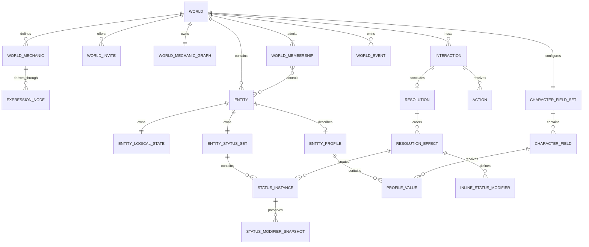

# Domain model

## Model overview

Gezerah separates world membership, user-authored mechanics, fictional
entities, and improvised live play. Nothing in the mechanical vocabulary is
globally special: every mechanic name and entity is created by a user inside a
World. Problems exist only as live Interactions created during Play.



## World product model

A world is the single authorization, configuration, entity, live-play, and
event boundary. It owns lifecycle and roster revisions. A World membership has
an `owner`, `editor`, `player`, or `spectator` membership role. That membership role controls
Build access and survives every Facilitator reassignment; it is not the membership's
momentary current play role in Play.

Exactly one facilitator assignment identifies the Facilitator. Its source
is `human`, with one active non-spectator `facilitator_membership_id`, or a
non-membership `terra` or `agent` source. A new world's owner is its initial
human facilitator. The assignment derives each membership's `current_play_role`:
the designated human is `facilitator`, a spectator remains `spectator`, and
every other active non-spectator is a `player`, including owners and editors.
Changing the assignment does not rewrite any durable membership role.

The assignment is represented by its `facilitator_source` and, for a human,
its membership. Facilitator reassignment is a separate world-revisioned
command, not an ordinary settings patch. An owner/editor or the current human
facilitator may reassign the Facilitator assignment to another
active non-spectator, Terra, or an agent, but only when no Interaction
is draft, open, or adjudicating. The narrow recovery exception lets the owner
assign themself when
the sole unfinished interaction is authored by the currently assigned Terra
source and is open or adjudicating;
the owner's submitted action is withdrawn before they continue as human Facilitator. In
Terra mode the world description also serves as the world
brief supplied to generation; it remains ordinary user-authored prose rather
than a privileged rules field.

A World may also carry an optional prose guide. It is nonsecret,
nonmechanical settings text for the expression of model-authored public
Problems and Consequences. It may shape diction, rhythm, narrative distance,
imagery, dialogue, and how in-world specialized language is attributed. It
cannot establish World facts, override Mechanics or authority, disclose
restricted information, direct tools, or choose a player's Action. Terra and
the ChatGPT page agent apply the current guide when authoring new prose; Luna
does not receive it when compiling Effects. A guide edit shares the World
settings revision and never rewrites existing Problems, Consequences, or
history.

A world Mechanic is a typed scalar definition with an author-facing
classification and a source:

- a capacity is a numeric `score` or `pool`;
- a capability is a Boolean `binary` value or numeric `rating`;
- an `input` owns an authored default and optional stored override;
- a `derived` owns a typed expression over other mechanics;
- `mutable_during_play` determines whether a live Consequence may directly
  target an input with a scalar `set` or `adjust-number` effect; it does not
  restrict status modifiers.

The classification adds no canonical name, entity class, or special key.

World Problems are carried by Interactions: prompt-first, free-form moments created during
Play by the current human facilitator, Terra, or an agent. Their
audience, Responders, Context Entities, Actions, Consequence, requested
Effects, and before/after facts in the Resolution receipt are captured relationally. A Consequence is
the public narrative of what transpires, optional selected-Action metadata, and
zero or more ordered requested Effects. An apply-status Effect defines an Inline status with a name,
optional description, and modifiers in that Problem; it is not selected from World configuration.

A character is a product projection over an ordinary world entity. It becomes
a character when at least one active non-spectator control relationship points
to it. Control is many-to-many, permitting troupe play and shared characters
without introducing an engine class.

## Authored identity and scope

The world is the isolation boundary for mechanics, entities, memberships,
Interactions, Resolution receipts, and World events. Durable resources use UUIDs. Human-readable
names are authored presentation and have no privileged meaning in application
code. Composite foreign keys carry `world_id` so relationships cannot cross
worlds when application code is bypassed.

## Entities, character fields, and profiles

An Entity is a durable fictional state owner with a display name, archive
state, one optimistic logical-state revision, and one independent status-set
revision. Creating an Entity also creates its empty logical-state and status-set
roots.

Each world owns one independently revisioned, ordered set of active character
fields. A field has a durable UUID, user-authored label, optional guidance,
position, and visibility:

- `world` is readable by every active World member;
- `restricted` is readable only by the entity's active
  non-spectator controllers, world owners/editors, and the currently designated
  human facilitator.

Every active field is required for every controlled entity. Requiredness is a
property of membership in the active field set, not a separate flag. Labels
such as “Backstory,” “Appearance,” or “Goals” are entirely user-authored. The
database seeds no field vocabulary and stores no canonical JSON profile.
Replacing the field set is atomic; omitted fields are archived, while their
definitions and existing values remain relationally retained.

Any entity may have one profile root with its own optimistic revision. Its
value rows connect that entity to configured fields and contain non-empty plain
text. A complete replacement may omit fields, allowing an incomplete draft to
be saved. It must match both the profile revision and field-set revision so a
draft cannot silently ignore a concurrent character-field-set change.

Owners/editors may edit any active entity profile. Any other active
non-spectator may edit a profile only while their world membership controls
that entity. Control
removal, leaving, or a membership-role change revokes edit authority without deleting the
profile. The designated human facilitator may read restricted values even when
they are neither an editor nor controller. Ordinary admitted members receive
only completed world-visible values.

Completion and live-Play admission are derived, never stored. An uncontrolled
Entity has Character status `not-controlled`. A controlled Entity has Character status `setup-required` while any
active Character field lacks a non-empty value and `ready` otherwise; with zero fields it
is immediately ready. An active non-spectator membership's Play status is
`waiting-for-character` with no control, `setup-required` while their
controlled-character setup is incomplete, and `ready` when it meets the current
character fields. This `play_status` remains projected even while they are
designated facilitator. A human
facilitator bypasses the readiness gate to run Play but may still report the
seat they will return to after Facilitator reassignment. Spectators report `ready` and remain
read-only.

Profile prose is not mechanical state. It cannot change Mechanic applicability,
be targeted by Effects, or advance the Entity's logical-state revision.

## Capacities, capabilities, and the mechanic graph

World mechanics are scalar numeric or Boolean definitions. Product kind and
mode determine the scalar kind; `source_kind` determines where its value comes
from:

| Product kind | Mode     | Scalar  | Input metadata                     | Derived metadata          |
| ------------ | -------- | ------- | ---------------------------------- | ------------------------- |
| Capacity     | `score`  | Number  | Default, optional bounds/step/unit | Expression, optional unit |
| Capacity     | `pool`   | Number  | Default, optional bounds/step/unit | Expression, optional unit |
| Capability   | `binary` | Boolean | Boolean default                    | Boolean expression        |
| Capability   | `rating` | Number  | Default, optional bounds/step/unit | Expression, optional unit |

Numbers use exact PostgreSQL `numeric` and immutable exact Go decimal
arithmetic. Exact decimal values cross HTTP as strings, responses are
canonicalized, and the values remain strings in the TypeScript client, so
ordinary JSON parsing cannot round large or highly precise values. JSON number
tokens are reserved for inherently integral transport values such as revisions,
counts, positions, and priorities.
The Go `Decimal` zero value is numeric zero; optionality is represented only by
`*Decimal` fields, and external text enters the domain through `ParseDecimal`.

Every mechanic applies to every entity in the world. There is no applicability
taxonomy, built-in class, or manufactured catch-all resource. Derived
Mechanics have no authored default, bounds, step, stored override, or direct-Play mutability.

A derived expression is a recursive typed tree whose leaves are typed literals
or stable mechanic-ID references. Supported internal operations are numeric
addition, subtraction, multiplication, minimum, maximum, and negation; Boolean
`and`, `or`, and `not`; equality; numeric comparisons; and a typed `if`.
References consume the dependency's effective value, not merely its stored
override. The collection of references across a World is therefore a directed
dependency graph even though each expression is represented as a tree.

Every mechanic save validates the proposed complete world graph. Type
inference verifies every node's arity and scalar kind, references must remain
inside the world and cannot point at an archived dependency from an active
mechanic, and cycle detection reports a concrete dependency path. Any error
rejects the whole save before the rules revision advances. Evaluation uses a
compiled dependency order and also detects a cycle defensively at runtime.
Status modifiers authored in a Consequence introduce no dependency
edges, so they cannot create a second kind of graph cycle.

Archiving a Mechanic removes it from current sheet presentation and new live
Effects while retaining stored overrides and Resolution receipts so history remains
interpretable. An active Mechanic cannot be archived while an active derived
Mechanic depends on it or a modifier from an active Status instance targets it. Archive the
derived dependents and remove the active Status instances first. Existing Resolution receipts,
removed Status instances, and modifier snapshots retain their references for history.

## Logical state and intrinsic/effective values

`entity_logical_states` provides one revision root per Entity.
`entity_input_value_overrides` stores sparse overrides by Mechanic ID. A
missing override materializes the Mechanic's authored default, so a new Entity
immediately has a complete generated sheet without redundant rows. Derived
values are never stored.

Evaluation distinguishes three layers:

1. An input's intrinsic value is its stored override or authored default.
2. A derived mechanic's intrinsic value is its expression result; references
   recursively consume the effective values of dependencies.
3. A Mechanic's effective value is its intrinsic value after all Status modifiers
   from active instances targeting that Mechanic have run.

```mermaid
flowchart LR
    LogicalInput["Stored override or authored default"] --> InputIntrinsic["Input intrinsic"]
    InputIntrinsic --> InputModifiers["Literal modifiers targeting input"]
    InputModifiers --> InputEffective["Input effective"]
    InputEffective --> DerivedExpression["Derived expression reference"]
    DerivedExpression --> DerivedIntrinsic["Derived intrinsic"]
    DerivedIntrinsic --> DerivedModifiers["Literal modifiers targeting derived"]
    DerivedModifiers --> DerivedEffective["Derived effective"]
```



This ordering makes changes propagate naturally. A Status modifier that adds to an
input affects every derived Mechanic that references it, while a Status modifier on a
derived Mechanic layers over that derived expression's result. Evaluation is
pure and memoized for one Entity snapshot; it either returns the complete
result or no result.

Entity-sheet responses contain:

- `logical_input_values`: materialized logical input values only;
- `effective_values`: effective values for all active and retained Mechanics;
- `evaluations`: source, presence, intrinsic/effective values, and applied
  modifier explanations by mechanic;
- `active_status_instances`: active instance names/descriptions, source interaction,
  resolution, and effect IDs, and snapshotted modifiers;
- `authored_default_input_mechanic_ids`: inputs whose value came from the authored default;
- `logical_state_revision`, `status_set_revision`, and `rules_revision`.

A full logical-state replacement supplies the desired logical input values,
not a patch, and rejects derived IDs. It must match both the logical-state revision
and the rules revision. Values equal to their authored defaults
normalize back to absence.

The same separation applies during Consequences: scalar `set` and `adjust-number`
read and mutate the logical input value, never its status-modified effective
value. Active modifiers are reapplied by evaluation after the logical-state transition;
their adjustments do not get baked into stored overrides.

## Problem-authored status instances

An Inline status is authored in a live Consequence, not World configuration. During Adjudication,
an `apply-status` Effect defines a required name, optional description, and an
ordered list of modifiers inline. A modifier names one mechanic, one literal
typed operand, an operation, and an integer priority. `set` must match the
mechanic's scalar kind; `add-number` and `multiply-number` require numeric
mechanics and operands. An empty modifier list is valid for a purely named
fictional condition.

Each apply target creates a durable Entity-specific Status instance. The instance
snapshots the inline name, description, and modifiers and records the source
interaction, resolution, and effect. Status names are presentation rather than
identity, so independently authored same-name Status instances may coexist. A later
Consequence removes one by supplying the exact active `status_instance_id` for
its entity target; an unknown, removed, cross-world, or mismatched instance is
a stale or invalid target rather than a name-based lookup. Removal retains the
instance and its source Resolution receipt as history. Resolve-level idempotency prevents
an equivalent retry from creating or removing an instance twice.

For each Mechanic, active Status modifiers execute by ascending priority, Status-instance
applied order, Status-instance ID, modifier position, and modifier ID. The
last ID comparisons make the order total and reproducible even if query order
changes. Exact decimal arithmetic is used throughout.

## User accounts, memberships, and invitations

A `user` represents a real person and owns a case-insensitive username,
display name, Argon2id password hash, and account status. Authentication binds
an opaque server session to that user. A `world_membership` grants an owner,
editor, player, or spectator membership role and membership status. Separately,
the world's facilitator assignment derives the current play role. A designated
human facilitator does not respond to their own Interaction; any other ready non-spectator may
respond even when their membership role is owner or editor.

An invite is an expiring and revocable bearer grant for a non-owner membership role. The
raw URL-safe token is returned only when the invite is created. PostgreSQL
stores its SHA-256 digest, and a redemption row makes use counting idempotent
per invite/user pair. Redeeming a valid link creates or reactivates one world
membership. An already-active membership keeps its membership role, so a bearer
link cannot silently escalate or downgrade it.

The server derives the actor only from an active, unexpired session and then
enforces membership roles and current play roles. User UUIDs remain durable internal identifiers,
but sending one in a header or command body does not authenticate or select an
actor.

## World roster and control

`world_membership_entity_controls` is the only character-authority edge. An
active non-spectator may control multiple entities, and an entity may have
multiple active non-spectator controllers. An optional acting entity on an
Action must be both controlled by the submitting current player and complete at
the moment the Action is submitted. The
accepted action snapshots its display name for stable history.

The world's `roster_revision` guards complete controller-set replacements. It
advances when roster membership/control composition changes independently of
the world settings revision.

In an agent-facilitated World, a current player waiting for a Character has one additional narrow command: atomically
claim an active entity with no active non-spectator controller. The same world
lock and `roster_revision` guard make the availability snapshot and claim race
explicit without granting general controller-editing authority.

Play status gates Play for current play role `player`. Memberships still in
onboarding remain active World members so they can read and edit authorized
Entity profiles, but
interactions/events return `character_setup_required` until their controlled
character setup is ready. An active uncontrolled entity or ready
controlled entity may be interaction context or a live-effect target; a
setup-required controlled entity may not. Acting-entity attribution also
requires the submitting Responder to control the ready Entity.

## Interactions and actions

An Interaction carries an improvised live Problem through this lifecycle:

```text
draft ──present──> open ──adjudicate──> adjudicating ──resolve──> resolved
  └────────────────────── cancel ──────────────────────────────> cancelled
```

- `draft`: facilitator-editable prompt and audience setup;
- `open`: visible to its audience and accepting Responder Actions;
- `adjudicating`: Action entry is closed; a human-facilitated Interaction is hidden
  from its non-facilitator audience, while a Terra or agent interaction remains
  visible as the automated source finishes or retries its decision;
- `resolved`: an immutable Consequence and committed resolution receipt exist;
- `cancelled`: final without a Consequence. A presented cancellation remains
  visible to its audience as history; a cancelled draft remains private.

An interaction stores an optional title, required prompt, facilitator-private
notes, audience memberships, eligible responders, and ordered context entities.
Presentation requires at least one audience member. Eligible responders are an
active, ready current-player subset of the audience. The interaction snapshots
`facilitator_source`; a human-authored interaction records its creator
membership, while Terra and agent interactions have no human creator.

Each Responder may have at most one Action. The Responder may withdraw it
while the Interaction is open. During Adjudication the compiled Consequence may
identify one Action or explicitly select none.

Non-facilitators may read open, resolved, and presented-cancelled Interactions
in whose audience they participate, plus an adjudicating Terra or agent
Interaction while the automated decision is pending. Responses omit private notes and
facilitator-only Resolution-receipt fields.

## Consequences and transition semantics

A Problem's Consequence contains one public narrative, optional selected-Action
metadata, and an ordered list of zero or more set, adjust-number, apply-status,
and remove-status Effects:

| Operation       | Target                                | Behavior                                                  |
| --------------- | ------------------------------------- | --------------------------------------------------------- |
| `set`           | Mutable input on one or more entities | Replaces a numeric or Boolean logical input value.        |
| `adjust-number` | Mutable numeric input on Entities     | Adds an exact amount, then validates the logical input result. |
| `apply-status`  | Entities plus one inline status       | Creates a distinct snapshotted instance for every target. |
| `remove-status` | Exact active instance per entity      | Removes only the identified persistent status instance.   |

Every target Entity must belong to the World, be active and eligible, and own a
logical-state root. An Effect value must match the Mechanic kind; numeric results must
satisfy configured bounds and step.

For a human-facilitated Problem, the public narrative is the authoring surface
and immutable input to compilation. The facilitator writes it, asks GPT-5.6
Luna for optional selected-Action metadata and zero or more Effects, reviews
the advisory preview, and chooses whether to resolve.

When Terra is the facilitator there is no human-authored draft or approval
stage. Any ready current player may ask Terra to continue while Play is
idle. Terra creates and presents an interaction to every ready active member,
with every ready non-spectator as an eligible responder and every ready
controlled Entity as context. Responders submit an Action or use the ordinary
Action text `I pass.` to pass. After all responders have acted, a ready
current player may
ask Terra to decide. That single lifecycle command enters adjudication,
generates Terra's prose, compiles it through Luna, runs the same deterministic
preview internally, and invokes the ordinary atomic resolve path. The pacing
current player supplies revisions and an idempotency key but cannot edit, select, or
approve model output.

With `agent` assigned, the server does not call a model. A ready current player
may present agent-supplied public prose through the dedicated agent command;
Audience, Responders, and Context Entities are still server-derived. After all Responders
act, the agent command supplies public narrative and concrete Effects, while the
server enforces revisions, validates a deterministic preview, and commits the
ordinary atomic Resolution. The authenticated membership's current play role remains `player` and is
not persisted as the author of agent-attributed rows or World events.

While an automated interaction is open or adjudicating and its source remains
assigned, any ready current player may use the ordinary cancellation command,
surfaced in Play as **Skip problem**. It records that current player as the human event
actor but retains Terra as the interaction source, applies no Consequence, and
leaves Terra assigned. Play returns to idle; creating a replacement still
requires a separate Continue command.

A failed Terra decision may be retried while the interaction remains
adjudicating. Alternatively, the owner-only Facilitator recovery above can recover
an open interaction waiting on a responder or an adjudicating interaction after
a failed model call. It preserves the interaction's Terra authorship,
withdraws the owner's own action if any, and lets the owner close/adjudicate as
needed and author a human-attributed resolution. No other Facilitator reassignment may cross an
unfinished interaction.

Effects execute in author order. A scalar Effect observes earlier scalar
changes to the same logical input value. Status-lifecycle Effects validate their
ordered Entity/Status-instance targets, but creating a Status instance does not change the
operand seen by a later scalar adjustment—Status modifiers are evaluation
layers, not logical input values. After the ordered transition, the engine evaluates
the resulting logical state and active Status instances together. It clones the
stored-override and Status-instance snapshots first, and any Effect or evaluation failure returns no partially
usable result. The application adds database transaction atomicity.

Preview optionally runs the same validation and application logic without
persisting. It is advisory and does not reserve a revision or need to precede
Resolution. Terra's autonomous decision uses this same preview path internally;
model output never bypasses World scope, mutability, type, bound, Status-lifecycle,
Interaction-lifecycle, or revision checks. Resolve remains the only path that locks the
relevant roots, rechecks revisions, applies the plan, and commits logical state plus
history together.

## Resolution receipts and events

A resolved interaction owns one immutable resolution representing its
Consequence and containing:

- the public narrative in the transport field `narrative` and optional
  facilitator-private notes;
- selected-Action metadata, if any;
- `facilitator_source`, a nullable human resolver membership, and the
  idempotency key;
- ordered requested effects and concrete targets, including each inline apply
  specification and each exact remove-instance target;
- ordered scalar applications with `changed`, `before`, and `after` values;
- ordered status applications with snapshotted names, exact instance IDs, and
  before/after active flags;
- every changed effective value, including transitive derived changes that
  were not directly targeted;
- the exact rules revision used for evaluation;
- affected Entity sheets after commit.

Normally Interaction and Resolution sources agree. Facilitator recovery is the
intentional exception: the Interaction remains attributed to its Terra source and the
Resolution records the human owner, preserving both authorship facts.

Resolution is unique per Interaction. A world-scoped idempotency key makes retry
safe: equivalent reuse returns the existing Resolution receipt with `replayed: true`,
while different content conflicts. Replay rebuilds current Entity sheets rather
than pretending the original response snapshot is still current.

The Resolution-receipt tree and final Interaction root are protected from mutation by
database triggers. A committed Resolution, its Consequence, logical-state and
Status-instance changes, Resolution receipt, Action
statuses, Interaction lifecycle, and World event share one transaction.

`world_events` is an append-only monotonic cursor used for SSE invalidation. Its
payload carries `actor_source` (`human`, `terra`, or `agent`), a human membership only
for human actors, and related resource IDs rather than state snapshots. Clients
reconnect with their last cursor and reload authoritative resources. The human
who clicks Continue or Decide is not recorded as the author or actor of Terra's
interaction, resolution, or events. Skipping is instead a human cancellation
event even though the interaction remains attributed to Terra.

## Revisions and lifecycle rules

Optimistic revisions protect world details, complete controller-set
replacements through the World roster, character-field sets, profiles, Entity
logical state, Interactions, Actions, and the world mechanic graph. Each
entity also has a status-set revision.
The facilitator assignment shares the world revision and normally changes only
between interactions; Facilitator recovery is the single unfinished-state
exception.
Mechanic mutations advance the rules revision. Logical-state replacement,
preview, and resolve carry `expected_rules_revision`; status modifiers authored
inside a Consequence are validated against that exact mechanic graph, and the
committed Resolution receipt retains the matched revision. A stale command
returns `409 revision_conflict`. Preview does not reserve a revision; resolve
must use fresh authoritative values. Executing an apply-status or remove-status Effect does not
publish configuration or advance the mechanic graph revision.

Archive and final-state rules include:

- archived mechanics cannot be used by new effects;
- derived Mechanics cannot own stored overrides or be directly targeted by scalar Effects;
- archived Entities reject setup/Entity-profile mutation and new live references;
- a World cannot archive while an Interaction is unfinished;
- audience-visible resolved/cancelled Interactions and committed Resolution receipts remain
  readable history, including for admitted members whose Play status is not
  ready.

Configuration and logical state are normalized relational data. JSON is a transport
shape, never the canonical persisted aggregate, and no migration seeds a world
vocabulary.

This document names the implementation field `prose_guide`; maintained product
terminology and its history remain authoritative in the registered Semantics
repository outside this source tree. Neither that documentation authority nor
the field gives any word inside a guide engine-level meaning.
