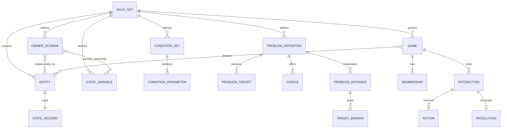
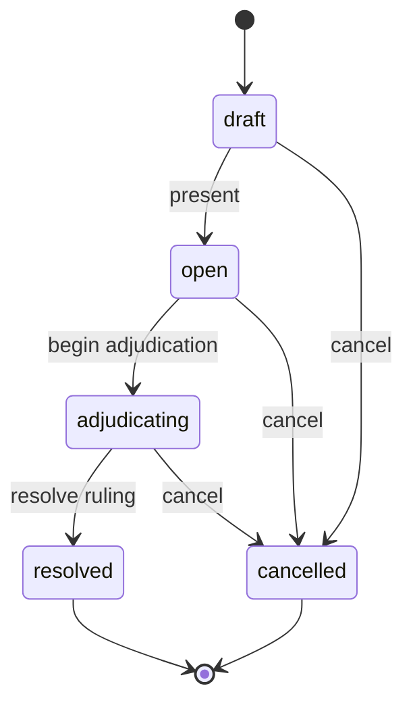

# Domain model

## Model overview

The model separates authored mechanics, generic state owners, configured
simulation, and live play. Nothing in the configured vocabulary is globally
special: every schema, key, option, unit, condition, problem, and entity is
created by a user inside a ruleset.



## Rulesets and authored identity

A ruleset is the isolation boundary for mechanical configuration. It has a
globally unique stable key, a name, and an optional description. Owner schemas,
entities, variables, conditions, problems, and their nested references cannot
cross this boundary.

Most top-level and nested resources use durable UUIDs. Human-readable keys are
for authored stability and display; handlers validate them as lowercase keys
that start with a letter and may contain lowercase letters, digits, `.`, `-`,
and `_`. The exact uniqueness scope depends on the resource:

- ruleset keys are globally unique;
- schema, entity, state-variable, condition, and problem keys are unique within
  a ruleset (entity keys are optional);
- target and choice keys are unique within their problem;
- parameter keys are unique within their condition;
- choice-option keys are unique within their state variable.

Keys have no privileged meaning in application code. Code should follow UUID
relationships and declared metadata rather than searching for a particular key.

## Owner schemas and entities

An owner schema is a user-authored capability or tag. It is deliberately not a
class hierarchy:

- an entity may implement any number of schemas;
- schemas do not inherit from one another;
- an entity has no required built-in schema;
- schema membership can satisfy state ownership, condition parameters, problem
  targets, and reference targets.

An entity is a generic durable state owner with a display name, optional stable
key, a set of owner-schema IDs, archive state, and a state revision. Creating an
entity also creates its empty state-record root.

The main eligibility rules are intentionally explicit:

- A variable is applicable when the entity implements **any** one of the
  variable's owner schemas.
- A condition parameter or problem target is satisfied only when an entity
  implements **all** schemas required by that parameter or target.
- A reference value is eligible when it remains in the same ruleset and, when
  target schemas are declared, the referenced entity implements **any** one of
  those target schemas.

Archiving preserves the entity or schema and its history. It prevents selected
new uses but does not invalidate already-authored references.

## State-variable definitions

A state-variable definition is the complete schema for one kind of entity
state. It declares:

- stable key, label, description, and display order;
- the owner schemas whose entities may own the value;
- scalar kind and `one` or `many` cardinality;
- kind-specific options, units, bounds, step, or reference restrictions;
- missing-value behavior;
- optional presentation group, control, and help text;
- whether conditions may address it;
- the exact effect operations authors/facilitators may use;
- active or archived state.

### Scalar kinds

| Kind          | Logical scalar                         | Definition metadata                      | JSON scalar shape                                                        |
| ------------- | -------------------------------------- | ---------------------------------------- | ------------------------------------------------------------------------ |
| `text`        | Unicode text                           | None                                     | `{ "kind": "text", "value": "..." }`                                     |
| `choice`      | Durable option identity                | One or more keyed/labeled options        | `{ "kind": "choice", "value": "<option key>" }`                          |
| `measurement` | Exact amount plus declared unit        | One or more units; optional min/max/step | `{ "kind": "measurement", "amount": 1.5, "unit": "m" }`                  |
| `number`      | Exact decimal                          | Optional min/max/step and display unit   | `{ "kind": "number", "value": 12.5 }`                                    |
| `boolean`     | Boolean                                | None                                     | `{ "kind": "boolean", "value": true }`                                   |
| `reference`   | Entity ID plus optional fallback label | Optional allowed target schemas          | `{ "kind": "reference", "entity_id": "<UUID>", "fallback_name": "..." }` |

The Go engine and PostgreSQL use exact decimal representations. HTTP JSON
numbers are decoded with `json.Number` and never intentionally round-trip
through `float64` in the backend. Frontend TypeScript represents them as
JavaScript numbers, so extremely large or high-precision values require care in
the current browser client even though server-side storage is exact.

Choice values and measurement units use their authored option key/unit text at
the HTTP boundary. Mapping resolves those strings to durable option/unit UUIDs
inside the domain and database model.

### Cardinality

`one` requires exactly one scalar. `many` uses set semantics:

- an empty array is a valid many-valued value;
- duplicate values are rejected;
- equality ignores order;
- references are considered duplicates by entity ID;
- add/remove operations are idempotent when the same scalar operand is already
  present or absent. Reference fallback text is part of scalar equality even
  though duplicate-reference validation is keyed by entity ID, so clients
  should use the currently returned fallback metadata when removing a
  reference.

The HTTP representation is a scalar object for `one` and an array of scalar
objects for `many`. Cardinality is carried explicitly in Go domain values and
in relational value rows so malformed data cannot be reinterpreted from ambient
metadata.

### Missing values and logical state

Absence of a stored value has one of two authored meanings:

- `unknown` means no logical value exists. Conditions reading it produce
  `unknown`, and operations that need a current value cannot proceed.
- `default` means the authored default is the logical value even when no
  override row exists.

A default can set `omit_when_stored`. When true, storing a value equal to the
default is normalized back to absence. This changes storage presence, not the
logical value returned by the API.

State responses therefore contain:

- `values`: all currently materialized logical values, including defaults;
- `defaulted_definition_ids`: definitions whose response value came from the
  missing-value default;
- `unknown_definition_ids`: applicable definitions with no logical value;
- `revision`: the optimistic state-record revision.

Only definitions applicable to the entity are included. Archived definitions
remain loadable so existing state and history stay interpretable.

### Presentation controls

Presentation metadata is advisory to clients. The server enforces compatible
pairs:

| Value kind    | Compatible controls       |
| ------------- | ------------------------- |
| `text`        | `short-text`, `long-text` |
| `choice`      | `select`                  |
| `measurement` | `measurement`             |
| `number`      | `number`                  |
| `boolean`     | `checkbox`                |
| `reference`   | `reference-picker`        |

### Condition addressability

The initial condition language can address only single-valued `number`,
`boolean`, and `choice` variables. Marking any other shape condition-addressable
is rejected.

### Effect permissions

Effect operations are opt-in per definition. Type compatibility is necessary
but not sufficient: the operation must also be present in the variable's
`allowed_effect_operations`.

| Operation       | Compatible definition | Behavior                                                                                       |
| --------------- | --------------------- | ---------------------------------------------------------------------------------------------- |
| `set`           | Any kind/cardinality  | Replaces the complete value with a validated operand, then applies omit-default normalization. |
| `clear`         | Any kind/cardinality  | Removes the stored override; logical state becomes defaulted or unknown.                       |
| `adjust-number` | Single number         | Adds an exact amount to the current logical number and revalidates bounds/step.                |
| `add-value`     | Any many-valued kind  | Adds one scalar if it is absent. Requires a known/default set.                                 |
| `remove-value`  | Any many-valued kind  | Removes one scalar if present. Requires a known/default set.                                   |

## Conditions

A condition set is a reusable parameterized expression tree. It declares one or
more parameters and a root expression. A caller binds each parameter exactly
once to concrete entities.

### Parameters and bindings

A parameter declares a key, label, cardinality, and one or more required owner
schemas. A `one` parameter binds exactly one entity and uses the `single`
quantifier. A `many` parameter binds zero or more distinct entities and uses
`any`, `all`, or `at-least`.

Every bound entity must belong to the condition's ruleset and implement all of
the parameter's required schemas. Binding order is retained for deterministic
evaluation output.

### Expression nodes

| Node type   | Meaning                                                                          |
| ----------- | -------------------------------------------------------------------------------- |
| `all`       | All children must be met.                                                        |
| `any`       | At least one child must be met.                                                  |
| `at-least`  | At least the declared count of children must be met.                             |
| `criterion` | Read one variable through a parameter and apply a predicate across its bindings. |

Groups require at least one child. The tree is limited to 10 levels and 250
nodes. IDs are unique inside the tree, sibling positions are unique, and
`at-least` counts must be reachable.

### Predicates

- Number: `eq`, `gt`, `gte`, `lt`, `lte`, or inclusive `between`.
- Boolean: `is`.
- Choice: `is` one option or `one-of` a non-empty option set.

Operands must satisfy the addressed definition's own bounds and choices.

### Three-valued logic

Each read produces `met`, `unmet`, or `unknown`. Unknown is not silently false.
Group semantics are:

| Group        | Met                | Unmet                             | Unknown                                  |
| ------------ | ------------------ | --------------------------------- | ---------------------------------------- |
| `all`        | Every child is met | Any child is unmet                | Otherwise, at least one child is unknown |
| `any`        | Any child is met   | Every child is unmet              | Otherwise, at least one child is unknown |
| `at-least N` | At least N are met | Even met + unknown cannot reach N | Remaining cases                          |

For an empty plural binding, `any` is unmet, `all` is met (vacuous truth), and
`at-least N` is unmet for positive N. Evaluation responses include the full
node tree, entity-level actual values, human-readable messages, and a deduped
sorted list of missing state addresses.

## Configured problems

A problem definition is a reusable configured transition. Its aggregate is:

```text
Problem definition
├── instance owner-schema template
├── target definitions
├── optional availability condition invocation
└── one or more choices
    ├── optional availability condition invocation
    └── resolution
        ├── automatic → one outcome
        └── condition invocation → met outcome + unmet outcome
            └── outcome → consequence set → ordered effects
```

### Targets

A target declares cardinality, minimum/maximum bindings, required schemas, and
a source:

- `supplied` bindings are selected on each problem instance;
- `problem-instance` automatically binds the instance entity itself.

At most one target may use `problem-instance`. It must be singular with exactly
one binding, and the problem's instance schema template must guarantee its
required schemas. Targets used by conditions or effects must be constrained by
at least one schema.

### Condition invocations

An invocation maps every condition parameter to one problem target. Parameter
and target cardinalities must agree, target schemas must guarantee parameter
schemas, and a target maximum must be high enough for every mapped `at-least`
criterion. Invocations belong to exactly one usage site and are not shared
sub-objects.

### Choices, outcomes, and effects

A choice may have an availability invocation. Its resolution is either:

- `automatic`, with one automatic outcome; or
- `condition`, with one invocation and explicit met/unmet outcomes.

Each outcome owns one consequence set. Effects have a complete zero-based
position sequence and target a problem target plus state-variable definition.
The target's schema requirements must guarantee that its bound entities can own
the variable.

### Problem instances

A problem instance is also a generic entity. On creation it:

- receives the problem's instance owner schemas;
- gets its own empty state record;
- stores bindings for every target;
- automatically binds a `problem-instance` target to itself;
- tracks a binding revision independently of its state revision.

The configured runtime uses the instance and bindings to resolve a selected
choice. Results are:

- `unavailable` when an availability guard is unmet;
- `incomplete` when required condition state is unknown and no guard is
  definitively unmet;
- `applied` when an outcome is selected and all effects validate.

Preview evaluates and applies against a cloned snapshot but never persists.
Resolve persists every changed state record in one transaction. Ordered effects
see earlier effects, and a later failure rolls back the entire transition.

## Games and memberships

A game selects one ruleset and has an `active` or `archived` status. Creation
also creates an active facilitator membership for the acting user. A game must
retain at least one active facilitator.

Users are real-world development identities and are separate from fictional
entities. Membership roles are:

| Role          | Intended authority                                                                     |
| ------------- | -------------------------------------------------------------------------------------- |
| `facilitator` | Manage game membership/entities and author, manage, preview, and resolve interactions. |
| `player`      | View addressed interactions and submit/withdraw eligible actions.                      |
| `spectator`   | View addressed interactions without submitting actions.                                |

Membership status is `invited`, `active`, or `left`. Only active memberships
may read a game or connect to its event stream. The current API exposes the
membership-to-entity-controls table in the database only as reserved schema;
the active HTTP behavior is driven by role, audience, and eligible-responder
membership lists rather than per-entity control assignments.

### Game entity mapping

A game maps an explicit subset of its ruleset's generic entities. The mapping
is exclusive globally: the same entity cannot belong to two games. New
assignments reject archived entities and cross-ruleset IDs. An entity already
used by an interaction, effect, operand, or application receipt cannot be
released from the game, preserving receipt integrity.

The game-scoped entity and state-variable endpoints filter the generic
configuration to the mapped runtime world. Concrete live effects may target
only mapped entities. A live transition also rejects reference operands or
authored defaults whose referenced entity is outside the current mapping.
Mapping replacement itself does not enforce that reference closure: an entity
referenced only by mutable state or a variable default can be released, after
which a later transition that encounters the reference will fail. Historical
interaction and receipt references do prevent release.

## Live interactions

An interaction contains a title, public prompt, facilitator-private notes,
audience memberships, eligible responder memberships, context entities, status,
and revision. Its lifecycle is:



Drafts are facilitator-only and editable. Non-facilitators see an interaction
only while it is `open` or `resolved`, only if their membership is in the
audience. Moving to `adjudicating` hides it from non-facilitators while the
ruling is prepared. Private notes are always omitted from non-facilitator
responses.

### Action submissions

Only an active `player` membership listed as an eligible responder can submit
while the interaction is open. A player may have at most one currently
submitted action for an interaction; they may withdraw their own submission and
submit another. Action status is `submitted`, `withdrawn`, `selected`, or
`declined`. Resolving with a selected action marks it selected and declines
other still-submitted actions.

### Live rulings

A ruling contains public narrative, optional action summary, optional private
notes, optional selected action, and up to 100 concrete effects. Unlike
configured problem effects, target entity IDs are already concrete, and every
live effect requires at least one distinct target entity.

Preview requires a facilitator and an `adjudicating` interaction, runs in a
read-only repeatable-read transaction, and returns advisory before/after state.
Resolve additionally requires a non-empty idempotency key. It locks the mutable
roots, rechecks the expected interaction revision, applies the transition,
persists changed state, records the complete receipt, finalizes statuses, and
appends an event in one transaction.

Applied receipts store both requested effects and per-entity applications with
before/after typed values. Database triggers prevent updates/deletes of an
applied receipt and its owned rows, of final interactions, and of game events.
The application `changed` flag records whether the stored override changed;
before/after values are logical values. They can therefore look equal when an
effect removes a redundant stored override and falls back to the same default.

Replaying a committed idempotency key verifies the request against that receipt,
but response state records are loaded at replay time. They may reflect later
state changes, and replay still requires a current active facilitator and active
game.

## Revisions, events, and history

| Revision                 | Advances when                                                          |
| ------------------------ | ---------------------------------------------------------------------- |
| State record             | Stored state or owner-schema memberships change its materialized view. |
| Problem-instance binding | Target bindings are replaced.                                          |
| Game                     | Membership or entity assignment changes, or the game is archived.      |
| Membership               | Its role or status changes.                                            |
| Interaction              | Draft/lifecycle data changes or an action is submitted/withdrawn.      |
| Action                   | The action is withdrawn or finalized by resolution.                    |

No-op replacements generally return current state without manufacturing a new
revision. Clients should use the latest response as the source for the next
expected revision.

Game events are an append-only cursor stream. They identify that a game-level
fact changed and carry related interaction/submission/resolution IDs when
applicable. They do not embed full new state; clients reload authoritative
resources after receiving them. Only game-scoped Play commands append these
events; trusted authoring changes to mapped entities or state do not.

## Archive semantics

Archiving is retention, not deletion:

- archived configuration remains readable and keeps existing references valid;
- new references to archived configuration are generally rejected;
- archived problem definitions cannot create new instances;
- archived entities cannot be newly assigned to games;
- archived games reject game-scoped Play mutations, while trusted authoring
  endpoints can still change their underlying ruleset entities and state;
- a game cannot be archived with draft, open, or adjudicating interactions;
- resolved/cancelled interactions and applied receipts remain history.

There are no public hard-delete endpoints.
