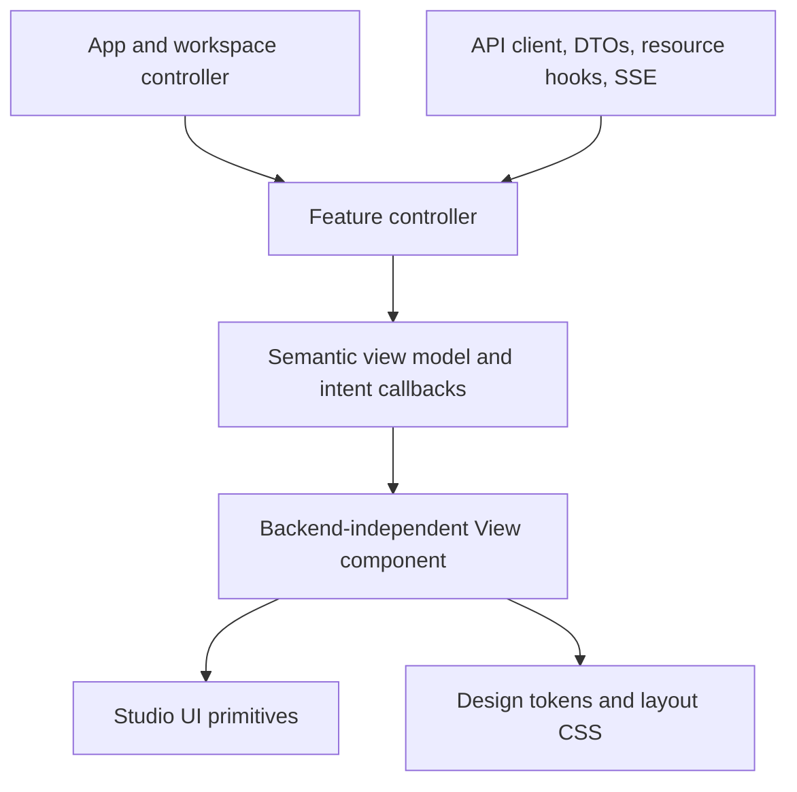

# Frontend

## Product surface

The React application presents two deliberately separate product areas over the
same World model. `/play` is the Play area and `/build` is the configuration area.
The root route keeps both choices and also presents the recommended, data-free
**Start a World with ChatGPT** quick start. Its copyable prompt asks ChatGPT to
shape the idea and guide the person through Build while the person signs in and
makes every durable change. The primary action opens that prompt in ChatGPT Work
on the web; copying it remains available. A signed-in account sees only worlds
it owns or has joined. Authors configure three
user-authored lists:

- **capacities**: numeric input or derived scores/pools carried by every entity;
- **capabilities**: Boolean/numeric input or derived ratings carried by every Entity;
- **character fields**: ordered text prompts required for each
  membership-controlled Entity before it can enter Play.

Entity sheets are generated from active Mechanics and expose intrinsic versus
effective values plus active Status-instance explanations. An Entity controlled
by an active non-spectator membership is presented as that membership's Character, with a
separately loaded profile generated from the world's active character fields.
Those values never become engine state.
Problems are not a configuration resource in this UI. A facilitator describes
each Problem during Play, or Terra creates it when designated as Facilitator.
Responders offer free-form Actions or pass. A human Facilitator writes one
unstructured account of what transpires and reviews Luna's compiled preview.
Terra instead authors and compiles a Consequence, then commits its Resolution without
exposing model output for human editing or approval. An apply-status Effect
defines an inline status in that Problem and snapshots it onto each affected Entity.

## Stack and source layout

The frontend is React 19 and strict TypeScript, built by Vite and managed with
Bun. It uses browser `fetch`, History API routing, and native form controls.
There is no router, global-state library, form framework,
component framework, or service worker.

| Path                                        | Responsibility                                                                   |
| ------------------------------------------- | -------------------------------------------------------------------------------- |
| `src/App.tsx`                               | Session, route, redirect, and top-level application controller.                  |
| `src/worldRoutes.ts`                        | Play and Build path parsing plus URL construction.                               |
| `src/api/client.ts`                         | Credentialed JSON fetch adapter, in-memory CSRF token, errors, and path helpers. |
| `src/api/types.ts`                          | Compile-time contract for the world and live-play APIs.                          |
| `src/components/StudioUI.tsx`               | Brand, fields, modal, notices, loading/empty states, avatars, and role labels.   |
| `src/**/*View.tsx`                          | Backend-independent markup, layout, accessibility, and local UI interaction.     |
| `src/**/*ViewModel.{ts,tsx}`                | Backend-independent semantic presentation contracts.                             |
| `src/features/HomeChoice.tsx`               | Data-free root navigation controller for Play and Build.                         |
| `src/features/ChatGPTWorldStartView.tsx`     | ChatGPT Work and copyable World-start surface for Home.                                 |
| `src/features/useChatGPTWorldStart.ts`       | Friendly Build-guide prompt construction and clipboard status.                   |
| `src/features/IdentityGate.tsx`             | Username/password authentication command controller.                             |
| `src/features/AccountControls.tsx`          | Password and server-side signout command controller.                             |
| `src/features/BuildLibrary.tsx`             | Build-world collection and creation controller.                                  |
| `src/features/PlayLibrary.tsx`              | Membership-filtered world collection controller.                                 |
| `src/features/WorldTemplateLibrary.tsx`     | Three-template catalog and idempotent World-copy controller.                      |
| `src/features/BuildWorkspace.tsx`           | Owner/editor gate, world resource, and Build navigation controller.              |
| `src/features/PlayWorkspace.tsx`            | Play-world resource and shell composition controller.                            |
| `src/features/RosterWorkspace.tsx`          | Entity, member, mechanic, selection, and refresh controller.                     |
| `src/features/RosterModals.tsx`             | Entity creation and controller-assignment command controllers.                   |
| `src/features/EntityDetail.tsx`             | Profile/sheet coordination and direct sheet persistence controller.              |
| `src/features/MechanicsWorkspace.tsx`       | Mechanic resource, transport mapping, and save/archive controller.               |
| `src/features/CharacterFieldsWorkspace.tsx` | Ordered character-field-set persistence controller.                              |
| `src/features/MembersWorkspace.tsx`         | Member/invite resources and invitation command controller.                       |
| `src/features/SettingsWorkspace.tsx`        | World-details save and owner-only archive controller.                            |
| `src/features/WorldPlay.tsx`                | Live resources, SSE/revision coordination, and problem command controllers.      |
| `src/features/EntityProfilePanel.tsx`       | Entity-profile resource and persistence controller.                              |
| `src/hooks/`                                | Collection/resource loading, dirty guards, and SSE refresh.                      |
| `src/styles/tokens.css`                     | The only file allowed to contain literal design colors.                          |
| `src/styles/app.css`                        | Responsive neutral layouts for libraries, editors, invitations, and live play.   |

ESLint includes hooks and JSX accessibility rules. Stylelint enforces tokenized
colors and bounded selector complexity. Prettier, TypeScript, Bun tests, and
Knip are all part of frontend CI.

## Presentation and operations boundary

Frontend features use a controller/view boundary so visual work does not depend
on the HTTP contract. This is an import boundary, not an attempt to make the
product generic or to support interchangeable backends. Views still speak the
product language—worlds, mechanics, character readiness, interactions,
Consequences, membership roles, and current play roles—while remaining unaware of how those concepts are
loaded or persisted.



The operational component keeps the established public feature name, such as
`SettingsWorkspace` or `WorldPlay`. It composes one or more adjacent components
whose names end in `View`. This lets callers and routes remain stable while a
feature is divided internally.

### Operational controller responsibilities

Controllers may import `src/api`, API-backed hooks, and `worldRoutes`. They own:

- relative API paths, HTTP methods, request headers, and JSON body construction;
- raw response DTOs and conversion from snake-case transport properties;
- authentication/session reactions and CSRF behavior supplied by the API client;
- expected revisions, idempotency keys, and authoritative response handling;
- resource loading, cancellation, retries, polling, and SSE invalidation;
- readiness gates that decide which resources are permitted to load;
- navigation and dirty-draft coordination across application routes;
- translation of `ApiError` codes and field paths into semantic view problems;
- refresh decisions after successful commands.

Controllers are allowed to own React state when that state coordinates a
command or several resources. They should reuse pure helpers in `src/domain`
instead of embedding deterministic transformation logic in request handlers.

### View responsibilities

Views receive a semantic model and callbacks representing user intent. They own:

- semantic HTML, responsive layout structure, CSS class names, and accessibility;
- visible loading, empty, unavailable, onboarding, ready, and error states;
- local visual interaction such as tabs, filters, selection, disclosure, and
  modal visibility when it does not coordinate a command or dirty draft;
- controlled form fields or pure frontend drafts when that keeps a complex
  editor cohesive;
- frontend validation and display-ready labels, counts, descriptions, and
  visual tones;
- intent callbacks such as `save(draft)`, `archive()`, `selectEntity(id)`, or
  `resolve(draft)`.

A view, shared component, or dedicated view-model module must not import
`src/api`, API DTO types, `worldRoutes`, `useResource`, `useCollection`, or
`useWorldEvents`; it must not call `fetch` or create an event stream. ESLint
enforces this for shared components and every `*View.tsx` and
`*ViewModel.{ts,tsx}` file. Type-only imports are included in the restriction
because importing a transport DTO would still make a visual file change when
the wire contract changes.

Views are not required to be stateless. The architectural test is whether the
view can render and exercise its local UI with fixture props and intent stubs,
without a server, API mock, session, route, or `fetch` implementation.

### The feature contract

Contracts are deliberately feature-specific rather than a universal screen or
repository abstraction. A typical controller passes two grouped values:

```ts
interface ExampleViewModel {
  mode: "loading" | "ready" | "unavailable";
  title: string;
  busy: "saving" | "archiving" | null;
  problem: { message: string; fields: Record<string, string> } | null;
}

interface ExampleViewActions {
  changeDraft(patch: Partial<ExampleDraft>): void;
  save(): void;
  archive(): void;
}
```

Only information that changes rendering belongs in the model. Transport-only
facts such as `expected_revision`, CSRF tokens, endpoint paths, and response
wrappers remain in the controller. Stable identifiers may cross the boundary
when a view needs list keys or must report which visible item the user selected.

The frontend does not mirror all of `api/types.ts` into a second canonical
domain model. Small view models and draft types are introduced where they
remove transport coupling; unchanged product-domain types may be represented by
equivalent local semantic types. Mapping remains close to the feature that uses
it.

For example, `SettingsWorkspace` receives the authoritative `World` DTO and
maps `name` and optional `description` into a settings draft. `SettingsView`
edits that draft and emits save/archive intent while displaying the current Facilitator
read-only. The controller adds `expected_revision`, accepts the returned
`World` as the new draft baseline, refreshes the workspace resource, and
performs archive navigation. Facilitator handoff is a separate Play command. The view
never sees the world ID, revision, endpoint, HTTP method, or response DTO.

### Errors, permissions, and server authority

`StudioUI` accepts a structural, presentation-safe error notice and has no API
import. Controllers map API field names to the fields used by their views and
choose user-facing error state. A revision conflict can therefore become a
semantic reload/conflict notice without passing raw transport revision fields
through the view contract. Controllers may still provide a display-ready
revision label when it is intentionally visible diagnostic information.

Permission booleans and readiness modes may be passed to views because they
materially change presentation. They are conveniences, not security controls.
The server remains authoritative for membership roles, current play roles, Play status, visibility,
and mutations; restricted properties must still be removed before
serialization.

### Live Play operational islands

Live Play has several independent command lifecycles, so it uses multiple view
contracts rather than one universal props object. The root controller owns the
member/entity/mechanic/interaction resources, polling, SSE reconnect, and rules
revision synchronization. Facilitator handoff, human problem creation, player
action composition, human adjudication/resolution, Terra pacing, compiled-effect
preview, and history are separate presentation islands. Command payload
construction, exact revisions, idempotency, and post-event authoritative reloads
remain operational even when the corresponding form and history layout are
extracted.

### Styling boundary

CSS depends only on stable classes and data attributes emitted by views.
`tokens.css` remains the literal-color authority and `app.css` contains the
current responsive system. Splitting CSS by feature is optional and independent
of the controller/view architecture; CSS Modules, CSS-in-JS, and a component
framework are not required. Backend enum values should be mapped to semantic UI
variants when they are used only to choose a visual tone.

## Routing and authentication

Routes are parsed without an external router:

| URL                                             | Surface                                       |
| ----------------------------------------------- | --------------------------------------------- |
| `/`                                             | ChatGPT World quick start plus Play/Build; no API load. |
| `/play`                                         | Current account's World list for Play.        |
| `/play/new`                                     | Three bundled World templates available to copy. |
| `/play/{world-id}`                              | Onboarding or Play.                           |
| `/play/invite/{opaque-token}`                   | Player/spectator invite preview and redeem.   |
| `/build`                                        | Editable-world list and world creation.       |
| `/build/{world-id}/capacities/{mechanic-id?}`   | Capacity catalog/editor.                      |
| `/build/{world-id}/capabilities/{mechanic-id?}` | Capability catalog/editor.                    |
| `/build/{world-id}/character-fields`            | Required character-field editor.              |
| `/build/{world-id}/roster`                      | Entity, controller, profile, and sheet setup. |
| `/build/{world-id}/members`                     | World memberships and invite links.           |
| `/build/{world-id}/settings`                    | World details, current-Facilitator summary, lifecycle. |
| `/build/invite/{opaque-token}`                  | Editor invite preview and redeem.             |

Unknown paths render a not-found screen rather than silently opening a library.
A bare Build world path canonicalizes to capacities. A player or spectator
cannot cause Play to render under a Build URL; Build shows an explicit
access boundary and offers a deliberate transition to Play.

The root quick start and area choices remain data-free. On entering Play, Build, or an invite URL,
the application bootstraps with `GET /api/me`. An anonymous browser sees a
username/password gate; signup asks for username, display name, and a password
of at least 8 characters with confirmation, while signin asks only for username
and password. Password change also confirms the new value because this release
has no recovery channel. The
requested URL remains in the address bar, so authentication returns the user
to the intended area or opaque invite without storing a redirect target.

The browser owns no durable identity credential in JavaScript. `fetch` sends
the server's HttpOnly SameSite session cookie, while the CSRF token returned by
signup, signin, `/api/me`, or password change lives only in module memory and
is added to unsafe calls as `X-GEZERAH-CSRF`. A global 401 boundary clears that
token and returns protected surfaces to the signin gate; each request captures
its starting authentication token so a late 401 from an old session cannot
tear down a newly established one. A `csrf_invalid` response caused by another
tab rotating the same account's cookie triggers `/api/me` and one safe retry;
the client will not replay the mutation if the cookie belongs to another user.
Account controls are
available in libraries, workspaces, and invite preview; signout revokes the
server session, and password change replaces the current session after
revoking the account's other sessions.

## World library

Both libraries request `GET /api/worlds`. The Build library filters to
owner/editor memberships, offers world creation, and
opens the capacity editor. The Play library asks which World the person wants
to play, shows every admitted saved World, and always offers **New world**.
Saved cards emphasize the current play role, Play status, roster size, and last
activity. The membership role remains available separately inside the World.

`/play/new` loads the complete three-item catalog from
`GET /api/world-templates`. Each choice has equal visual weight and an explicit
**Copy and play** command. The client generates the destination World UUID and
reuses it when retrying `POST /api/world-templates/{template_id}/clone`, so an
uncertain response cannot create a second copy. A successful command replaces
the catalog URL with `/play/{world-id}` and enters ordinary Character
onboarding. An incomplete catalog is treated as unavailable rather than
silently offering fewer than three choices.

## Static configuration

The Build sidebar contains exactly:

- Capacities;
- Capabilities;
- Character fields;
- Roster & sheets;
- Members & invites;
- Settings.

Capacity modes are `score` and `pool`. Capability modes are `binary` and
`rating`. An input numeric definition can declare default, minimum, maximum,
step, and unit; an input Boolean defaults to false. A derived definition uses a
recursive expression builder with literal/reference leaves, typed numeric and
Boolean operations, comparisons, and conditionals. The editor filters
operations/references by expected kind for guidance; the server remains the
authority and rejects invalid types or cycles when saved. Only inputs may set
`mutable_during_play`; it gates direct scalar effects, not status modifiers.

Build's explicit-save editors share one dirty/unload guard. It protects
section changes, mechanic and roster child selection, Settings, Home, and both
desktop and mobile exits to the Build library. Cancelling keeps the current
draft and destination; accepting discards the draft before navigation. The
capacity and capability editors archive rather than delete and include a
generated-sheet preview. Archiving removes a Mechanic from new use while
preserving stored overrides, historical Status instances and modifier snapshots, and Resolution receipts. Active
derived dependents must be archived and active Status instances whose modifiers target
the mechanic must be removed first; the server explains either conflict. There
are no privileged configured keys or predefined mechanic names; stable internal
IDs are not a user-facing ontology.

The character-field screen edits the whole ordered character-field set as one
draft. Each field has a user-authored label, optional guidance, and either
`world` or `restricted` visibility. The latter is currently
readable by active controllers, durable owners/editors, and the designated
human facilitator. Every published field is required; there is no per-field
required toggle. Publishing uses the current character-field-set revision, preserves
durable IDs, and warns when adding/removing character fields can change existing
character readiness.

## World memberships and invite links

Editors can mint player, spectator, or editor links with an expiry from one to
90 days. The raw token is returned only by the create response. The screen
builds the same-origin URL, offers a clipboard action, and warns that the token
will not be listed again. Existing invite rows show creator, membership role, use count,
expiry/revocation state, and an explicit revoke command.

Redeeming a link creates or reactivates one world membership. Returning to the
same valid link as an existing active member is idempotent and does not silently
escalate the existing membership role.

## Play surface

The Play surface has three regions on wide screens: roster, current Problem and
history, and selected entity sheet. It collapses to a single-column flow on
narrow screens.

An owner/editor creates world entities, assigns active non-spectator
controllers, edits profiles, and makes direct setup sheet changes in the Build
roster. Every active capacity and capability appears automatically on
the generated sheet. Inputs begin at authored defaults; derived values are
evaluated from their expressions. The sheet displays active Status-instance chips,
labels derived fields as Derived, and lists the modifier trail from
intrinsic to effective value whenever modifiers are present. Build inputs
edit only logical input values and send both logical-state and rules revisions.
Play renders sheets read-only. Each active Status instance exposes its optional
description and the source Problem, so equal names remain distinguishable
without becoming keys.

The roster labels Entities controlled by the current membership as “Your
character” and otherwise names active Controllers. The selected Entity panel
has Profile and Sheet tabs. Active Controllers and owner/editors fill the
configured fields and may save partial drafts; other members see only completed
world-visible prose. The designated human facilitator can also read restricted
profile prose. Mechanical sheet inputs remain disabled in Play.
Profile values are fetched only for the selected entity rather than embedded in
the roster collection.

A current player who has no controlled Entity sees a waiting screen. A current player
whose controlled-character setup is incomplete sees only the onboarding
profile UI, including completion counts and every field they are authorized to
fill. The
client does not request live interactions or the event stream until
`play_status` becomes `ready`; onboarding uses World/Entity/profile resources.
If a character-field-set change later makes the current player's setup incomplete, stream reconnect also
triggers an authoritative reload.

Archived worlds bypass player-seat onboarding so every admitted member can
read the frozen Play history and any audience-visible resolved/cancelled Interactions. All
archived Play controls remain read-only.

`play_status` remains the underlying player-seat readiness while that
membership is facilitator. The facilitator can enter Play regardless, and a
handoff confirmation warns whether they will return to a ready seat or to
character setup. Spectators are always ready and read-only.

The Play header names the current Facilitator, the viewer's current play
role, and their membership role. Between Problems, an owner/editor or the
current human facilitator can use the Facilitator picker to assign another active
non-spectator or Terra. The control is unavailable while an interaction is
unfinished; Settings only displays the assignment. The sole recovery exception
is a **Take over** button for an owner while a Terra interaction is open or
adjudicating.

With a human Facilitator, the lifecycle is:

1. the designated facilitator clicks **New problem** and writes the moment;
2. the UI audience is every active membership whose `play_status` is ready,
   while the facilitator chooses optional eligible current-player responders
   and context entities;
3. responders offer or withdraw one action, optionally attributed to a ready
   controlled entity;
4. the facilitator closes Action entry and enters private Adjudication;
5. the facilitator writes **What transpires?**, asks Luna to compile optional
   selected-Action metadata and Effects, and reviews the advisory
   preview;
6. the facilitator resolves, atomically storing logical-state/Status-instance changes, source
   provenance, the immutable Resolution receipt, lifecycle change, and World-event cursor.

The facilitator may instead choose **Cancel problem** while it is unfinished; a
presented cancellation remains in audience history, while a cancelled draft
remains private.

With Terra as Facilitator, the human controls are pacing only:

1. while Play is idle, any ready current player clicks **Ask Terra to
   continue**;
2. Terra creates and presents a problem to all ready active memberships; all
   ready non-spectators are responders and ready controlled entities are
   context;
3. every responder submits an action or clicks **Pass**. The UI shows acted-or-
   passed progress and enables the decision only after every responder Action is submitted;
4. while the problem is open or Terra is adjudicating it, any ready current
   player may confirm **Skip problem**. The interaction becomes cancelled
   without a Consequence, Terra remains Facilitator, and Play returns
   to idle without automatically preparing a replacement;
5. any ready current player asks Terra to decide. The UI moves to a Terra
   pending state while the server generates prose, compiles it with Luna,
   previews it internally, and resolves it;
6. the pacing current player cannot edit or approve the narrative, selection, notes, or
   effects. On a provider failure the client reloads the adjudicating
   interaction and offers a retry with the same idempotency key. As an explicit
   recovery path, the owner may confirm **Take over** during the open or
   adjudicating interaction; their own submitted action is withdrawn. An open
   problem exposes the human close/adjudicate flow, while an adjudicating one
   opens the human-Facilitator Consequence UI directly.

Resolved and presented-cancelled history remains visible to its audience.
Human cancellations are labelled **Cancelled**; cancelled Terra-authored
Problems are labelled **Skipped · Terra**. Cancelled drafts remain
facilitator-only. There is deliberately no problem-template catalog, problem
editor, pre-authored problem route, or Terra output approval screen.

`useWorldEvents` holds the authorized SSE stream and reconnects with its last
cursor when the connection ends. Event data is treated as invalidation; the
client reloads authoritative World, Entity, and Interaction resources rather
than reconstructing state from the event payload. `rules-updated` also reloads
the revision-wrapped world mechanic graph. Play waits until mechanic and Entity
rules revisions agree before allowing a Consequence built from them.

## Client state and errors

`useCollection` and `useResource` abort obsolete requests, retain same-path
values during refresh, and expose explicit reload functions. Editors keep local
drafts; drafts are not persisted. Successful commands use returned resources
or reload the authoritative collection.

`api<T>()` sends same-origin JSON, maps the server error envelope to `ApiError`,
and exposes field errors where forms can attach them. Successful payloads are
compile-time typed but are not runtime-schema validated. Exact decimal Mechanic values
remain strings in API models and numeric form state; outgoing authored payloads
canonicalize valid decimal text, while compiled Consequence effects are
forwarded unchanged. Ordinary JavaScript JSON parsing therefore cannot round
these values. Revisions, counts, positions, and priorities remain JavaScript
numbers.

## Accessibility and responsive behavior

The UI uses a shared neutral visual system with sans-serif typography and
restrained color, radius, and elevation. It uses semantic headings, fieldsets,
labels, explicit button types, focus
rings, alert/status roles, an Escape-close modal, a skip link, and reduced-
motion handling. Desktop configuration uses a persistent sidebar and
master-detail editor. Below 950px it switches to a sticky world/section bar;
catalogs, forms, play roster, and sheets reflow rather than relying on horizontal
page scrolling.
