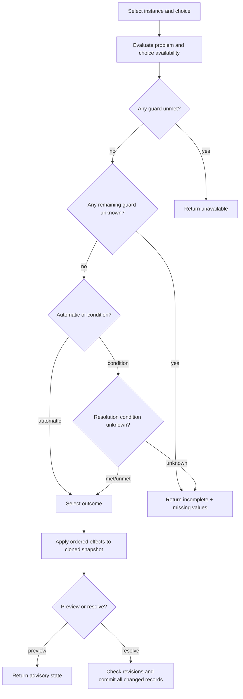

# Workflows

## Author a playable vocabulary

The overview screen presents the intended dependency order. A useful minimal
flow is:

1. Create a ruleset with a stable key and name.
2. Create owner schemas that describe capabilities relevant to this ruleset.
3. Create state-variable definitions and assign each to one or more owner
   schemas.
4. Create entities and assign the schemas they implement.
5. Inspect entity state and add stored overrides where defaults/unknowns are not
   sufficient.
6. Optionally create condition sets that read condition-addressable state.
7. Optionally create problem definitions with targets, choices, conditions, and
   effects.
8. Create problem instances and bind their supplied targets.
9. Use Runtime to preview and resolve configured choices, or use Play to create
   a multiplayer game from the ruleset.

The ordering is not seed vocabulary. It is dependency ordering: later
aggregates refer to durable IDs from earlier aggregates.

## Configure typed state

When adding a variable, decide the mechanics in this order:

1. **Ownership:** which authored schema capabilities can own it?
2. **Shape:** one scalar or a set, and which scalar kind?
3. **Domain:** options, units, bounds, step, or reference eligibility.
4. **Absence:** is a missing value unknown, or does it have a logical default?
5. **Storage normalization:** if defaulted, should an equal override be omitted?
6. **Conditions:** can conditions address it? Only one-valued number, Boolean,
   and choice definitions qualify.
7. **Effects:** opt in only the mutations the ruleset intends to permit.
8. **Presentation:** choose compatible display grouping/control/help metadata.

After saving, the State inspector materializes applicable logical values for an
entity. Saving uses the displayed state revision. A revision conflict means the
record changed elsewhere; reload before deciding how to merge.

## Build and evaluate a condition

1. Declare each entity role as a parameter with singular/plural cardinality and
   required schemas.
2. Build an `all`, `any`, or `at-least` expression tree from criteria.
3. For each criterion, select a parameter, matching quantifier, an eligible
   condition-addressable variable, and a kind-compatible predicate.
4. Evaluate directly by binding parameter IDs to entity IDs.

Treat `unknown` as a request for missing information, not a failed test. The
evaluation response reports every missing `{entity_id, state_variable_id}`
address and explains each expression node.

## Configure and resolve a problem

### Authoring

1. Choose instance owner schemas. Every new instance entity will implement
   these schemas.
2. Add targets. Use `problem-instance` only for an exact self-target; use
   `supplied` for bindings selected on an instance.
3. Optionally map a condition invocation as a problem availability guard.
4. Add one or more choices and optional choice availability guards.
5. Choose automatic resolution or map a condition to met/unmet outcomes.
6. Add ordered effects to each outcome. Enable the operation on the variable
   first and ensure the target schemas guarantee state ownership.

The problem editor saves the whole aggregate. Duplication generates fresh IDs
for the problem and all nested owned resources while retaining references to
external schemas, variables, and condition sets.

### Instantiation

Creating an instance simultaneously creates its generic entity and state root.
Bind every supplied target within its declared bounds. The automatic instance
target, if configured, is filled with the new entity. Updating bindings requires
the current binding revision.

### Resolution

Preview never reserves a result. State or bindings may change before resolve.
The API accepts optional state-revision guards and an optional binding guard;
direct clients that require resolve to match a preview should send every
relevant current guard. The current Runtime UI sends the binding revision but
does not guard every state record, so it deliberately resolves against the
latest locked state and may produce a newer result than its preview.

## Run a live game

### Create identities and a game

The current Play UI begins by selecting or creating a local development user.
The selected user UUID is stored in browser local storage and sent as
`X-DND-User-ID`.

The acting user creates a game for one ruleset and optionally selects available
entities. The server makes that user an active facilitator. A facilitator can
then:

- add users as facilitators, players, or spectators;
- set a membership to invited, active, or left;
- assign/release eligible ruleset entities;
- archive the game after every interaction is final.

An entity assigned to another game is unavailable. Once a game uses an entity
in interaction or resolution history, that entity cannot be released.

### Present an interaction

1. As facilitator, create a draft with prompt, optional title/private notes,
   audience memberships, eligible player responders, and context entities.
2. Edit the draft while it remains `draft`.
3. Present it using the current interaction revision. It becomes `open`.
4. Audience members can now see it; private notes remain facilitator-only.
5. Each eligible player may submit one current free-form action. They can
   withdraw it while the interaction remains open.

The audience and responder lists use membership IDs, not user IDs. Context
entities must already be assigned to the game.

### Adjudicate and resolve

1. The facilitator moves the open interaction to `adjudicating`. This closes
   action submission and hides the interaction from non-facilitators.
2. Select an action if appropriate, write the public narrative and optional
   notes/summary, and add concrete typed effects.
3. Preview. The server validates all entity/variable/value relationships and
   returns the state that would result without writing it.
4. Resolve with the current interaction revision and a fresh idempotency key.
5. The server atomically changes state, finalizes action statuses, marks the
   interaction resolved, records the immutable receipt, and emits an event.

If the response is lost after commit, retry the exact same request with the
same idempotency key. The server returns `replayed: true`. Do not reuse the key
for different content or a different interaction.

### Cancel and archive

A facilitator may cancel a draft, open, or adjudicating interaction. Resolved
and cancelled interactions are final. A game may be archived only after every
interaction is resolved or cancelled; archive makes all mutation commands fail
while retaining read-only history.

## Client freshness and conflict recovery

The Play screen connects to the game event stream. Events trigger reloads; they
do not merge state locally. For any `revision_conflict`:

1. preserve unsaved user input where practical;
2. reload the authoritative aggregate;
3. show the newer revision and changed values;
4. let the user decide whether to reapply the draft;
5. submit using the new expected revision.

For network failures, the frontend's draft state remains in the mounted React
component. It is not durable across a page close unless a specific feature
stores it in local storage.

## Archive instead of delete

Configuration and play history use archive/final states rather than public
deletion. Before archiving a referenced definition, check dependent problems,
instances, and game history. Existing references are retained, while attempts
to introduce new references to archived resources are rejected.
