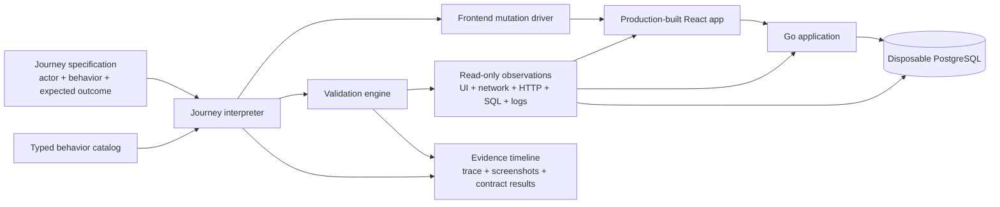

# Scenario-test architecture plan

## Status and companion documents

This document defines the target technical architecture for the executable
scenario-test system. The target is delivered as one coherent change: a single
frontend-driven lifecycle spine, focused UI-boundary tests, fast direct
contracts, and lower-layer tests. It has no accepted partial delivery state.
Until that change lands, [the code mapping](code-mapping.md) remains the
authority for what the current suite actually executes.

The companion documents are:

- [Business scenarios](business-scenarios.md), which defines the product
  situations and expected business outcomes the suite should cover.
- [Code mapping](code-mapping.md), which maps stable scenario and behavior IDs
  to the frontend, HTTP, rules, persistence, and existing test code responsible
  for them.

The three documents deliberately answer different questions:

| Document                | Authority                   | Primary question                                       |
| ----------------------- | --------------------------- | ------------------------------------------------------ |
| This document           | Test-system structure       | How are journeys executed and validated?               |
| `business-scenarios.md` | Business intent             | What must users be able to do, and what should happen? |
| `code-mapping.md`       | Implementation traceability | Which code regions implement or protect each behavior? |

## Architectural position

A user journey is the authority for causality and intent: a named actor
attempted a named behavior with particular inputs and expected a particular
outcome. A registered outcome contract is the authority for what counts as that
outcome working. The journey interpreter and validation engine are execution
machinery; neither invents business expectations.

The central abstraction is therefore a typed **behavior catalog**, not a loose
collection of Playwright helpers. The one lifecycle-spine specification is a
program written with that catalog. A Playwright adapter performs each behavior
through the real frontend. A separate validation engine observes the result
through read-only surfaces and evaluates registered outcome contracts.

The complete suite has four evidence lanes. They share scenario IDs and
vocabulary, but they do not make interchangeable coverage claims:

| Lane             | Purpose                                                                                        | Coverage claim    |
| ---------------- | ---------------------------------------------------------------------------------------------- | ----------------- |
| Lifecycle spine  | One UI-authentic world lifecycle from first identity and world authoring through final archive | `journey`         |
| UI boundaries    | Small rendered checks for navigation, recovery, accessibility, responsive layout, and SSE      | `ui-boundary`     |
| Direct contracts | Table-driven HTTP/PostgreSQL checks for matrices, races, privacy, atomicity, and idempotency   | `direct-contract` |
| Lower layers     | Go and frontend unit checks for exhaustive rules and pure transformations                      | `lower-layer`     |

Harness-wide invariants such as forbidden writes from validators, unexpected
`5xx` responses, and the suite runtime budget are reported as
`harness-policy`. Encountering a behavior in one lane does not silently grant
coverage in another.

The browser journey is exactly one Playwright test,
`test/specs/scenarios/lifecycle-spine.spec.ts`. It creates and retains owner,
editor, player, and spectator contexts while one generated world moves through
these checkpoints:

1. the owner authors a playable world (`JRN-001`);
2. the player moves from invitation through waiting and setup to ready
   (`JRN-002`);
3. the table presents, answers, adjudicates, previews, and resolves shared work
   (`JRN-003`);
4. resolution applies, distinguishes, and removes exact status instances
   (`JRN-004`);
5. the spectator follows the public table without private data or authority
   (`JRN-005`);
6. the editor collaborates and facilitates without owner-only authority
   (`JRN-006`);
7. the owner clears unfinished-work blockers, archives the world, and reopens
   retained read-only history (`JRN-007`).

These are individually named checkpoints and coverage results inside one test,
not separately bootstrapped journeys or ordered tests that share residue.



The key trust rule is:

> Journeys may change application state only by operating the rendered
> frontend. Validators may observe through additional read-only surfaces, but
> may never seed, repair, or otherwise mutate journey state.

This rule gives the suite an authentic browser boundary while still allowing
it to distinguish a frontend presentation defect from an HTTP, transaction, or
persistence defect.

## Goals

The scenario-test system should:

- express journeys in the language of user intent rather than selectors,
  routes, endpoint paths, database rows, or arbitrary helper names;
- make every supported behavior and every expected outcome a first-class,
  registered, typed definition;
- require an explicit validation contract for every declared outcome;
- perform all journey mutations through accessible browser interactions in the
  production-built React application;
- give every actor an isolated browser context and authentic development
  identity flow;
- support multi-actor behavior and SSE-driven updates without using refresh as
  a synchronization mechanism;
- let outcome contracts combine user-visible checks with read-only HTTP and,
  where justified, PostgreSQL observations;
- produce one causal evidence timeline that relates user actions, network
  activity, validation results, screenshots, Playwright traces, and server
  logs;
- fail early when a behavior is unimplemented, an outcome is missing a
  contract, an ID is duplicated, or a forbidden test-layer dependency appears;
- remain a thin layer inside Playwright Test so the repository retains its
  current browser lifecycle, diagnostics, and `./ci.sh e2e` entrypoint;
- keep the complete wall-clock runtime of the authoritative `./ci.sh e2e`
  command below 30 seconds on the supported CI runner, measured from command
  invocation through successful teardown and exit, including isolated-worktree
  preparation, dependency checks, frontend and backend validation/builds,
  harness startup, every evidence lane, artifact reporting, and cleanup;
- preserve Worldwright's domain constraints: all mechanic and character-field
  vocabulary is user-authored and world-scoped, and scenario infrastructure
  must not introduce privileged names, built-in entity classes, or seed
  vocabulary.

## Non-goals

The architecture does not:

- replace Playwright with a custom test runner;
- introduce Gherkin, YAML, generated prose, or another external scenario DSL;
- reproduce the Go rules engine as a shadow TypeScript domain model;
- force every authorization, revision, graph, exact-decimal, or transaction
  edge case through a browser;
- replace focused Go rules tests, Go application tests, or direct HTTP contract
  tests;
- make selectors, API routes, SQL, or database identifiers part of business
  scenario specifications;
- use API or SQL writes as "setup" for a journey declared frontend-authentic;
- establish visual-regression baselines, load testing, or a full cross-browser
  matrix in the required suite;
- parallelize mutable work on the same generated aggregate or add more than
  the two explicitly bounded workers while the suite shares one application
  and database.

Direct HTTP tests remain the better authority for server-only properties such
as forbidden status codes, sensitive-field absence, idempotency conflicts,
exact receipt shape, and atomic rollback. They can share semantic vocabulary
with the catalog, but they must not be presented as user journeys.

## Design principles

### Intent is distinct from gesture

`CreateWorld`, `RedeemInvite`, and `ResolveProblem` are behaviors. Clicking a
button, filling a textbox, and pressing Escape are gestures. Journeys import
behaviors; frontend drivers own gestures.

A behavior should be large enough to express one user intention and small
enough to have a bounded outcome. It should not represent an entire story, and
it should not mirror every DOM event. A useful test is whether product language
can complete this sentence without mentioning the interface: "The actor tries
to ___."

### Expected outcomes are explicit

An attempted behavior does not imply success. Each journey step selects a
declared outcome such as `created`, `validation-rejected`, `forbidden`,
`conflicted`, or `cancelled`. The selected outcome determines the contract that
the validation engine runs.

### Drivers perform; contracts decide

A frontend driver may use Playwright's actionability and auto-waiting to carry
out gestures. It must not declare that the business behavior succeeded. The
outcome contract recognizes the resulting state, captures provisional outputs,
and validates it.

### Observation cannot arrange the result

HTTP and PostgreSQL probes are read-only by construction. Validation code may
explain what occurred, but cannot create a membership, advance a revision,
insert a receipt, or repair missing state. If a journey needs such state, an
actor must create it through earlier catalog behaviors.

### User-observable values drive later user behavior

Values used by a later frontend action must be obtainable by a real user. For
example, an invite URL is captured from the visible one-time invite control,
and a world can be selected by its visible name. Internal UUIDs discovered from
the current URL, a captured response, or a read-only probe may help validators,
but must not become a shortcut that lets a later driver bypass the UI.

### The catalog is a composition root

Every behavior is packaged as a cohesive module and registered once. The
catalog rejects duplicate IDs, missing drivers, missing outcome contracts, and
contracts for undeclared outcomes. Journey files cannot import unregistered
driver or validator functions.

### Assertions state facts, not algorithms

Validators check durable business facts such as "the owner sees the world" or
"the final receipt and effective state agree." They should not reimplement
mechanic evaluation, readiness derivation, visibility filtering, or transition
rules. Reimplementing application logic in the oracle risks making the test
suite share the application's mistake.

## Core model

### Stable identities

Use namespaced, stable IDs at every traceability level:

| Kind              | Example                            | Purpose                                                                    |
| ----------------- | ---------------------------------- | -------------------------------------------------------------------------- |
| Business scenario | `WRL-001`                          | Links the business plan, executable journey, and code map.                 |
| Journey           | `journey.complete-world-lifecycle` | Identifies the one UI-authentic path through the seven canonical journeys. |
| Behavior          | `world.create`                     | Names one user intention independently of UI implementation.               |
| Outcome           | `created`                          | Selects one result variant of a behavior.                                  |
| Contract          | `world.create.created`             | Names the complete definition of a working outcome.                        |
| Validator         | `world.owner-can-read`             | Names one reusable, read-only fact check.                                  |
| Milestone         | `player.ready-for-table`           | Names a cross-behavior state that merits explicit validation.              |

IDs appear in evidence artifacts and in [the code mapping](code-mapping.md).
Renaming display prose does not require renaming an ID. Semantic changes to a
behavior or contract increment its numeric version and are called out in the
mapping document.

### Behavior definitions

A behavior definition contains only domain-facing metadata and types:

- stable ID and version;
- typed input;
- declared outcome names;
- typed output for each outcome;
- sensitivity metadata for inputs and outputs that must be redacted;
- optional business-scenario IDs for traceability.

The sketches in this document illustrate the required capability boundaries;
implementation syntax may vary without weakening those boundaries.

```ts
export const CreateWorld = defineBehavior({
  id: "world.create",
  version: 1,
  scenarios: ["WRL-001"],
  input: shape<{
    name: string;
    description?: string;
  }>(),
  outcomes: {
    created: outcome<{
      world: ResourceRef<"world">;
    }>(),
    validationRejected: outcome<{
      fields: readonly FieldIssue[];
    }>(),
  },
});
```

`shape<T>()` is a compile-time type token, not a new runtime schema dependency.
Scenario inputs are authored in TypeScript and checked by `tsc`; registry and
output checks still run at runtime. Runtime schemas are unnecessary unless the
suite begins accepting externally generated scenario data.

Behavior definitions do not contain selectors, endpoint paths, SQL, or
application rules. They are safe for journey specifications to import.

### Behavior modules

A behavior module is the deployable vertical unit that makes a definition
executable:

```ts
export const CreateWorldModule = implementBehavior(CreateWorld, {
  driver: createWorldThroughFrontend,
  contracts: {
    created: worldCreatedContract,
    validationRejected: worldCreationRejectedContract,
  },
});
```

The generic returned by `implementBehavior` requires the contract keys to
exactly match the behavior's declared outcomes. The central catalog repeats
this check at startup and also verifies unique behavior, contract, and
validator IDs.

Keeping definition, driver, contracts, and behavior-specific validators in one
vertical folder prevents the catalog from degrading into disconnected helper
functions. Shared screen adapters and shared validators remain separate only
when two or more behavior modules genuinely reuse them.

### Lifecycle-spine specification

The lifecycle spine names all persistent actors and executes registered
behavior/outcome pairs in one Playwright `test()`. It has no access to `Page`,
`Locator`, `APIRequestContext`, `fetch`, SQL, storage state, or raw assertions.
Its internal composition functions make the lifecycle readable, but they do
not create additional tests or hidden setup paths.

```ts
export default defineJourney({
  id: "journey.complete-world-lifecycle",
  scenarios: [
    "JRN-001",
    "JRN-002",
    "JRN-003",
    "JRN-004",
    "JRN-005",
    "JRN-006",
    "JRN-007",
  ],
  actors: {
    owner: newActor(),
    editor: newActor(),
    player: newActor(),
    spectator: newActor(),
  },
  async execute(journey) {
    const authored = await authorPlayableWorld(journey);
    await journey.checkpoint(PlayableWorldAuthored, authored);

    const table = await admitAndReadyParticipants(journey, authored);
    await journey.checkpoint(PlayerReady, table);

    const round = await resolveSharedRound(journey, table);
    await journey.checkpoint(SharedRoundResolved, round);

    const statuses = await completeStatusLifecycle(journey, round);
    await journey.checkpoint(StatusHistoryComplete, statuses);

    const archived = await closeAndArchiveWorld(journey, statuses);
    await journey.checkpoint(WorldArchivedWithHistory, archived);
  },
});
```

Each composition function above contains explicit `journey.step` calls and
named cheap ribs immediately adjacent to the successful operation whose state
they reuse. Suitable ribs include form rejection followed by correction,
partial-profile rejection followed by completion, invalid preview followed by
valid preview, editor/spectator authority projections, and archive rejection
while work remains unfinished. A rib may join the spine only when it is
non-destructive or uses a disposable sibling resource and leaves the required
lifecycle state unambiguous.

`journey.step` returns only after the frontend driver and the immediate portion
of the selected outcome contract have passed. Outputs become usable references
only at that point. Expensive system observations run in a coalesced checkpoint
snapshot before any subsequent mutation consumes the state they prove. This
prevents later steps from building on an unvalidated mutation without paying
for repeated HTTP and SQL reads after every gesture.

Journey data is unique per Playwright test and human-readable in the UI.
Generated names are scenario data, not canonical product vocabulary.

### Resource and value references

References connect steps without exposing implementation identifiers:

```ts
type ResourceRef<K extends ResourceKind> = Readonly<{
  kind: K;
  handle: string;
}>;
```

The public reference stored in a journey context is opaque. An internal
evidence index can associate the handle with:

- visible names and links that a later driver may use;
- the route value currently exposed in the browser address bar;
- internal UUIDs captured for read-only validation;
- the actor and step that produced the resource;
- sensitivity classification and redaction policy.

The driver-facing resolver exposes only user-observable selectors or links.
The validator-facing resolver may also expose internal IDs. This capability
split prevents an ID learned from SQL from becoming a navigation shortcut.

Invite tokens and invite URLs are secret references. They may be read from the
visible one-time link and opened in another actor's browser, but they are
redacted from the JSON evidence report and console output. Playwright traces
can still contain the rendered link, so failure artifacts must be treated as
sensitive and retained only for disposable test runs.

### Actor sessions

An actor is a journey role, not a preassigned Worldwright membership role.
`owner`, `player`, or `spectator` authority emerges through the actions in the
journey—world creation, invite redemption, and controller assignment—rather
than hidden fixture setup.

Each actor session owns:

- one isolated `BrowserContext`;
- one primary `Page`, with explicit support for a new page only when a behavior
  genuinely opens one;
- its authenticated account and opaque server session as established by the
  visible signup/signin flow;
- a browser observer for console errors, page exceptions, failed resources,
  responses, main-frame navigations, and SSE connection evidence;
- an actor-local serial action queue;
- sensitive values and evidence handles associated with that actor.

Contexts never share cookies, CSRF tokens, or browser storage. Accounts and
sessions in the lifecycle spine must be established through the visible
authentication gate. Journey setup must not inject cookies with
`page.evaluate`, `addInitScript`, `addCookies`, or a prepared storage-state
file.

The current Playwright-provided `page` fixture and ad hoc
`browser.newContext()` calls should be replaced in scenario specs by one
`scenarioTest` fixture that consistently creates, observes, and closes all
actor contexts.

## Execution components

### Journey interpreter

The interpreter is responsible for orchestration, not assertions. For each
sequential step it performs this algorithm:

1. Start a named Playwright `test.step` containing the journey ID, actor,
   behavior, version, and expected outcome.
2. Resolve input references through the journey context using the driver's
   restricted, user-observable view.
3. Verify that the actor session exists and that the behavior module is present
   in the catalog.
4. Mark the browser observer's action boundary and set the mutation ledger to
   `frontend-driver` phase.
5. Invoke the registered driver with the actor's frontend capability and typed
   input.
6. Close the action boundary. The driver returns no claim of business success.
7. Advance the mutation epoch and invalidate authoritative observations from
   prior epochs.
8. Ask the validation engine to settle, capture, and evaluate the immediate
   experience portion of the selected outcome contract.
9. Run only the cheap action-boundary invariants: mutation-ledger integrity,
   incremental browser exceptions, unexpected `5xx`, and failed assets.
10. Publish outputs whose prerequisite validations passed and record any
    checkpoint-scoped validators as pending coverage obligations.
11. Append the step, observations, immediate contract results, outputs, and
    timing to the evidence timeline.
12. Continue only if the immediate contract passed; otherwise attach
    diagnostics, fail the Playwright step, and mark dependent downstream
    obligations `blocked-by` the failed scenario or behavior ID.

If a driver itself cannot complete a browser gesture—for example, its target
never becomes actionable—the interpreter records a `driver-failure`. This is
different from an expected business rejection, whose gestures complete and
whose rejection contract must pass.

### Frontend mutation drivers

Every behavior has exactly one normal frontend driver in the authentic suite.
A driver receives a deliberately narrow capability:

```ts
interface FrontendDriver<I> {
  perform(context: {
    actor: ActorUI;
    input: ResolvedUserInput<I>;
    screens: ScreenCatalog;
    action: ActionEvidenceBoundary;
  }): Promise<void>;
}
```

Drivers may:

- navigate to `/`, an area root, or a user-obtainable deep link when opening
  that location is itself part of the behavior;
- click, fill, select, check, press keys, and operate dialogs through semantic
  `getByRole`, `getByLabel`, and related accessible locators;
- use Playwright's actionability checks and bounded waits needed to complete a
  gesture;
- capture a visible value such as an invite URL through an observational
  output resolver associated with the contract.

Drivers may not:

- call `page.request`, `fetch`, an application API client, SQL, or Go helpers;
- intercept, fulfill, abort, or mock application requests;
- write local storage, cookies, IndexedDB, or application state directly;
- use `page.evaluate` to invoke application code or alter the DOM;
- use `force: true` to bypass user-visible actionability;
- use arbitrary sleeps;
- construct internal resource URLs from IDs learned by validators to skip
  visible navigation;
- assert backend or business outcomes.

Direct `page.goto` is restricted to explicit open/navigate behaviors: initial
entry, a bookmarked application route, or a visible invite link. Ordinary
movement inside Build and Play uses the rendered links and controls a user
would use.

Screen adapters should represent stable UI regions—identity gate, Build
library, mechanic editor, roster, invite panel, onboarding, and live table—not
entire business workflows. Drivers compose those regions. A screen adapter can
change when markup changes without changing the behavior definition or
journey.

### Validation engine

The validation engine runs independently of the driver implementation. Its
input is the behavior definition, selected outcome, original typed input,
action boundary, actor registry, read-only probes, and current journey context.

An outcome contract has four ordered phases:

1. **Settle:** wait for the smallest observable condition showing that the UI
   has reached the expected result state.
2. **Capture:** derive provisional output references from visible UI, current
   routes, or captured responses.
3. **Validate:** run required immediate experience checks and register any
   checkpoint-scoped system or cross-actor checks against the provisional
   output.
4. **Publish:** expose outputs to subsequent journey steps only after all
   prerequisite validations pass.

```ts
export const worldCreatedContract = defineOutcomeContract({
  id: "world.create.created",
  version: 1,
  settle: [WorldBuilder.headingIsVisible],
  capture: {
    world: WorldReference.fromVisibleHeadingAndCurrentRoute,
  },
  experience: [
    WorldBuilder.showsCreatedWorldName,
    WorldBuilder.showsSavedState,
  ],
  system: [
    WorldQueries.ownerCanReadWorld,
    WorldQueries.worldAppearsOnceInOwnerLibrary,
  ],
  invariants: [
    BrowserInvariants.noUnexpectedException,
    NetworkInvariants.noUnexpectedServerError,
  ],
});
```

Every outcome contract must contain at least one experience validation unless
the catalog explicitly records and reviews an exception. A validator required
to make the next mutation safe runs immediately. Other system, persistence,
and cross-actor validators attach to the nearest named checkpoint. Querying
every table after every click would make the suite slow and coupled without
increasing confidence.

The engine reports each validator separately. If an experience validation
fails but system validations pass, the report identifies a likely frontend or
presentation defect. If experience passes but persistence fails, the report
identifies a false-success or consistency defect. This diagnostic split is a
primary reason to keep drivers and validation separate.

### Mutation-epoch observation batching

The runtime maintains a monotonically increasing mutation epoch. Closing a
frontend action boundary advances the epoch and invalidates all authoritative
HTTP, PostgreSQL, and cross-actor projection observations from earlier epochs.
UI assertions remain live locator reads and are never satisfied from this
cache.

At each named lifecycle checkpoint, the validator builds one immutable
observation snapshot for the current epoch:

- independent read-only HTTP observations are started concurrently;
- identical actor/resource/projection requests are deduplicated;
- PostgreSQL facts are collected in one registered read-only transaction;
- response data is shared only among validators that declared the same actor,
  projection, resource, and sensitivity scope;
- every pending scenario contract consumes the shared facts but reports its
  own pass/fail result and duration.

The cache key includes mutation epoch, actor, resource, projection, and
observation surface. It is never reused across a mutation or across actors
whose authorization can produce different projections. A new behavior may not
begin while a checkpoint snapshot for the current state is still being
evaluated.

The required snapshots are deliberately few:

1. `playable-world-authored`;
2. `player-ready`;
3. `problem-open-or-adjudicating`;
4. `resolution-and-status-history-complete`;
5. `world-archived`.

One snapshot may prove multiple outcomes and global invariants. Sharing the
observation is a performance optimization; every scenario ID retains an
independent coverage record.

### Validators and read-only probes

Validators are registered, named facts rather than anonymous `expect()` calls
inside journeys. A validator declares:

- stable ID and description;
- observation surface: UI, browser/network, HTTP, PostgreSQL, or server log;
- consistency policy: immediate or eventual with a bounded timeout;
- required actor and resource references;
- sensitivity of any captured evidence;
- the check that produces pass/fail evidence.

The planned probe capabilities are:

| Probe            | Allowed operations                                                                                                                     | Intended use                                                                                           |
| ---------------- | -------------------------------------------------------------------------------------------------------------------------------------- | ------------------------------------------------------------------------------------------------------ |
| UI               | Read text, roles, labels, values, visibility, enabled state, URL, focus, and accessibility-facing structure.                           | What a user can see and operate.                                                                       |
| Browser observer | Read console/page errors, failed requests, response metadata, navigation counts, and SSE connection timing captured during the action. | Global health and causality evidence.                                                                  |
| HTTP query       | Authenticated or public `GET`/`HEAD` only, through centralized resource queries.                                                       | Authorization-filtered authoritative read models.                                                      |
| PostgreSQL query | Predeclared parameterized `SELECT` probes in a read-only transaction/role.                                                             | Atomicity, immutable receipt, event, and relational persistence facts not exposed adequately by reads. |
| Server log       | Read the disposable app log within the step time window.                                                                               | Corroborating panic/database/internal-error diagnostics.                                               |

The HTTP probe interface exposes no general `request` method and no mutation
verbs. The SQL probe accepts registered query objects rather than arbitrary SQL
from behavior contracts, opens read-only transactions, and should use a role or
session with `default_transaction_read_only=on`. Public HTTP read models are
preferred; SQL is reserved for important persistence facts.

UI validation capabilities omit click/fill/check/press methods. Because a
Playwright `Locator` is intrinsically mutable, directory-boundary checks must
also reject mutation methods in validator modules.

Network metadata collection defaults to method, sanitized URL, status,
resource type, actor, and timestamps. Response bodies are not broadly logged.
A contract may register a narrow, redacted response extractor when an internal
ID is required for observation—for example, learning the development user ID
from the UI-initiated profile-create response. Such an internal handle cannot
be resolved by frontend drivers.

### Outcome, checkpoint, and global contracts

Three contract scopes are needed:

1. **Outcome contracts** run after a behavior attempt, such as
   `invite.redeem.redeemed` or `problem.resolve.conflicted`.
2. **Checkpoint contracts** validate a mutation-epoch snapshot created by
   several behaviors, such as `player.ready-for-table` or
   `world.ready-to-play`. The spine invokes a registered milestone ID with
   typed references; it does not supply ad hoc assertions.
3. **Global invariants** run automatically at action boundaries, such as no
   uncaught browser exception, no unexpected `5xx`, no failed static asset, and
   no mutation during validation.

An outcome can explicitly allow an expected transport failure. For example, a
permission-denied contract may allow one matching `403` response while still
rejecting any unrelated `4xx` or all `5xx` responses. Allowances belong to the
contract and are scoped to the action boundary, never disabled globally.

### Mutation ledger

Authenticity should be enforced at runtime as well as by convention. The
browser observer records all state-changing requests during a scenario and
attributes them to an active frontend-driver boundary. The runtime fails if:

- a non-read request occurs while the validation engine is active;
- a request appears outside a declared behavior action boundary;
- a validator attempts an HTTP verb other than `GET` or `HEAD`;
- a SQL probe begins a writable transaction;
- a journey or driver imports a direct mutation adapter.

This ledger does not attempt to hard-code all endpoint paths into the behavior
definition. Its first purpose is to prove that mutation originated in an
actor's real browser while a named user behavior was being performed.

## Evidence-lane execution

### Lifecycle spine

The spine is the only lane allowed to claim `journey` evidence. It starts from
a clean browser context and disposable database, creates all required state
through rendered controls, and keeps the generated world and actor contexts
alive through archive. It must not call direct fixture APIs, seed storage, or
use data produced by another test.

The spine stops on the first failed prerequisite. Its own downstream coverage
records become `blocked-by <scenario-id>`, while independent UI-boundary,
direct-contract, and lower-layer tests continue. This prevents a cascade of
misleading assertions against uncertain lifecycle state without hiding which
obligations did not run.

### UI boundaries

`test/specs/ui-boundaries/*.spec.ts` contains only boundaries that need a real
browser but do not justify replaying the lifecycle: deep links and identity
continuation, dirty-draft navigation, narrow layout and keyboard operation,
transient command/load recovery, and deliberate SSE interruption and
reconnection.

A UI-boundary test may arrange the smallest required state through supported
product HTTP APIs to avoid repeating expensive authoring gestures. Such setup
uses generated, ruleset-scoped user data and may not introduce built-in
vocabulary or write SQL. The test reports only `ui-boundary` evidence for the
rendered behavior it actually exercises; it cannot claim the authoring or
onboarding journey used to arrange its state.

### Direct contracts

`test/specs/contracts/*.contract.spec.ts` owns complete role/authorization
matrices, cross-world substitutions, privacy serialization, stale revisions,
exact idempotent replay, conflicting key reuse, competing resolution, atomic
rollback, invalid or archived targets, archive blockers, post-archive
mutation, receipt shape, and immutable-history facts.

Cases are table-driven and share generated fixtures only when isolation and
case attribution remain explicit. Setup uses normal product HTTP commands;
PostgreSQL remains a read-only evidence surface. These tests report
`direct-contract`, never `journey`, and avoid browser startup unless the
contract is specifically about rendered behavior.

### Lower layers

Go and frontend tests own exhaustive expression typing, operation arity,
cycles, exact decimal boundaries, effect ordering, status modifier ordering,
pure route parsing, and draft transformation permutations. They report
`lower-layer`. Repeating those matrices through the browser would add runtime
without strengthening the relevant oracle.

## Concurrency and eventual consistency

### Sequential causality by default

Journey steps run in order, and each actor has a serial queue. The next step
cannot consume outputs until the prerequisite portion of the current outcome
contract passes. A required checkpoint completes before another mutation can
invalidate the state it is responsible for proving. This makes the causal
statement in the journey unambiguous.

### Explicit concurrent groups

True multi-actor concurrency is declared rather than hidden in `Promise.all`:

```ts
await journey.concurrent("players offer actions", [
  step(playerOne, OfferAction.outcomes.submitted, { problem }),
  step(playerTwo, OfferAction.outcomes.submitted, { problem }),
]);
```

The interpreter resolves all inputs, opens all action boundaries, starts the
drivers together, then evaluates each expected contract. The same actor cannot
appear twice in one concurrent group. Use concurrent groups for actual
user-level collaboration; retain direct HTTP integration tests for precise
revision races and idempotency collisions that a browser cannot schedule
deterministically.

### SSE and eventual observations

World events are invalidation hints. `useWorldEvents` receives the SSE event
and reloads authoritative resources, so a cross-actor contract must wait for
the resulting UI fact rather than assert the raw event payload as the final
state.

Validators declare bounded eventual consistency centrally:

```ts
eventually(PlayerTable.showsPresentedProblem, {
  timeout: durations.sseRefresh,
  interval: durations.observationPoll,
});
```

There are no arbitrary `waitForTimeout` calls. Playwright locator assertions
handle ordinary UI settling; the validation engine's `eventually` policy is
reserved for server/event-driven propagation.

To prove live behavior, an SSE contract records the observing actor's current
main-frame navigation count before the other actor mutates state, waits for the
new DOM state, and verifies that no reload or navigation occurred. A manual
`page.reload()` is not an acceptable synchronization mechanism. Reconnection
scenarios are separate, deliberate business scenarios.

The contract timeout should distinguish:

- UI actionability and form response;
- ordinary authoritative reload;
- SSE propagation/reconnection;
- application startup, which remains owned by global setup.

Central categories make timeouts explainable and prevent individual scenarios
from masking defects with longer waits.

## Evidence and reporting

The evidence store records a chronological, actor-aware timeline. Each entry
contains:

- journey, business-scenario, behavior, outcome, contract, and validator IDs;
- actor and browser-context label;
- sanitized input and validated output references;
- driver and validation phase boundaries;
- network summaries and expected-failure allowances;
- validator surface, attempts, duration, and result;
- page URL and main-frame navigation count at checkpoints;
- links to Playwright screenshots, trace, and video where retained;
- the relevant `test/artifacts/app-server.log` time window on failure.

Emit the timeline as a JSON attachment through `testInfo.attach` and mirror its
major nodes as nested Playwright `test.step` entries. The existing list and HTML
reporters then remain useful without a custom reporter.

The required run captures the structured timeline and sanitized network
summaries continuously, takes screenshots only on failure, and does not record
video. Always-on trace/video recording is excluded because it consumes time on
passing runs merely to discard the artifact. An opt-in diagnostic rerun may
record a trace or video outside the authoritative runtime measurement. Add an
explicit checkpoint screenshot only where it materially explains a
multi-actor or responsive state. Artifact generation must not become the test
oracle.

At the end of the suite, generate a coverage inventory containing:

- scenario ID and named case key;
- base behavior and the dimension changed from that base case;
- primary evidence tier: `journey`, `ui-boundary`, `direct-contract`,
  `lower-layer`, or `harness-policy`;
- owning file plus journey/checkpoint, test, or lower-layer symbol;
- registered behavior, outcome, contract, and validator IDs;
- required and observed surfaces;
- mutation epoch and shared snapshot ID where applicable;
- duration and terminal result: `passed`, `failed`, `blocked-by <id>`, or
  `not-run`.

A single action or observation snapshot may satisfy multiple scenario IDs only
when every ID is explicitly registered against the action, runs its own
outcome contract, and receives its own coverage result. Incidental execution
does not count. Broad matrix rows must expose named case keys so a
representative pass cannot claim the matrix.

This is behavioral coverage, not line coverage. A missing owner, missing named
case, tier mismatch, `not-run` required result, or unaccounted catalog outcome
fails CI. `blocked-by` preserves an honest causal report but still makes the
suite fail.

## Proposed source layout

The architecture should live inside the existing `test/` TypeScript project:

```text
test/
  src/
    scenario/
      core/
        behavior.ts
        contract.ts
        journey.ts
        actor.ts
        references.ts
        outcome.ts
      catalog/
        index.ts
      runtime/
        interpreter.ts
        validationEngine.ts
        scenarioContext.ts
        actorSession.ts
        consistency.ts
        mutationLedger.ts
        observationEpoch.ts
      evidence/
        timeline.ts
        redaction.ts
        attachments.ts
        coverage.ts
      adapters/
        playwright/
          actorUI.ts
          browserObserver.ts
          screens/
        http/
          readOnlyClient.ts
          queries/
        postgres/
          readOnlyDatabase.ts
          queries/
        logs/
          appLogProbe.ts
      behaviors/
        identity/create-development-profile/
          definition.ts
          driver.ts
          contracts.ts
          index.ts
        worlds/create-world/
          definition.ts
          driver.ts
          contracts.ts
          validators.ts
          index.ts
        invitations/redeem-invite/
          ...
        interactions/resolve-problem/
          ...
      checkpoints/
        player-ready-for-table.ts
      fixtures/
        scenarioTest.ts
      architecture-tests/
        catalog.test.ts
        interpreter.test.ts
        boundaries.test.ts
  specs/
    scenarios/
      lifecycle-spine.spec.ts
    ui-boundaries/
      entry-navigation.spec.ts
      authoring-errors.spec.ts
      onboarding-recovery.spec.ts
      live-recovery.spec.ts
      accessibility-responsive.spec.ts
    contracts/
      mechanics.contract.spec.ts
      authorization.contract.spec.ts
      membership-lifecycle.contract.spec.ts
      consequence-atomicity.contract.spec.ts
      concurrency-idempotency.contract.spec.ts
```

The folders under `behaviors/` are organized by user-facing product concepts,
not backend packages or routes. Each vertical behavior folder is cohesive.
Shared adapters remain technical and cannot be imported directly by journey
specifications.

The complete implementation moves the authentic browser portions of
`configuration.spec.ts` and `play.spec.ts` into the single lifecycle spine,
moves their focused rendered edges into `ui-boundaries/`, and moves their HTTP,
revision, privacy, persistence, graph, and receipt checks together with
`state-graph.spec.ts` into named direct-contract or lower-layer owners. Existing
tests are removed or rewritten only in the same change that registers
equivalent or stronger evidence for every scenario ID they own.

See [the code mapping](code-mapping.md) for the concrete current files behind
each planned behavior.

## Integration with the existing harness

The current harness provides the correct application boundary:

1. `test/src/appServer.ts` builds the Vite frontend into `web/static`.
2. It builds the real `cmd/dnd` Go binary.
3. It creates a uniquely named disposable PostgreSQL database.
4. It starts the Go application on a free loopback port with debug logging.
5. It waits for `/api/health`.
6. Playwright drives Chromium against that production-style, single-binary
   stack.
7. Teardown stops the process, drops the database, and removes runtime data.

The scenario architecture extends that boundary rather than replacing it. The
integrated harness must:

- extend runtime metadata or the worker fixture with the disposable database
  connection needed by the optional read-only SQL probe; protect the metadata
  file with restrictive permissions and remove it at teardown;
- add `scenarioTest` as an extension of Playwright's base test, responsible for
  actor sessions, catalog construction, probes, evidence, and cleanup;
- attach the browser observer before the first page navigation so startup and
  identity errors are captured;
- preserve two bounded Playwright workers and zero retries while the browser
  lanes share one application and database; the lifecycle spine remains one
  serial test and only independently generated aggregates may overlap;
- replace the existing 90-second escape hatch with bounded central action,
  propagation, checkpoint, and file budgets that fit inside the 30-second
  whole-command gate;
- continue using the existing browser discovery in `test/src/e2e.ts`;
- keep artifacts under `test/artifacts/` and the server log at
  `test/artifacts/app-server.log`;
- build the frontend and Go binary once per `./ci.sh e2e` invocation and pass
  those exact artifacts to global setup rather than rebuilding them in
  `appServer.ts`; direct invocation of the test project may retain a build
  fallback;
- install each locked dependency set once, run independent frontend/backend
  validation concurrently where cache and output isolation are proven safe,
  and avoid serial duplicate formatting, type-check, build, or test work.

The disposable database is shared by the browser and direct-contract lanes.
The lifecycle spine owns one generated world; boundary and contract tests own
different generated users, worlds, and resource IDs and cannot depend on prior
test order. Two workers may overlap those independent aggregates. Assertions
must remain actor-, world-, or exact-resource-scoped; controlled-time changes
must target one generated ID; and table-wide counts or event observations are
forbidden in parallel specs. Increasing the worker count, introducing a
table-wide observer, or allowing two tests to mutate one aggregate requires one
application process and database per worker first.

`./ci.sh e2e` remains the sole authoritative entrypoint. Scenario-runtime unit
tests, architecture checks, every evidence lane, and the runtime gate belong to
that path; a second validator path that can drift is prohibited.

## Runtime budget and measurement

The performance requirement is a hard suite property:

> One successful `./ci.sh e2e` invocation must finish in less than 30.0 seconds
> of wall-clock time on the supported CI runner.

The clock begins before isolated-worktree preparation and ends after browser,
application, database, temporary-worktree, and artifact cleanup. It includes
locked dependency checks, frontend and backend formatting/lint/type/rules/unit
checks, production builds, scenario-runtime architecture tests, harness
startup, the lifecycle spine, UI-boundary tests, direct contracts, coverage
report generation, and teardown. Browser-only time, a selected test file,
median duration, a retry, or a warmed manually started application cannot be
reported as satisfying this requirement.

`ci.sh` records elapsed time for each major stage and enforces the final wall
clock. The Playwright report records lifecycle checkpoint, validator, boundary,
and direct-contract durations so regressions have an owner. The suite keeps
headroom rather than treating 29.99 seconds as a normal operating point.

The primary runtime controls are architectural:

- author and invite state once along the single lifecycle spine;
- keep actor contexts and SSE connections alive instead of reopening them;
- place safe rejection ribs immediately beside the successful operation;
- batch authoritative reads by mutation epoch and checkpoint;
- table-drive matrices below the browser;
- reuse build artifacts and one application/database lifecycle;
- keep one minimal visible assertion per action and reserve deep evidence for
  checkpoints or failures;
- disable video and other always-recorded diagnostics in the required run;
- use bounded condition waits, never sleeps or retries.

A runtime miss fails `./ci.sh e2e`; increasing timeouts, dropping registered
coverage, or reclassifying part of the command as outside the measurement is
not a fix.

## Compile-time and runtime enforcement

The architecture should make the correct path easier and enforce critical
boundaries in layers.

### Type-level enforcement

- `defineBehavior` brands behavior IDs and associates each outcome with its
  exact output type.
- `implementBehavior` requires exactly one driver and an exhaustive contract
  map.
- `journey.step` accepts only a registered outcome handle and returns only that
  outcome's output.
- resource kinds are branded so an entity reference cannot be supplied where a
  world, membership, status-instance, or interaction reference is required;
- secret references do not satisfy ordinary printable-value types;
- validators receive read-only capability interfaces; drivers receive UI
  mutation capabilities but no probes.

### Catalog startup checks

- behavior, contract, outcome, validator, journey, and milestone IDs are
  unique;
- every declared outcome has exactly one contract;
- every behavior has exactly one authentic frontend driver;
- every referenced validator is registered;
- every journey and code-map scenario ID exists in the business inventory;
- every documented mapped path exists in the checkout;
- every required business scenario and named case has exactly one primary
  evidence owner in an allowed tier.

### Static dependency checks

Use a small TypeScript-compiler-API architecture check rather than fragile text
matching. TypeScript is already a test-project dependency. It should enforce:

- scenario specs import only the public journey API and behavior definitions;
- scenario specs do not import `@playwright/test` directly except for the thin
  fixture wrapper;
- drivers cannot import HTTP, PostgreSQL, or log probes;
- validators cannot import driver capabilities or invoke Playwright mutation
  methods;
- journey, driver, and validator directories cannot use `page.request`, direct
  `fetch`, `page.evaluate`, request routing/mocking, storage injection,
  `force: true`, or `waitForTimeout`;
- PostgreSQL query modules contain only registered parameterized read queries;
- HTTP query adapters expose only `GET` and `HEAD`.

The mutation ledger then supplies runtime defense for cases static structure
cannot prove.

## Testing the test architecture

The scenario engine itself needs focused tests before it becomes an authority.

### Core and interpreter tests

Use fake drivers and fake probes to verify:

- sequential ordering and actor-local serialization;
- explicit concurrent-group barriers;
- exact selection of an expected outcome contract;
- output references are unavailable before validation and published afterward;
- failed contracts stop dependent steps;
- driver failures are distinct from expected business outcomes;
- secret redaction in timelines and errors;
- validator results preserve surface, attempts, and timing;
- eventual checks stop on success and produce useful timeout evidence;
- cleanup runs for all actor contexts after a failure.

### Catalog tests

Construct intentionally invalid catalogs and assert rejection of:

- duplicate IDs;
- missing drivers;
- missing or surplus outcome contracts;
- unknown validators;
- invalid business-scenario links;
- multiple authentic drivers for one behavior.

Compile-only fixtures with `// @ts-expect-error` should prove that wrong
resource kinds and outcome output types are rejected.

### Capability and boundary tests

Run the static architecture check in CI and unit-test it against miniature
valid/invalid source trees. Exercise the read-only HTTP adapter against a fake
server to prove mutation verbs are unavailable and rejected. Exercise the SQL
adapter against the disposable database to prove writes fail inside its
read-only session.

### Complete integration proof

The delivered suite proves the architecture through the complete lifecycle,
not through a temporary partial slice. One run must exercise catalog startup,
actor isolation, every frontend driver used by the spine, output capture,
mutation epochs, batched checkpoint validation, SSE convergence, evidence
redaction, coverage reporting, direct contracts, and cleanup.

## One-shot implementation boundary

The planning documents are committed together before implementation. The
implementation is then delivered as one complete unit containing all of the
following:

- behavior/outcome types, exhaustive registration, actor sessions, typed
  references, interpreter, validation engine, mutation-epoch observation
  cache, evidence timeline, coverage inventory, and Playwright fixture;
- fake-runtime, catalog, capability, and architecture tests;
- screen adapters and behavior modules for the entire world lifecycle;
- the single owner/editor/player/spectator lifecycle spine through archive;
- the focused UI-boundary suite;
- table-driven direct-contract suites and retained lower-layer rule coverage;
- migration of current broad specs to explicit evidence owners without a gap
  or duplicate claim;
- build/harness reuse, stage timing, and enforcement of the less-than-30-second
  whole-`./ci.sh e2e` wall clock;
- matching business-scenario and code-mapping ownership records.

There is no accepted intermediate architecture in which only the runtime,
authoring, onboarding, live table, coverage map, or performance gate exists.
The change is complete only when every registered required case has a terminal
coverage result, all architecture boundaries pass, all seven lifecycle
checkpoints execute, and the authoritative command finishes below the runtime
limit.

## Risks and controlling decisions

| Risk                                                                | Controlling decision                                                                                                                                                              |
| ------------------------------------------------------------------- | --------------------------------------------------------------------------------------------------------------------------------------------------------------------------------- |
| A custom DSL becomes harder to maintain than the product.           | Keep journeys in TypeScript and Playwright as the runner; build only typed behavior/outcome primitives needed by real scenarios.                                                  |
| The behavior catalog becomes another bag of helpers.                | Require vertical behavior modules, stable IDs, exhaustive registration, and a single catalog composition root.                                                                    |
| Behaviors become either clicks or whole stories.                    | Define one bounded user intention per behavior and review catalog additions against business-scenario language.                                                                   |
| Validators duplicate application rules and agree with the same bug. | Assert observable facts and persisted relationships; retain pure Go rule tests for algorithms.                                                                                    |
| API setup quietly undermines authenticity.                          | Capability-separated imports, static checks, browser mutation ledger, read-only probes, and no prepared identity storage.                                                         |
| Page objects hide the behavior just as much as selectors do.        | Keep screen adapters limited to UI regions; keep behavior intent and ordered steps visible in the driver.                                                                         |
| Deep SQL checks make tests coupled to migrations.                   | Prefer HTTP read models; use registered SQL probes only for high-value atomicity/history facts and map them explicitly in `code-mapping.md`.                                      |
| SSE tests become timing-dependent.                                  | Central eventual policies, DOM-based authoritative results, observer evidence, and no arbitrary sleeps or reload synchronization.                                                 |
| Shared database data leaks between journeys.                        | Two workers overlap only unique aggregate-owned data; assertions are world/exact-ID scoped; no table-wide observations; broader parallelism requires database/app per worker.     |
| Outcome contracts accumulate broad exception lists.                 | Scope transport allowances to one action boundary and require exact method/path/status matching.                                                                                  |
| Traces leak invite bearer tokens or private prose.                  | Redact structured evidence, use disposable data, limit artifact retention, and treat traces as sensitive.                                                                         |
| The suite grows too slow to be authoritative.                       | Keep a small required journey spine, use system probes selectively, and leave exhaustive mechanics/transport matrices in lower layers.                                            |
| UI text churn causes unnecessary breakage.                          | Prefer roles and labels because they are part of the accessibility contract; isolate DOM details in screen adapters while retaining business-visible labels as expected behavior. |
| Retries conceal nondeterminism.                                     | Keep zero retries in the required suite, preserve detailed evidence, and fix synchronization at the contract boundary.                                                            |

## Decisions to record during implementation

The implementation must resolve and record these details as part of the same
coherent delivery:

- exact naming and versioning convention for behavior and contract IDs;
- whether provisional output capture is part of `defineOutcomeContract` or a
  separate registered resolver type;
- the smallest UI observation facade that remains pleasant to author while
  preventing mutation;
- whether the first PostgreSQL probe uses a small Node driver dependency or a
  process wrapper, while preserving parameterization and enforced read-only
  sessions;
- how runtime database metadata is passed from global setup without leaking it
  into durable reports;
- which failed resource types are globally ignored, if any;
- central timeout values for form settlement, ordinary reload, and SSE
  propagation;
- the initial required-outcome set in
  [the business scenario plan](business-scenarios.md).

These are implementation decisions within the approved architecture, not
reasons to weaken the core frontend-only mutation boundary.

## Acceptance criteria

The architecture is successfully implemented when all of the following are
true:

- A journey file can be read as actors performing named business behaviors and
  expecting named outcomes, with no selectors, routes, endpoints, SQL, or raw
  assertions.
- Every behavior is a registered vertical module with one frontend driver and
  an exhaustive outcome-contract map.
- A missing driver, missing contract, duplicate ID, wrong reference kind, or
  forbidden layer import fails type-checking, startup validation, or the
  architecture check before browser execution.
- All state required by an authentic journey is created through the rendered
  UI starting from a clean browser context and the disposable database.
- Accounts and sessions are created through the visible authentication gate;
  no journey injects a cookie, CSRF token, or caller-selected user ID.
- Each actor has an isolated browser context, and multi-actor flows do not
  share cookie jars or browser storage.
- Validators can independently report user-experience and system-state results
  while having no mutation capability.
- The mutation ledger can show that every application write came from an
  actor's browser during a named behavior driver.
- Output references are published only after their outcome contract passes,
  and later drivers can resolve only user-observable portions of those
  references.
- A player browser can observe a facilitator's presented/resolved problem via
  SSE-driven UI refresh without page reload, arbitrary sleep, or API polling in
  the journey.
- Expected denial/conflict outcomes allow only their declared transport
  failures, while unexpected `5xx`, browser exceptions, and failed assets fail
  the scenario.
- Failure output includes an actor-aware causal timeline, validator matrix,
  sanitized network evidence, screenshot/trace links, and relevant server-log
  context. Video is available only in an explicitly requested diagnostic run.
- Existing direct HTTP and Go tests remain available for precise rules,
  authorization, privacy, revision, idempotency, and transaction coverage.
- The generated behavior coverage inventory connects executable journeys to
  stable IDs in [the business scenarios](business-scenarios.md) and paths in
  [the code mapping](code-mapping.md).
- The complete system runs through the existing `./ci.sh e2e` entrypoint
  against the production-built React frontend, real Go application, and a
  disposable PostgreSQL database.
